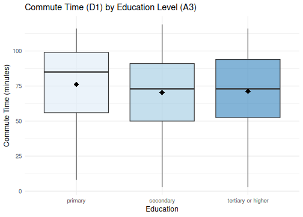
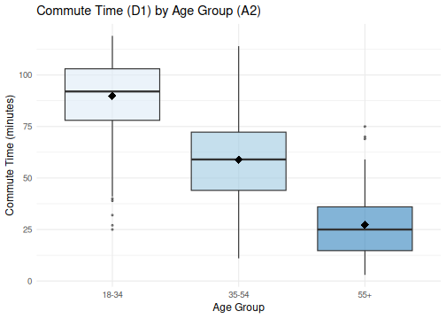
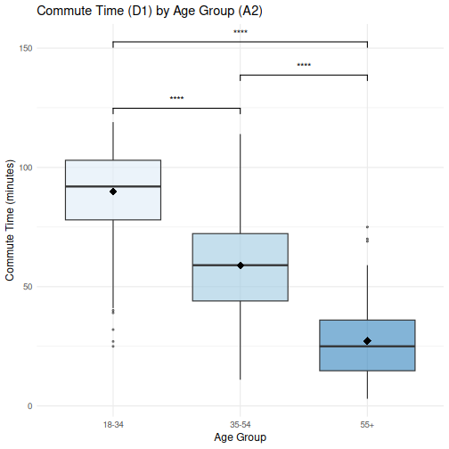
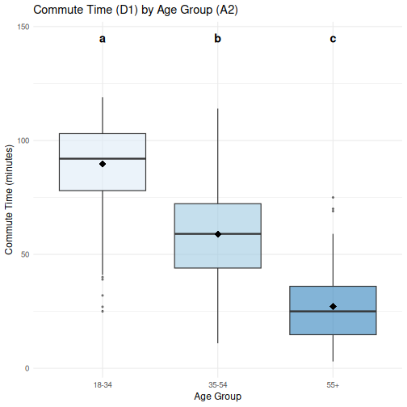
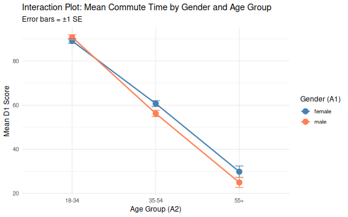
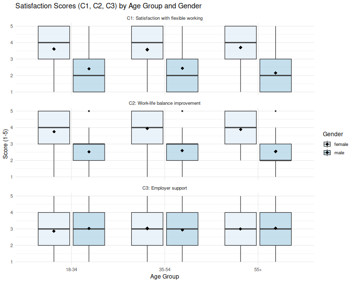
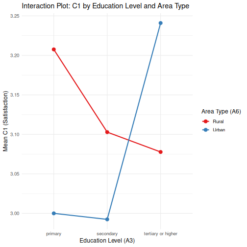

::: objectives
- Select the appropriate `ANOVA` variant for a given research design using the decision framework
- Check the assumptions required for each `ANOVA` type
- Explain when and why `ANOVA` is preferred over running multiple `t-tests`
- Run a `one-way ANOVA`, `Welch's ANOVA` and `MANOVA`
- Apply appropriate post-hoc tests (`Tukey HSD`, `Games-Howell`, `emmeans` with `Bonferroni`) following a significant result
- Follow up a significant `MANOVA` with univariate `ANOVAs` per dependent variable
- Accurately report results

:::

::: questions
- What `ANOVA` should I use?
- How do I check whether my data meet the assumptions of these tests?
:::

---

## Other materials
[See Workshop 7 Slides
here](https://irimmn.sharepoint.com/:p:/s/IRIMRWorkshops/IQBz78bURpO8SqoON5SqHJObAUO0CDwN0sCka84SLd4dGdY?e=UjpAZp)

[See Workshop 7 recording here -
1](https://irimmn.sharepoint.com/:v:/s/IRIMRWorkshops/IQAfaLW8aiYxSK0rGvRGkQs0AYMMo3cia0a4yGcwqjc03i8?e=4TZBZU)

---

## Dataset overview

This workshop uses a generated (made-up) dataset of **1,005 survey responses**
on flexible working and work-life balance. The cleaned `.rds` file preserves
all factor levels and ordered factors set in a [previous lesson 5. Quantitative Data Analysis in R](https://irim-mongolia.github.io/irim-r-workshops/quantitative_data_analysis.html).

**Survey schema (variables used in this workshop)**

| Section | Variable | Type | Description |
|---------|----------|------|-------------|
| **A (Demographics)** | A1 – Gender | Factor (male, female) | What is your gender? |
| | A2 – Age Group | Ordered Factor (18–34, 35–54, 55+) | What is your age? |
| | A3 – Education | Ordered Factor (primary, secondary, tertiary+) | Highest level of education? |
| | A4 – Income | Ordered Factor (low, middle, high) | Annual income level? |
| | A6 – Area Type | Factor (Rural, Urban) | Urban or rural residence? |
| **C (Satisfaction)** | C1 | Integer (1–5) | Satisfaction with flexible working arrangements |
| | C2 | Integer (1–5) | Extent flex working improves work-life balance |
| | C3 | Integer (1–5) | Employer support for flexible working in practice |
| **D (Commute)** | D1 | Numeric | Commute time to work (minutes) |
| | D2 | Numeric | Commute distance (km) |

---

## Why `ANOVA`?

When you want to compare means across **three or more groups**, running
multiple `t-tests` is not appropriate. It inflates the Type I error rate
(false positive rate) with every additional comparison. `ANOVA` tests all
group differences simultaneously with a single omnibus `F-test`, keeping
the error rate under control.

### The `F-statistic`

The `F-statistic` is the ratio of **between-group variance** to
**within-group variance**:

$$F = \frac{\text{Mean Square Between}}{\text{Mean Square Within}}$$

A large `$F$` indicates that the group means differ more than would be
expected by chance alone. The `F-test` is omnibus: it tells you *that*
at least one group differs, but not *which* groups. Post-hoc tests
answer the question of *which* groups differ.

::: callout
## Omnibus tests

An omnibus test is an overall test that asks whether there are any
significant differences among a set of groups or variables, without
specifying where those differences lie. In the context of `ANOVA`, the
`F-test` is omnibus: a significant result tells you that at least one
group mean differs from the others, but not which specific pairs are
different.

Think of it as a first screening step: if the omnibus test is
non-significant, you stop; if it is significant, you follow up with
post-hoc tests (such as `Tukey HSD`) to pinpoint exactly where the
differences are.
:::

The type of `ANOVA` you choose depends on your study design. Use the
questions below to find the right test.

---

## Which `ANOVA`?

## 1. How many independent variables (factors) do you have?

- **One factor**, comparing means across 3+ groups → proceed to [Question 2](#q2)
- **Two factors**, testing main effects and/or an interaction → `Two-way ANOVA`
- **Two or more factors, multiple outcome variables** → `MANOVA`

**Example 1 (one factor):** Does commute time (D1) differ across age groups
(18–34, 35–54, 55+)?

**Example 2 (two factors):** Does commute time (D1) differ across age group *and* gender: tests both main effects and their interaction.

**Example 3 (MANOVA):** Do gender and age group simultaneously affect satisfaction with flexible working (C1), work-life balance (C2), and employer support (C3)?


## 2. Are the same participants measured more than once? {#q2}

- **Yes**: same subjects in every condition (within-subjects design) → `Repeated Measures ANOVA`
- **No**: different participants in each group (between-subjects design) → proceed to [Question 3](#q3)

Repeated measures controls for individual differences, increasing statistical power. Common in longitudinal studies, pre/post designs, and within-subject experiments.


## 3. Is homogeneity of variance met? {#q3}

Check with **Levene's test**

- **Yes**: variances are roughly equal across groups → `One-way ANOVA`
- **No**: variances differ significantly across groups → `Welch's ANOVA`

`Welch's ANOVA` does not assume equal variances. It adjusts the degrees of freedom (`Welch–Satterthwaite` equation) to account for heteroscedasticity. It is often recommended as the default over classical `one-way ANOVA`, since it performs well even when variances *are* equal.


## 4. Do you have both within- and between-subjects factors?

- **Yes**: one factor is within-subjects, another is between-subjects → `Mixed ANOVA`
- **No**: all factors are the same type → stay with your choice above

**Example:** Measuring blood pressure at three time points (*within*) across a treatment vs control group (*between*).


## 5. Check your assumptions

### `One-way` & `Two-way ANOVA`

| Assumption | How to check | If violated |
|---|---|---|
| Normality of residuals | `Shapiro-Wilk` test, `Q-Q plot` | `Kruskal-Wallis` (non-parametric) |
| Homogeneity of variance | Levene's test | Use `Welch's ANOVA` |
| Independence of observations | Study design | Reconsider design |

**Note on sample size:** When group sizes exceed n = 30, the Central Limit Theorem provides sufficient protection against mild normality violations. `Shapiro-Wilk` becomes overly sensitive in large samples and should be interpreted alongside a `Q-Q` plot rather than in isolation.

### `Welch's ANOVA`

| Assumption | How to check | If violated |
|---|---|---|
| Normality of residuals |`Shapiro-Wilk` test, `Q-Q` plot | `Games-Howell` post hoc is robust to mild violations |
| Independence of observations | Study design | Reconsider design |

`Welch's ANOVA` **relaxes** the homogeneity of variance assumption; no `Levene's` test required beforehand.

### `Repeated Measures ANOVA`

| Assumption | How to check | If violated |
|---|---|---|
| Normality of residuals | `Shapiro-Wilk`, `Q-Q` plot | `Friedman` test (non-parametric) |
| Sphericity | `Mauchly's` test | Apply `Greenhouse-Geisser ε` correction |
| No extreme outliers | Boxplots per condition | Investigate and consider exclusion |

Sphericity is the most commonly overlooked assumption. If `Mauchly's` test is significant (*p* < .05), apply the `Greenhouse-Geisser` correction rather than abandoning the analysis.

### `MANOVA`

| Assumption | How to check | If violated |
|---|---|---|
| Multivariate normality | `mvn()` from `MVN` package, `Q-Q` plot | Proceed with caution if n is large |
| Homogeneity of covariance matrices | `Box's M test` | Use `Pillai's Trace` (most robust statistic) |
| No multivariate outliers | Mahalanobis distance | Investigate and consider exclusion |
| No multicollinearity between DVs | Correlation matrix | DVs should be related but r < .90 |
| Independence of observations | Study design | Reconsider design |


## 6. Post-hoc tests after a significant result

| Situation | Recommended test | Notes |
|---|---|---|
| `One-way ANOVA`, equal group sizes | `Tukey HSD` | Assumes equal variances and balanced groups |
| `One-way ANOVA`, unequal group sizes | `Bonferroni` correction | More conservative but appropriate for small number of comparisons |
| `Welch's ANOVA` | `Games-Howell` | Does not assume equal variances; use instead of Tukey HSD |
| `Two-way ANOVA`, no significant interaction | `emmeans` with `Bonferroni` | Interpret main effects only; marginal means adjusted for other factor |
| `Two-way ANOVA`, interaction present | `emmeans` simple main effects with Bonferroni | Do not interpret main effects in isolation; localise the interaction |
| `MANOVA` (significant overall) | Separate ANOVA per dependent variable, then `emmeans` with `Bonferroni` | Follow up only on dependent variables that drive the multivariate effect |
| Multiple outcome variables tested simultaneously | `FDR (Benjamini-Hochberg)` | Controls false positive rate across a family of tests |
| `Repeated measures ANOVA` | Pairwise comparisons with `Bonferroni` | Adjust within the within-subjects factor |
| `Mixed ANOVA` | `emmeans` with `Bonferroni` per factor | Separate comparisons for between- and within-subjects factors |


## 7. Non-parametric alternatives

Use these when normality is not met and sample sizes are small.

| Parametric test | Non-parametric alternative |
|---|---|
| `One-way ANOVA` | `kruskal.test()` — `Kruskal-Wallis` |
| Repeated measures ANOVA | `friedman.test()` — `Friedman` test |
| `Two-way ANOVA` | Aligned Ranks Transformation (`ARTool` package) |
| `MANOVA` | `Adonis` (permutation-based; `vegan` package) |

---

## `ANOVA` Summary table

| Test | Factors | Design | Equal variances required? | Recommended post-hoc | Notes |
|---|---|---|---|---|---|
| `One-way ANOVA` | 1 | Between-subjects | Yes | `Tukey HSD` (equal groups); Bonferroni (unequal groups) | Check Levene's test first |
| `Welch's ANOVA` | 1 | Between-subjects | **No** | `Games-Howell` | Robust alternative to one-way ANOVA when variances are unequal |
| `Two-way ANOVA` (no interaction) | 2 | Between-subjects | Yes | `emmeans` with `Bonferroni` | Interpret main effects only; use Type II SS for unbalanced designs |
| `Two-way ANOVA` (interaction present) | 2 | Between-subjects | Yes | `emmeans` simple main effects with `Bonferroni` | Do not interpret main effects in isolation; localise interaction |
| `Repeated measures ANOVA` | 1+ | Within-subjects | Yes (+ sphericity) | `Bonferroni` pairwise | Check `Mauchly's` test for sphericity; use `Greenhouse-Geisser` correction if violated |
| `Mixed ANOVA` | 2+ | Within + between | Yes (+ sphericity) | `emmeans` with `Bonferroni` per factor | Separate comparisons for between- and within-subjects factors |
| `MANOVA` | 2+ | Between-subjects | Yes | `emmeans` or discriminant analysis | Use when multiple dependent variables are correlated |
| `Kruskal-Wallis` | 1 | Between-subjects | No (non-parametric) | Dunn test with `Bonferroni` | Use when normality or equal variance assumptions are severely violated |
| `Friedman` | 1 | Within-subjects | No (non-parametric) | `Wilcoxon` signed-rank with `Bonferroni` | Non-parametric equivalent of `repeated measures ANOVA` |

---

## Set up

Start by opening your `intro_r` RStudio project and start a new R Notebook
(`File → New File → R Notebook`). Save it as `anova.Rmd` in
your `scripts` folder. Ensure your `global environment` is empty! You can also `sweep’`your global environment by clicking the `broom` icon.

When you open a new `R Notebook`, some explanatory text is provided. This can be deleted so you can enter your own text and code.

### Load packages and data

Download packages (if needed) and load libraries.  


``` r
for (pkg in c("tidyverse", "here", "rstatix", "effectsize", "ggsignif", "emmeans")) {
  if (!requireNamespace(pkg, quietly = TRUE)) install.packages(pkg)
}

library(tidyverse)
library(here)
library(effectsize) # for repeated_measures_d
library(rstatix) # tidy statistical tests
library(ggsignif) # significance displayed on ggplots
library(emmeans)
```

Read in the cleaned survey data that was processed in the [previous workshop](https://irim-mongolia.github.io/irim-r-workshops/quantitative_data_analysis.html).

Download the data first if you need to.


``` r
download.file("https://raw.githubusercontent.com/IRIM-Mongolia/irim-r-workshops/main/episodes/data/cleaned/generated_survey_data_clean.rds", here("data/cleaned/generated_survey_data_clean.rds"), mode = "wb")
```


``` r
survey <- readRDS(here("data", "cleaned", "generated_survey_data_clean.rds"))
survey
```

``` output
# A tibble: 1,005 × 28
   A1    A2    A3    A4    A5    A6    B1    B1_1  B1_2  B1_3  B1_4  B1_5  B2   
   <fct> <ord> <ord> <ord> <fct> <fct> <chr> <lgl> <lgl> <lgl> <lgl> <lgl> <chr>
 1 male  18-34 seco… low   regi… Urban <NA>  FALSE FALSE FALSE FALSE FALSE 1 4 7
 2 male  35-54 seco… midd… regi… Rural 2 4 5 FALSE TRUE  FALSE TRUE  TRUE  1 4 6
 3 fema… 35-54 tert… low   regi… Rural 2 3 4 FALSE TRUE  TRUE  TRUE  FALSE 3 6 7
 4 male  18-34 tert… low   regi… Urban 5     FALSE FALSE FALSE FALSE TRUE  3 5 8
 5 male  35-54 seco… high  regi… Rural 5     FALSE FALSE FALSE FALSE TRUE  2 5 6
 6 fema… 18-34 tert… high  regi… Urban 1 3 5 TRUE  FALSE TRUE  FALSE TRUE  3 6  
 7 male  35-54 seco… high  regi… Urban 2 4 5 FALSE TRUE  FALSE TRUE  TRUE  2 6 7
 8 fema… 18-34 tert… midd… regi… Rural 3 4 5 FALSE FALSE TRUE  TRUE  TRUE  6 7 8
 9 male  18-34 tert… low   regi… Urban 2 4   FALSE TRUE  FALSE TRUE  FALSE 2 5 8
10 male  18-34 prim… midd… regi… Urban 5     FALSE FALSE FALSE FALSE TRUE  5 8  
# ℹ 995 more rows
# ℹ 15 more variables: B2_1 <lgl>, B2_2 <lgl>, B2_3 <lgl>, B2_4 <lgl>,
#   B2_5 <lgl>, B2_6 <lgl>, B2_7 <lgl>, B2_8 <lgl>, C1 <dbl>, C2 <dbl>,
#   C3 <dbl>, D1 <dbl>, D2 <dbl>, E1 <ord>, E2 <chr>
```

---

## `One-way ANOVA` and `Welch's ANOVA` 
**Test 1: Research question:** Does commute time (D1) differ across level of education? (primary, secondary, tertiary or higher)?

### Assumptions

- Observations are independent. 
- The continuous variable is approximately normally distributed within each group, *or* each group has n > 30. 
- Equal variances across groups (check with `Levene's test`).

Let's produce some summary statistics that we can use in our reporting, and check the sample sizes.


``` r
survey %>%
  group_by(A3) %>%
  summarise(
    n    = n(),
    mean = round(mean(D1, na.rm = TRUE), 1),
    sd   = round(sd(D1, na.rm = TRUE), 1)
  )
```

``` output
# A tibble: 3 × 4
  A3                     n  mean    sd
  <ord>              <int> <dbl> <dbl>
1 primary              101  76.3  27.5
2 secondary            545  70.3  27.6
3 tertiary or higher   359  71.3  27  
```

Sample sizes for each education group are large (>30), so normality is assumed under the central limit theorem. 

### Exploratory plot

We'll use a box plot to plot the distributions of the three age groups.


``` r
survey %>%
  group_by(A3) %>%
  mutate(group_mean = mean(D1, na.rm = TRUE)) %>%
  ggplot(aes(x = A3, y = D1, fill = A3)) +
  geom_boxplot(alpha = 0.6, outlier.size = 0.8) +
  stat_summary(fun = mean, geom = "point", shape = 18,
               size = 4, colour = "black") +
  labs(title = "Commute Time (D1) by Education Level (A3)",
       x = "Education", y = "Commute Time (minutes)") +
  scale_fill_brewer(palette = "Blues") +
  theme_minimal(base_size = 12) +
  theme(legend.position = "none")
```



Respondents with a primary education appear to have slightly higher commute times, let's continue to see if the differences are statistically significant.

### Check equal variances


``` r
survey %>%
  levene_test(D1 ~ A3)
```

``` output
# A tibble: 1 × 4
    df1   df2 statistic     p
  <int> <int>     <dbl> <dbl>
1     2  1002    0.0643 0.938
```

A `Levene's test` p-value of > 0.05 means we accept the assumption of equal variances (homogeneity of variance) across groups. We can run the the standard `one-way ANOVA`.

### Run the `one-way ANOVA`


``` r
aov_d1_a3 <- survey %>% 
  anova_test(D1 ~ A3, detailed = TRUE)
aov_d1_a3
```

``` output
ANOVA Table (type II tests)

  Effect      SSn      SSd DFn  DFd     F     p p<.05   ges
1     A3 3016.859 748535.8   2 1002 2.019 0.133       0.004
```

::: callout
## Reading `one-way ANOVA` output

The output contains:

- **Effect**: the predictor variable being tested
- **SSn (Sum of Squares Numerator)**: the variance in the dependent variable that is explained by the predictor group differences; this is the between-group variance
- **SSd (Sum of Squares Denominator)**: the variance in the dependent variable that is not explained by the predictor group differences, i.e., the residual/error variance; this is the within-group variance
- **DFn**: degrees of freedom for the numerator, equal to the number of groups minus one
- **DFd**: degrees of freedom for the denominator, equal to the total sample size minus the number of groups
- **F**: the F-statistic, calculated as (SSn/DFn) ÷ (SSd/DFd); a ratio of between-group to within-group variance; if it is small, it indicates group means are not meaningfully separated relative to within-group spread
- **p**: the p-value
- **p<.05**: a flag column that marks significant effects with an asterisk; if blank, confirms non-significance
- **ges**: (Generalised Eta-Squared), the effect size estimate, representing the proportion of total variance in the dependent varible explained by the predictor. 


| GES | Interpretation |
|----|----------------|
| 0.01 | Small |
| 0.06 | Medium |
| 0.14 | Large |
| >0.14 | Very large |

:::


### Post-hoc tests: `Tukey HSD`

After a significant `ANOVA`, the **Tukey Honest Significant Difference (HSD)**
test compares all pairs of group means while controlling for the familywise
error rate.

Our `one-way ANOVA` above did not produce a significant result (p = 0.133), so the below code is just a demonstration of how to run a `tukey_hsd` test from the `rstatix` package.


``` r
survey %>% 
  tukey_hsd(D1 ~ A3)
```

``` output
# A tibble: 3 × 9
  term  group1  group2 null.value estimate conf.low conf.high p.adj p.adj.signif
* <chr> <chr>   <chr>       <dbl>    <dbl>    <dbl>     <dbl> <dbl> <chr>       
1 A3    primary secon…          0   -5.95    -12.9      1.000 0.11  ns          
2 A3    primary terti…          0   -5.02    -12.2      2.20  0.233 ns          
3 A3    second… terti…          0    0.926    -3.43     5.29  0.872 ns          
```


::: callout
## Reporting checklist for `one-way ANOVA` (and `Welch's`)

1. **Research question** and the grouping variable
2. **Group means and SDs** 
3. **Levene's test result** (assumption check)
4. **F-statistic, degrees of freedom, p-value**: *F*(df_between, df_within) = X.XX
5. **Post-hoc comparisons** (Tukey HSD) if significant
6. **Effect size** (ges) with interpretation

:::


**Example sentence:**
A one-way ANOVA was conducted to examine the effect of education level (A3) on daily commute time (D1) after equal variances were confirmed by `Levenes` test. The result was not statistically significant, F(2, 1002) = 2.019, p = 0.133, indicating that commute time did not differ meaningfully across highest education level (primary: mean = 76.3 minutes, std = 27.5; secondary: mean = 70.3 minutes, std = 27.6; tertiary or higher: 71.3 minutes, std = 27.0). 

The generalised eta-squared value (ges = 0.004) confirmed a negligible effect size, with education level accounting for less than 1% of the variance in daily commute time, suggesting that education has no practical relationship with how long respondents commute each day.


**Test 2: Research question:** Does commute time (D1) differ across age groups
(18–34, 35–54, 55+)?

### Summary statistics

Let's start by looking at the summary statistics

``` r
survey %>%
  group_by(A2) %>%
  summarise(
    n    = n(),
    mean = round(mean(D1, na.rm = TRUE), 1),
    sd   = round(sd(D1, na.rm = TRUE), 1)
  )
```

``` output
# A tibble: 3 × 4
  A2        n  mean    sd
  <ord> <int> <dbl> <dbl>
1 18-34   497  89.8  17.2
2 35-54   416  58.9  20  
3 55+      92  27.2  16.4
```

Sample sizes are all >30.

### Exploratory plot

We'll use a box plot to plot the distributions of the three age groups.


``` r
survey %>%
  group_by(A2) %>%
  mutate(group_mean = mean(D1, na.rm = TRUE)) %>%
  ggplot(aes(x = A2, y = D1, fill = A2)) +
  geom_boxplot(alpha = 0.6, outlier.size = 0.8) +
  stat_summary(fun = mean, geom = "point", shape = 18,
               size = 4, colour = "black") +
  labs(title = "Commute Time (D1) by Age Group (A2)",
       x = "Age Group", y = "Commute Time (minutes)") +
  scale_fill_brewer(palette = "Blues") +
  theme_minimal(base_size = 12) +
  theme(legend.position = "none")
```



A clear pattern is visible: younger respondents appear to have longer commutes than older ones.

### Check equal variances


``` r
survey %>%
  levene_test(D1 ~ A2)
```

``` output
# A tibble: 1 × 4
    df1   df2 statistic        p
  <int> <int>     <dbl>    <dbl>
1     2  1002      7.47 0.000604
```

A `Levene's test` p-value of < 0.05 means we reject the assumption of equal variances (homogeneity of variance) across groups. We will need to run `Welch's ANOVA` instead of the standard `one-way ANOVA`.

### Run the `Welch's ANOVA`

We'll use the `welch_anova_test` function from the `rstatix` package. 


``` r
# Welch's ANOVA
waov_d1_a2 <- survey %>% welch_anova_test(D1 ~ A2)
waov_d1_a2
```

``` output
# A tibble: 1 × 7
  .y.       n statistic   DFn   DFd         p method     
* <chr> <int>     <dbl> <dbl> <dbl>     <dbl> <chr>      
1 D1     1005      695.     2  263. 9.81e-106 Welch ANOVA
```

::: callout
## Reading `welch_anova_test` output

The output contains:

- **.y.**: the dependent variable being tested
- **n**: total sample size across all groups
- **statistic**: the F-statistic, representing the ratio of variance between groups to variance within groups; a larger value indicates greater separation between group means relative to within-group spread
- **DFn**: degrees of freedom for the numerator, equal to the number of groups minus one
- **DFd**: degrees of freedom for the denominator; in `Welch's ANOVA` this is a fractional value estimated using the `Welch-Satterthwaite` correction, rather than the standard n − k, to account for unequal variances across groups
- **p**: the p-value, indicating the probability of observing an F-statistic this large by chance alone
- **method**: confirms the test used

:::


The `Welch's ANOVA` is highly significant: **F(2, 263.11) = 695.1, p < 0.001**.
The mean daily commute time decreases with age; 18–34: 89.8 min, 35–54: 58.9 min, 55+: 27.2 min. But the `F-test` alone cannot tell us whether all three pairwise differences are significant. We need a post-hoc test. For `Welch's ANOVA`, we can use the `Games-Howell` post-hoc test.

### Post-hoc tests: `Games-Howell`


``` r
# Post-hoc: Games-Howell (does not assume equal variances)
survey %>% 
  games_howell_test(D1 ~ A2)
```

``` output
# A tibble: 3 × 8
  .y.   group1 group2 estimate conf.low conf.high    p.adj p.adj.signif
* <chr> <chr>  <chr>     <dbl>    <dbl>     <dbl>    <dbl> <chr>       
1 D1    18-34  35-54     -30.9    -33.9     -28.0 8.28e-14 ****        
2 D1    18-34  55+       -62.6    -67.1     -58.1 3.64e-14 ****        
3 D1    35-54  55+       -31.7    -36.3     -27.0 0        ****        
```

::: callout
## Reading `games_howell_test` output

The output contains:
- **y.**: the dependent variable
- **group1 / group2**: the two groups being compared in each pairwise test
- **estimate**: the mean difference between group1 and group2; negative values indicate group1 has a lower mean than group2
- **conf.low / conf.high**: the lower and upper bounds of the 95% confidence interval around the mean difference; if none of the intervals cross zero, it confirms all differences are significant
- **p.adj**: the adjusted p-value after correction for multiple comparisons
- **p.adj.signif**: a significance stars label, providing a quick visual indicator of the strength of evidence

:::

### Effect size
Unfortunately, the `Welch's ANOVA` output does not report the effect size, so we'll have to calculate the generalised eta-squared value. 


``` r
# extract values from waov_d1_a2
F_val <- waov_d1_a2$statistic
DFn   <- waov_d1_a2$DFn
DFd   <- waov_d1_a2$DFd

eta_sq <- (F_val * DFn) / (F_val * DFn + DFd)
round(eta_sq, 3)
```

``` output
    F 
0.841 
```

The `Games-Howell` post-hoc test reveals that the mean commute times of all age groups are statistically significantly different from each other, and the ges value confirms the effect size is very large. Putting this all together:

"A `Welch's one-way ANOVA` was conducted after equal variances were not confirmed by `Levenes test`. The results revealed a statistically significant effect of age group on daily commute time, F(2, 263.11) = 695.1, p < 0.001, with mean commute times decreasing across age groups (18–34: mean = 89.8 minutes, std = 17.2; 35–54: mean = 58.9 minutes, std = 20.0; 55+: mean = 27.2 minutes, std = 16.4). 

`Games-Howell` post-hoc tests indicated that all three pairwise comparisons were statistically significant (p < 0.001): 18–34 year-olds reported significantly longer daily commute times than both 35–54 year-olds (mean difference = 30.93 min, 95% CI [27.99, 33.87], p < 0.001) and those aged 55+ (mean difference = 62.60 min, 95% CI [58.15, 67.06], p < 0.001), and 35–54 year-olds reported significantly longer commute times than those aged 55+ (mean difference = 31.67 min, 95% CI [27.00, 36.34], p < 0.001).

The generalised eta-squared value is very large (0.841), confirming that age group explains over 84% of the variance in commute time."


### Plotting significant differences

We can use the `geom_signif` function from the `ggsignif` package to plot the levels of significance directly on the graph:


``` r
survey %>%
  group_by(A2) %>%
  mutate(group_mean = mean(D1, na.rm = TRUE)) %>%
  ggplot(aes(x = A2, y = D1, fill = A2)) +
  geom_boxplot(alpha = 0.6, outlier.size = 0.8) +
  stat_summary(fun = mean, geom = "point", shape = 18,
               size = 4, colour = "black") +
  geom_signif(
    comparisons = list(c("18-34", "35-54"),
                       c("35-54", "55+"),
                       c("18-34", "55+")),
    annotations = c("****", "****", "****"),
    step_increase = 0.12,   # vertical spacing between brackets
    tip_length    = 0.02,
    textsize      = 4
  ) +
  labs(title = "Commute Time (D1) by Age Group (A2)",
       x = "Age Group", y = "Commute Time (minutes)") +
  scale_fill_brewer(palette = "Blues") +
  theme_minimal(base_size = 12) +
  theme(legend.position = "none")
```



Or, we can use the `geom_text` function to label the groups.


``` r
# Compact letter display data frame
cld_labels <- data.frame(
  A2    = factor(c("18-34", "35-54", "55+"), levels = c("18-34", "35-54", "55+")),
  label = c("a", "b", "c"),
  y     = c(145, 145, 145)   # adjust height to sit above the boxplot whiskers
)

survey %>%
  group_by(A2) %>%
  mutate(group_mean = mean(D1, na.rm = TRUE)) %>%
  ggplot(aes(x = A2, y = D1, fill = A2)) +
  geom_boxplot(alpha = 0.6, outlier.size = 0.8) +
  stat_summary(fun = mean, geom = "point", shape = 18,
               size = 4, colour = "black") +
  geom_text(data = cld_labels, aes(x = A2, y = y, label = label),
            inherit.aes = FALSE, size = 5, fontface = "bold") +
  labs(title = "Commute Time (D1) by Age Group (A2)",
       x = "Age Group", y = "Commute Time (minutes)") +
  scale_fill_brewer(palette = "Blues") +
  theme_minimal(base_size = 12) +
  theme(legend.position = "none")
```



---

::: callout
## Failing to reject H₀ is a valid result

A non-significant `ANOVA` does not mean "nothing happened"- it means the
data provides insufficient evidence of a difference. Report it clearly,
including the F-statistic and effect size. A small effect size (ges) adds useful information: the predictor contributes essentially nothing to variance in the dependent variable.
:::

---

## `Two-Way ANOVA`

A `two-way ANOVA` extends the one-way design by including **two
categorical factors** simultaneously. It allows us to test:

1. The **main effect** of Factor A (holding Factor B constant)
2. The **main effect** of Factor B (holding Factor A constant)
3. The **interaction effect** of A × B: whether the effect of one factor
   depends on the level of the other

Interactions are the most interesting and often the most important result.
An interaction means that a simple statement like "females are more satisfied"
may be incomplete: the gender difference might be larger in some groups than others.

**Test 3: Research question:** Is commute time influenced by gender (A1), age group (A2), or their interaction?

### Summary statistics
Let's start with the summary statistics:


``` r
survey %>%
  group_by(A1, A2) %>%
  summarise(n = n(),
            mean = round(mean(D1, na.rm = TRUE), 1),
            sd   = round(sd(D1, na.rm = TRUE), 1)
            )
```

``` output
`summarise()` has regrouped the output.
ℹ Summaries were computed grouped by A1 and A2.
ℹ Output is grouped by A1.
ℹ Use `summarise(.groups = "drop_last")` to silence this message.
ℹ Use `summarise(.by = c(A1, A2))` for per-operation grouping
  (`?dplyr::dplyr_by`) instead.
```

``` output
# A tibble: 6 × 5
# Groups:   A1 [2]
  A1     A2        n  mean    sd
  <fct>  <ord> <int> <dbl> <dbl>
1 female 18-34   294  89.1  18  
2 female 35-54   246  60.7  20.9
3 female 55+      43  29.8  17  
4 male   18-34   203  90.8  16  
5 male   35-54   170  56.2  18.5
6 male   55+      49  24.9  15.8
```

Note that the sample sizes are unequal between the groups, so we'll note this in the results. Type II sum of squares (used in the `two-way ANOVA`) is the appropriate choice for unbalanced designs.


### Exploratory plot

An **interaction plot** (also called a line-by-group plot) is the best
diagnostic tool for a `two-way ANOVA`. **Parallel lines indicate no interaction**;
lines that converge, cross, or diverge suggest an interaction effect.


``` r
survey %>%
  group_by(A1, A2) %>%
  summarise(
    mean_D1 = mean(D1, na.rm = TRUE),
    se_D1   = sd(D1, na.rm = TRUE) / sqrt(n()),
    .groups = "drop"
  ) %>%
  ggplot(aes(x = A2, y = mean_D1, colour = A1, group = A1)) +
  geom_point(size = 4) +
  geom_line(linewidth = 1) +
  geom_errorbar(aes(ymin = mean_D1 - se_D1, ymax = mean_D1 + se_D1),
                width = 0.1) +
  labs(title = "Interaction Plot: Mean Commute Time by Gender and Age Group",
       subtitle = "Error bars = ±1 SE",
       x = "Age Group (A2)", y = "Mean D1 Score",
       colour = "Gender (A1)") +
  scale_colour_manual(values = c("steelblue", "coral")) +
  theme_minimal(base_size = 12)
```



The lines here cross, and are then parallel with increasing age: Commute time decreases with age, and there appears to be an interaction effect with age group and gender.


### Check equal variances

``` r
survey %>%
  levene_test(D1 ~ A1 * A2)
```

``` output
# A tibble: 1 × 4
    df1   df2 statistic       p
  <int> <int>     <dbl>   <dbl>
1     5   999      3.92 0.00160
```

Note, if group sizes are roughly equal, `two-way ANOVA` is considered robust to mild violations of homogeneity. We'll continue running the `two-way ANOVA` with the Type II tests for the unbalanced design, but we'll note the violation when reporting the results. 


### Run the two-way ANOVA

We'll use the `anova_test` function again here.


``` r
aov_d1_a1_a2 <- survey %>% 
  anova_test(D1 ~ A1 * A2, detailed=TRUE)

aov_d1_a1_a2
```

``` output
ANOVA Table (type II tests)

  Effect        SSn      SSd DFn DFd       F         p p<.05   ges
1     A1    531.861 335232.7   1 999   1.585  2.08e-01       0.002
2     A2 410844.876 335232.7   2 999 612.163 2.85e-174     * 0.551
3  A1:A2   2423.519 335232.7   2 999   3.611  2.70e-02     * 0.007
```

Results:

-   **Gender (A1)**: F(1, 999) = 1.585, p =  0.208, ges = 0.002 (negligible effect)
-   **Age group (A2)**: F(2, 999) = 612.163, p < 0.001, ges = 0.551 (large effect)
-   **Interaction (A1 × A2)**: F(2, 999) = 3.611, p = 0.027, ges = 0.007 (negligible effect)

The dominant finding is the strong main effect of age group (confirmed in the earlier `Welch's ANOVA` test). The significant interaction suggests the effect of age on commute time is not identical for males and females, warranting further investigation with post-hoc tests or interaction plots. Gender alone plays no meaningful independent role in predicting commute time.

Since the interaction (A1 × A2) is significant, the recommended post-hoc approach is to fit the equivalent linear model, and calculate the Estimated Marginal Means (also called least-squares means) using the `emmeans` package.

This returns a mean, standard error, and confidence interval for each cell (each gender × age group combination), adjusted for the overall model structure.


``` r
# Fit the model
model <- lm(D1 ~ A1 * A2, data = survey)

# Get estimated marginal means
emm <- emmeans(model, ~ A1 * A2)
emm
```

``` output
 A1     A2    emmean   SE  df lower.CL upper.CL
 female 18-34   89.1 1.07 999     87.0     91.2
 male   18-34   90.8 1.29 999     88.3     93.4
 female 35-54   60.7 1.17 999     58.4     63.0
 male   35-54   56.2 1.40 999     53.4     59.0
 female 55+     29.8 2.79 999     24.3     35.3
 male   55+     24.9 2.62 999     19.8     30.1

Confidence level used: 0.95 
```

Next, we'll do the pairwise comparisons, with a `Bonferroni` correction.

``` r
# All pairwise comparisons
pairs(emm, adjust = "bonferroni")
```

``` output
 contrast                        estimate   SE  df t.ratio p.value
 (female 18-34) - (male 18-34)      -1.72 1.67 999  -1.028  1.0000
 (female 18-34) - (female 35-54)    28.39 1.58 999  17.933 <0.0001
 (female 18-34) - (male 35-54)      32.90 1.77 999  18.642 <0.0001
 (female 18-34) - (female 55+)      59.29 2.99 999  19.825 <0.0001
 (female 18-34) - (male 55+)        64.19 2.83 999  22.709 <0.0001
 (male 18-34) - (female 35-54)      30.10 1.74 999  17.331 <0.0001
 (male 18-34) - (male 35-54)        34.62 1.90 999  18.179 <0.0001
 (male 18-34) - (female 55+)        61.01 3.08 999  19.840 <0.0001
 (male 18-34) - (male 55+)          65.91 2.92 999  22.605 <0.0001
 (female 35-54) - (male 35-54)       4.52 1.83 999   2.473  0.2036
 (female 35-54) - (female 55+)      30.91 3.03 999  10.208 <0.0001
 (female 35-54) - (male 55+)        35.81 2.87 999  12.494 <0.0001
 (male 35-54) - (female 55+)        26.39 3.13 999   8.440 <0.0001
 (male 35-54) - (male 55+)          31.29 2.97 999  10.534 <0.0001
 (female 55+) - (male 55+)           4.90 3.83 999   1.279  1.0000

P value adjustment: bonferroni method for 15 tests 
```

``` r
# Age comparisons within each gender (simple main effects)
emmeans(model, pairwise ~ A2 | A1, adjust = "bonferroni")
```

``` output
$emmeans
A1 = female:
 A2    emmean   SE  df lower.CL upper.CL
 18-34   89.1 1.07 999     87.0     91.2
 35-54   60.7 1.17 999     58.4     63.0
 55+     29.8 2.79 999     24.3     35.3

A1 = male:
 A2    emmean   SE  df lower.CL upper.CL
 18-34   90.8 1.29 999     88.3     93.4
 35-54   56.2 1.40 999     53.4     59.0
 55+     24.9 2.62 999     19.8     30.1

Confidence level used: 0.95 

$contrasts
A1 = female:
 contrast          estimate   SE  df t.ratio p.value
 (18-34) - (35-54)     28.4 1.58 999  17.933 <0.0001
 (18-34) - (55+)       59.3 2.99 999  19.825 <0.0001
 (35-54) - (55+)       30.9 3.03 999  10.208 <0.0001

A1 = male:
 contrast          estimate   SE  df t.ratio p.value
 (18-34) - (35-54)     34.6 1.90 999  18.179 <0.0001
 (18-34) - (55+)       65.9 2.92 999  22.605 <0.0001
 (35-54) - (55+)       31.3 2.97 999  10.534 <0.0001

P value adjustment: bonferroni method for 3 tests 
```

``` r
# Gender comparisons within each age group
emmeans(model, pairwise ~ A1 | A2, adjust = "bonferroni")
```

``` output
$emmeans
A2 = 18-34:
 A1     emmean   SE  df lower.CL upper.CL
 female   89.1 1.07 999     87.0     91.2
 male     90.8 1.29 999     88.3     93.4

A2 = 35-54:
 A1     emmean   SE  df lower.CL upper.CL
 female   60.7 1.17 999     58.4     63.0
 male     56.2 1.40 999     53.4     59.0

A2 = 55+:
 A1     emmean   SE  df lower.CL upper.CL
 female   29.8 2.79 999     24.3     35.3
 male     24.9 2.62 999     19.8     30.1

Confidence level used: 0.95 

$contrasts
A2 = 18-34:
 contrast      estimate   SE  df t.ratio p.value
 female - male    -1.72 1.67 999  -1.028  0.3041

A2 = 35-54:
 contrast      estimate   SE  df t.ratio p.value
 female - male     4.52 1.83 999   2.473  0.0136

A2 = 55+:
 contrast      estimate   SE  df t.ratio p.value
 female - male     4.90 3.83 999   1.279  0.2012
```

To bring this all together:

A `two-way ANOVA` was conducted to examine the effects of gender (A1) and age group (A2) on daily commute time (D1). Prior to analysis, `Levene's test` indicated a violation of the homogeneity of variance assumption; and cell sizes were unequal across the six gender × age group combinations (females: 18–34, n = 294; 35–54, n = 246; 55+, n = 43; males: 18–34, n = 203; 35–54, n = 170; 55+, n = 49), with the 55+ age group notably underrepresented relative to younger cohorts. This imbalance was considered when interpreting the results, and Type II sums of squares were used in the `ANOVA` to account for the unequal cell sizes.

Results revealed no significant main effect of gender, F(1, 999) = 1.585, p = 0.208, ges = 0.002, indicating that male and female respondents did not differ meaningfully in commute time when considered independently. In contrast, age group exerted a large and highly significant main effect on commute time, F(2, 999) = 612.163, p < .001, ges = 0.551, accounting for 55% of the variance in daily commute time and corroborating the earlier `Welch's ANOVA` findings. A statistically significant but small interaction effect between gender and age group was also observed, F(2, 999) = 3.611, p = 0.027, ges = 0.007, suggesting that while the overall pattern of declining commute time with age holds for both genders, the magnitude of this relationship differs slightly between males and females.

Given the significant interaction, follow-up analysis was conducted using estimated marginal means (`emmeans`) with `Bonferroni` correction. Estimated marginal means revealed a consistent pattern of declining commute time with age for both genders (females: 18–34, mean = 89.1 min, 95% CI [87.0, 91.2]; 35–54, mean = 60.7 min, 95% CI [58.4, 63.0]; 55+, mean = 29.8 min, 95% CI [24.3, 35.3]; males: 18–34, mean = 90.8 min, 95% CI [88.3, 93.4]; 35–54, mean = 56.2 min, 95% CI [53.4, 59.0]; 55+, mean = 24.9 min, 95% CI [19.8, 30.1]).

Simple main effects confirmed that age group differences were significant for both females, F(2, 580) = 262.459, p < 0.001, and males, F(2, 419) = 379.216, p < 0.001, with all pairwise age comparisons reaching significance (all p < 0.001) within each gender. The decline in commute time across age groups was somewhat steeper for males (18–34 vs 55+: estimate = 65.9 min) than for females (18–34 vs 55+: estimate = 59.3 min), suggesting the age effect is more pronounced among male respondents.

Examination of gender differences within each age group revealed that the interaction effect was localised to the 35–54 age group, where females reported statistically significantly longer commute times than males (estimate = 4.52 min, t(999) = 2.473, p = .014). No significant gender differences were found in the 18–34 group (estimate = −1.72 min, t(999) = −1.028, p = .304) or the 55+ group (estimate = 4.90 min, t(999) = 1.279, p = 0.201), indicating that males and females commute for comparable durations at the youngest and oldest age groups. Taken together, these findings suggest that while age is the dominant predictor of daily commute time, the relationship between age and commute time differs subtly by gender, with a slight increase in commute times of 4.52 minutes for midlife females."

::: callout
## Two-way ANOVA: interpreting main effects when there is no interaction

When the interaction term is non-significant, it is safe to
interpret the main effects independently. If the interaction *were* significant,
interpreting main effects in isolation would be misleading- you would first
describe how the effect of one factor changes across levels of the other.
:::

---

## `MANOVA`

`MANOVA` (Multivariate Analysis of Variance) is an extension of `ANOVA` that tests the effect of one or more categorical independent variables on two or more continuous dependent variables simultaneously, rather than testing each outcome separately with multiple `one-way ANOVAs`.

**Why use `MANOVA` instead of multiple `ANOVAs`?**

- Running separate `ANOVAs` on multiple outcomes inflates Type I error (false positives accumulate)
- `MANOVA` tests all outcomes together in a single model, controlling the overall error rate
- It also accounts for correlations between dependent variables, which separate `ANOVAs` ignore
- If the outcomes are correlated (e.g., C1, C2, C3 are all satisfaction measures), `MANOVA` is more powerful and appropriate

**Test 4: Research Question:** "Do gender (A1) and age group (A2) simultaneously affect satisfaction with flexible working (C1), work-life balance improvement (C2), and employer support (C3)?"

::: callout
## `MANOVA` vs `t-tests`  
In the [previous workshop 6. T-tests in R](https://irim-mongolia.github.io/irim-r-workshops/t_tests_and_anova.html)., we used a variety of `t-test` to investigate various research questions related to C1 and C2 survey responses.

`MANOVA` was used here not to replace the earlier tests, but to answer a different and complementary research question: one about the combined effect of gender and age on the overall satisfaction profile across C1, C2, and C3 simultaneously. The earlier tests remain valid for their own specific research questions.
:::

### Summary statistics


``` r
survey %>%
  group_by(A1, A2) %>%
  summarise(
    C1_mean = round(mean(C1, na.rm = TRUE), 2),
    C1_sd   = round(sd(C1, na.rm = TRUE), 2),
    C2_mean = round(mean(C2, na.rm = TRUE), 2),
    C2_sd   = round(sd(C2, na.rm = TRUE), 2),
    C3_mean = round(mean(C3, na.rm = TRUE), 2),
    C3_sd   = round(sd(C3, na.rm = TRUE), 2),
    n       = n()
  )
```

``` output
`summarise()` has regrouped the output.
ℹ Summaries were computed grouped by A1 and A2.
ℹ Output is grouped by A1.
ℹ Use `summarise(.groups = "drop_last")` to silence this message.
ℹ Use `summarise(.by = c(A1, A2))` for per-operation grouping
  (`?dplyr::dplyr_by`) instead.
```

``` output
# A tibble: 6 × 9
# Groups:   A1 [2]
  A1     A2    C1_mean C1_sd C2_mean C2_sd C3_mean C3_sd     n
  <fct>  <ord>   <dbl> <dbl>   <dbl> <dbl>   <dbl> <dbl> <int>
1 female 18-34    3.61  1.32    3.75  1.14    2.87  1.41   294
2 female 35-54    3.57  1.22    3.94  1.09    3.03  1.4    246
3 female 55+      3.7   1.32    3.88  0.98    3     1.4     43
4 male   18-34    2.41  1.31    2.53  1.06    3.03  1.42   203
5 male   35-54    2.44  1.28    2.59  1.1     2.94  1.46   170
6 male   55+      2.16  1.09    2.55  1.24    3.04  1.38    49
```

- C1 and C2 show a large and consistent gender difference: females score ~ 1.2 points higher than males on both variables across all age groups
- C3 shows virtually no gender difference: means are similar across all cells (range 2.87–3.04)
- Age group appears to have minimal effect on any of the three satisfaction variables


Before running `MANOVA` it is useful to visualise the distribution of each 
dependent variable across groups. Boxplots are recommended to assess 
distributions, spread, and potential outliers across cells.

### Exploratory plot

``` r
# Reshape to long format for faceted plotting
survey_long <- survey %>% 
  pivot_longer(cols = c(C1, C2, C3),
               names_to  = "variable",
               values_to = "score") %>%
  mutate(variable = recode(variable,
    C1 = "C1: Satisfaction with flexible working",
    C2 = "C2: Work-life balance improvement",
    C3 = "C3: Employer support"
  ))

# Faceted boxplot by age group and gender
ggplot(survey_long, aes(x = A2, y = score, fill = A1)) +
  geom_boxplot(alpha = 0.6, outlier.size = 0.8) +
  stat_summary(fun = mean, geom = "point", shape = 18,
               size = 3, colour = "black",
               position = position_dodge(width = 0.75)) +
  facet_wrap(~ variable, ncol = 1) +
  scale_fill_brewer(palette = "Blues") +
  labs(title = "Satisfaction Scores (C1, C2, C3) by Age Group and Gender",
       x     = "Age Group",
       y     = "Score (1-5)",
       fill  = "Gender") +
  theme_minimal(base_size = 12)
```



### Check correlations between dependent variables
Dependent variables should be moderately correlated, related enough to justify the use of `MANOVA`but not so highly correlated that multicollinearity is a concern (r < .90).


``` r
survey %>%
  select(C1, C2, C3) %>%
  cor(use = "complete.obs") %>%
  round(3)
```

``` output
       C1    C2     C3
C1  1.000 0.200 -0.071
C2  0.200 1.000  0.022
C3 -0.071 0.022  1.000
```

- C1 and C2 are weakly positively correlated (r = 0.200), related but distinct
- C1 and C3 are negligibly negatively correlated (r = −0.071)
- C2 and C3 are negligibly correlated (r = 0.022)

The correlations are low but the variables are conceptually related, which justifies the use of `MANOVA`. However the weak correlations suggest `MANOVA` may offer limited advantage over separate `ANOVAs` here: the dependent variables are largely independent of each other, meaning the multivariate approach adds little beyond controlling the familywise error rate.

### Check multivariate normality

With all cell sizes exceeding n = 43 and a total sample of n = 1,005, 
the Central Limit Theorem provides sufficient protection against 
violations of multivariate normality. A formal test is not required; 
this assumption is considered met by sample size alone.

### Check multivariate outliers (`Mahalanobis` distance)
Although the large sample size (n = 1,005) reduces sensitivity to individual cases, multivariate outliers are still checked as they can distort Pillai's Trace even in large samples. With bounded Likert-scale dependent variabless (1–5), severe outliers are unlikely but worth confirming.


``` r
survey %>%
  select(C1, C2, C3) %>%
  mahalanobis_distance()
```

``` output
# A tibble: 1,005 × 5
      C1    C2    C3 mahal.dist is.outlier
   <dbl> <dbl> <dbl>      <dbl> <lgl>     
 1     5     3     3      2.12  FALSE     
 2     1     5     1      7.42  FALSE     
 3     4     3     2      0.947 FALSE     
 4     1     3     3      2.22  FALSE     
 5     1     2     4      3.18  FALSE     
 6     5     2     4      4.34  FALSE     
 7     3     3     1      1.99  FALSE     
 8     4     5     1      3.87  FALSE     
 9     4     3     1      2.34  FALSE     
10     3     2     5      3.23  FALSE     
# ℹ 995 more rows
```

### Check homogeneity of covariance matrices (`Box's M` test)


``` r
# Box's M test - tests equality of covariance matrices across groups
box_m(survey[, c("C1", "C2", "C3")], survey$A1)
```

``` output
# A tibble: 1 × 4
  statistic p.value parameter method                                            
      <dbl>   <dbl>     <dbl> <chr>                                             
1      3.31   0.769         6 Box's M-test for Homogeneity of Covariance Matric…
```

``` r
box_m(survey[, c("C1", "C2", "C3")], survey$A2)
```

``` output
# A tibble: 1 × 4
  statistic p.value parameter method                                            
      <dbl>   <dbl>     <dbl> <chr>                                             
1      8.78   0.721        12 Box's M-test for Homogeneity of Covariance Matric…
```
**Note:** `Box's M` test is highly sensitive to departures from normality 
and large sample sizes. A significant result does not automatically 
invalidate the `MANOVA`: if `Box's M` is significant, use `Pillai's` Trace 
as the test statistic, which is the most robust to violations of this 
assumption.

### Run the `MANOVA`
We'll use the `manova` function from base `R`.


``` r
# Omnibus MANOVA
manova_model <- manova(cbind(C1, C2, C3) ~ A1 * A2, data = survey)
summary(manova_model, test = "Pillai")
```

``` output
           Df  Pillai approx F num Df den Df Pr(>F)    
A1          1 0.35691  184.442      3    997 <2e-16 ***
A2          2 0.00449    0.749      6   1996 0.6102    
A1:A2       2 0.00423    0.705      6   1996 0.6459    
Residuals 999                                          
---
Signif. codes:  0 '***' 0.001 '**' 0.01 '*' 0.05 '.' 0.1 ' ' 1
```

::: callout
## Reading `MANOVA` output

The output contains:

- **Df**: degrees of freedom for each effect; residuals = (n − number of cells)
- **`Pillai`**: `Pillai's` Trace statistic; ranges from 0 to 1, where larger values indicate a stronger multivariate effect; interpreted similarly to R² (the proportion of multivariate variance explained by the effect)
- **approx F**: the approximate F-statistic converted from `Pillai's` Trace for significance testing
- **num Df**: numerator degrees of freedom; equal to the number of dependent variables × the effect df
- **den Df**: denominator degrees of freedom used in the F-test
- **Pr(>F)**: the p-value for each effect

:::

`MANOVA` results:

**A1 (Gender):** Pillai = 0.357, F(3, 997) = 184.44, p < 0.001

- Highly significant multivariate effect
- Gender explains approximately 35.7% of the multivariate variance across C1, C2, and C3 combined
- This is a large effect and the dominant finding in the model

**A2 (Age Group):** Pillai = 0.004, F(6, 1996) = 0.749, p = 0.610

- Non-significant multivariate effect
- Age group has no meaningful effect on the combined satisfaction outcomes
- Pillai = 0.004 indicates a negligible effect size

**A1:A2 (Interaction):** Pillai = 0.004, F(6, 1996) = 0.705, p = .646

- Non-significant interaction
- The effect of gender on satisfaction outcomes is consistent across all age groups
- No need to investigate simple main effects

Only gender (A1) requires follow-up. Age group and the interaction are both non-significant with negligible effect sizes, so follow-up analysis is restricted to examining which dependent variables drive the gender effect via univariate `two-way ANOVAs` on C1, C2, and C3.

`Two-way ANOVAs` are used here to mimic the structure of the `MANOVA`.

``` r
survey %>% anova_test(C1 ~ A1 * A2)
```

``` output
ANOVA Table (type II tests)

  Effect DFn DFd       F        p p<.05      ges
1     A1   1 999 215.368 2.67e-44     * 0.177000
2     A2   2 999   0.184 8.32e-01       0.000368
3  A1:A2   2 999   0.927 3.96e-01       0.002000
```

- Gender (A1): F(1, 999) = 215.368, p < .001, ges = 0.177; highly significant, large effect
- Gender alone accounts for 17.7% of the variance in C1
- Age group and interaction: both non-significant with negligible effect sizes; age has no bearing on C1


``` r
survey %>% anova_test(C2 ~ A1 * A2)
```

``` output
ANOVA Table (type II tests)

  Effect DFn DFd       F        p p<.05      ges
1     A1   1 999 328.241 1.18e-63     * 0.247000
2     A2   2 999   1.893 1.51e-01       0.004000
3  A1:A2   2 999   0.389 6.78e-01       0.000778
```
- Gender (A1): F(1, 999) = 328.241, p < .001, ges = 0.247; highly significant, large effect
- Gender accounts for 24.7% of the variance in C2; the strongest gender effect across all three dependent variables
- Age group and interaction: both non-significant; age has no bearing on C2


``` r
survey %>% anova_test(C3 ~ A1 * A2)
```

``` output
ANOVA Table (type II tests)

  Effect DFn DFd     F     p p<.05      ges
1     A1   1 999 0.286 0.593       0.000286
2     A2   2 999 0.230 0.795       0.000459
3  A1:A2   2 999 0.859 0.424       0.002000
```

- Gender (A1): F(1, 999) = 0.286, p = .593, ges = 0.000; non-significant, negligible effect
- Age group: F(2, 999) = 0.230, p = .795, ges = 0.000; non-significant
- Interaction: F(2, 999) = 0.859, p = .424, ges = 0.002; non-significant
- Neither gender nor age group has any effect on perceptions of employer support

Putting all of the results together:

"A `one-way MANOVA` was conducted to examine the simultaneous effect of gender (A1) and age group (A2) on three satisfaction outcomes: satisfaction with flexible working arrangements (C1), work-life balance improvement (C2), and employer support (C3). Prior to analysis, assumptions were assessed. No multivariate outliers were identified via `Mahalanobis` distance. `Box's M` tests indicated homogeneity of covariance matrices across gender (p = 0.769) and age group (p = 0.721), confirming the assumption was met. Correlations among the dependent variables were low (C1–C2: r = .200; C1–C3: r = −.071; C2–C3: r = .022), indicating the variables were sufficiently independent to avoid multicollinearity while justifying a multivariate approach to control familywise error.

The overall `MANOVA` was statistically significant for gender, `Pillai's` Trace = 0.357, F(3, 997) = 184.44, p < 0.001, indicating that males and females differed significantly on the combined satisfaction outcome. Neither age group (`Pillai's` Trace = 0.004, F(6, 1996) = 0.749, p = 0.610), nor the gender × age group interaction )`Pillai's` Trace = 0.004, F(6, 1996) = 0.705, p = 0.646), reached statistical significance, with both effects showing negligible effect sizes.

Follow-up univariate `two-way ANOVAs` were conducted for each dependent variable to identify which outcomes drove the significant gender effect. Results revealed large and highly significant gender effects for both C1 (F(1, 999) = 215.368, p < 0.001, ges = 0.177), and C2 (F(1, 999) = 328.241, p < 0.001, ges = 0.247), with females reporting higher satisfaction with flexible working arrangements (females: mean = 3.61–3.70; males: mean = 2.16–2.44) and greater perceived work-life balance improvement (females: mean = 3.75–3.94; males: mean = 2.53–2.59) across all age groups. 

In contrast, C3 (employer support) showed no significant effect of gender (F(1, 999) = 0.286, p = 0.593, ges = 0.000), age group (F(2, 999) = 0.230, p = 0.795), or their interaction (F(2, 999) = 0.859, p = 0.424), indicating that perceptions of employer support were uniformly moderate and consistent across all gender and age group combinations (overall range: mean = 2.87–3.04).

As gender is a binary variable, no post-hoc pairwise comparisons were required for C1 or C2. The direction and magnitude of the gender difference is fully captured by the mean scores and the univariate F-tests. Taken together, these findings indicate that gender is a strong and consistent predictor of satisfaction with flexible working and perceived work-life balance benefits, while perceptions of employer support appear to be uniformly moderate and unrelated to either gender or age group in this sample."

---

## Exercises

:::: challenge
**Challenge 1:** `One-way ANOVA`

Run a one-way ANOVA to test whether C2 (work-life balance improvement)
differs across income levels (A4). If significant, run a post-hoc test.
Report F, p, ges, and post-hoc results.

::: solution
## Solution


``` r
# Summary statistics
survey %>%
  group_by(A4) %>%
  summarise(
    n    = n(),
    mean = round(mean(C2, na.rm = TRUE), 2),
    sd   = round(sd(C2, na.rm = TRUE), 2)
  )
```

``` output
# A tibble: 3 × 4
  A4         n  mean    sd
  <ord>  <int> <dbl> <dbl>
1 low      394  3.42  1.18
2 middle   326  3.25  1.32
3 high     285  3.2   1.33
```


``` r
# Levene's test for homogeneity of variance
survey %>%
  levene_test(C2 ~ A4)
```

``` output
# A tibble: 1 × 4
    df1   df2 statistic      p
  <int> <int>     <dbl>  <dbl>
1     2  1002      2.98 0.0511
```


``` r
# Step 3 — One-way ANOVA
aov_c2_a4 <- survey %>%
  anova_test(C2 ~ A4)
aov_c2_a4
```

``` output
ANOVA Table (type II tests)

  Effect DFn  DFd    F     p p<.05   ges
1     A4   2 1002 3.11 0.045     * 0.006
```

``` r
survey %>% 
  tukey_hsd(C2 ~ A4)
```

``` output
# A tibble: 3 × 9
  term  group1 group2 null.value estimate conf.low conf.high  p.adj p.adj.signif
* <chr> <chr>  <chr>       <dbl>    <dbl>    <dbl>     <dbl>  <dbl> <chr>       
1 A4    low    middle          0  -0.178    -0.402   0.0451  0.147  ns          
2 A4    low    high            0  -0.227    -0.460   0.00483 0.0565 ns          
3 A4    middle high            0  -0.0489   -0.291   0.193   0.884  ns          
```

A `one-way ANOVA` revealed a statistically significant but negligible effect of income level (A4) on work-life balance improvement (C2)(F(2, 1002) = 3.11, p = 0.045, ges = 0.006). Despite the significant omnibus test, Tukey HSD post-hoc comparisons revealed no significant differences between any pair of income groups (low vs middle: p = 0.147; low vs high: p = 0.057; middle vs high: p = 0.884), with all confidence intervals spanning zero. The marginal omnibus significance combined with a negligible effect size and non-significant pairwise comparisons suggests that income level has no meaningful practical effect on perceived work-life balance improvement in this sample.

:::
::::

:::: challenge
**Challenge 2 2:** `Two-way ANOVA`

Run a `two-way ANOVA`: `C1 ~ A3 * A6` (satisfaction by education level
and area type). Draw an interaction plot first. Interpret the main effects
and interaction term.

::: solution


``` r
# Interaction plot

survey %>%
  group_by(A3, A6) %>%
  summarise(mean_C1 = mean(C1, na.rm = TRUE)) %>%
  ggplot(aes(x = A3, y = mean_C1, colour = A6, group = A6)) +
  geom_line(linewidth = 1) +
  geom_point(size = 3) +
  labs(title    = "Interaction Plot: C1 by Education Level and Area Type",
       x        = "Education Level (A3)",
       y        = "Mean C1 (Satisfaction)",
       colour   = "Area Type (A6)") +
  scale_colour_brewer(palette = "Set1") +
  theme_minimal(base_size = 12)
```

``` output
`summarise()` has regrouped the output.
ℹ Summaries were computed grouped by A3 and A6.
ℹ Output is grouped by A3.
ℹ Use `summarise(.groups = "drop_last")` to silence this message.
ℹ Use `summarise(.by = c(A3, A6))` for per-operation grouping
  (`?dplyr::dplyr_by`) instead.
```




``` r
# Summary statistics
survey %>%
  group_by(A3, A6) %>%
  summarise(
    n    = n(),
    mean = round(mean(C1, na.rm = TRUE), 2),
    sd   = round(sd(C1, na.rm = TRUE), 2)
  )
```

``` output
`summarise()` has regrouped the output.
ℹ Summaries were computed grouped by A3 and A6.
ℹ Output is grouped by A3.
ℹ Use `summarise(.groups = "drop_last")` to silence this message.
ℹ Use `summarise(.by = c(A3, A6))` for per-operation grouping
  (`?dplyr::dplyr_by`) instead.
```

``` output
# A tibble: 6 × 5
# Groups:   A3 [3]
  A3                 A6        n  mean    sd
  <ord>              <fct> <int> <dbl> <dbl>
1 primary            Rural    53  3.21  1.23
2 primary            Urban    48  3     1.34
3 secondary          Rural   282  3.1   1.43
4 secondary          Urban   263  2.99  1.46
5 tertiary or higher Rural   193  3.08  1.44
6 tertiary or higher Urban   166  3.24  1.31
```

``` r
survey %>%
  levene_test(C1 ~ A3 * A6)
```

``` output
# A tibble: 1 × 4
    df1   df2 statistic     p
  <int> <int>     <dbl> <dbl>
1     5   999      1.66 0.141
```


``` r
# run two way ANOVA
aov_c1_a3_a6 <- survey %>%
  anova_test(C1 ~ A3 * A6)

aov_c1_a3_a6
```

``` output
ANOVA Table (type II tests)

  Effect DFn DFd     F     p p<.05      ges
1     A3   2 999 0.588 0.556       1.00e-03
2     A6   1 999 0.065 0.799       6.51e-05
3  A3:A6   2 999 1.258 0.285       3.00e-03
```

A `two-way ANOVA` was conducted to examine the effects of education level (A3) and area type (A6) on satisfaction with flexible working arrangements (C1). Levene's test was non-significant (p=0.141), indicating equal variances across groups. The interaction between education level and area type was non-significant (F(2, 999) = 1.258, p = 0.285, ges = 0.003), suggesting that the effect of education on satisfaction did not differ between rural and urban respondents. 

The main effect of education level was also non-significant (F(2, 999) = 0.588, p = 0.566, ges = 0.001), and the main effect of area type was non-significant (F(1, 999) = 0.065, p = 0.799, ges = 0.000). Taken together, these results indicate that neither education level nor area type, individually or in combination, had a meaningful effect on satisfaction with flexible working arrangements in this sample.

:::
::::
