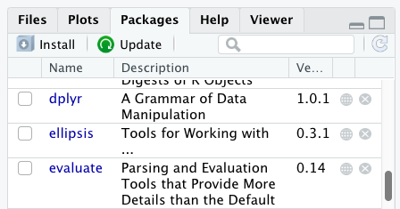

::: objectives
- `R package` гэж юу болохыг ойлгоорой
- `packages` табыг ашиглан багцуудыг суулгана уу.
- `R` кодыг ашиглан багцуудыг суулгана уу.
- `R Markdown` болон `R Notebooks`-ийн үндсэн синтаксийг ойлгох
:::

::: questions
- `R package` гэж юу вэ?
- `R` багцуудыг хэрхэн суулгах вэ?
- `R Markdown` ба `R Notebooks` гэж юу вэ?
- Би `R` кодыг текст болон графиктай хэрхэн нэгтгэх вэ?
- Би хэрхэн `.Rmd` файлыг `.html` болгон хөрвүүлэх вэ?
:::

## Талархал

Энэхүү семинарыг Дата мужааны хичээлүүдийн материалыг ашиглан тохируулсан
[`R for Social Scientists`](https://datacarpentry.github.io/r-socialsci/index.html),
ялангуяа [`lesson 00-intro`](https://datacarpentry.github.io/r-socialsci/00-intro.html) болон
[`lesson 06-rmarkdown`](https://datacarpentry.github.io/r-socialsci/06-rmarkdown.html).

## Бусад материал

[Зөвлөгөөний 2 слайдыг үзнэ үү
энд](https://irimmn.sharepoint.com/:p:/s/IRIMRWorkshops/IQAqoM4BmLU6R6UjbycjaZmtAaafTMrG87jL2YfVwXwb5vc?e=FZkIgq)

[2-р семинарын бичлэгийг үзнэ үү
энд](https://irimmn.sharepoint.com/:v:/s/IRIMRWorkshops/IQDtlOBD0YyDQao0uFaHsLxnAV5RXuEj7SKOzi2nDZJn5X4?e=1QT3FN)

## `R packages` гэж юу вэ?

[`R Packages`](https://r-pkgs.org/) нь үндсэн нэгжүүд юм
хуулбарлах боломжтой `R` код. Эдгээр нь дахин ашиглах боломжтой `R` функцүүдийн цуглуулга юм.
жишээ өгөгдөл, хэрхэн ашиглахыг тодорхойлсон баримт бичиг
функцууд.

## Үндсэн `R` болон багцуудын хооронд ямар ялгаа байдаг вэ?

[`base R package`](https://cran.r-project.org/doc/manuals/r-patched/packages/base/refman/base.html)
`R`-г хэлээр ажиллах боломжийг олгодог үндсэн функцуудыг агуулсан:

- Арифметик
- Оролт/гаралт
- Програмчлалын үндсэн дэмжлэг гэх мэт

`R` програм хангамжийг `base R` багц суулгасан үед түгээдэг. онд
`base R` суулгацаас гадна 20,000 гаруй суулгац бий
`R`-ийн үйл ажиллагааг өргөтгөхөд ашиглаж болох нэмэлт багцууд.
Эдгээрийн ихэнхийг `R` хэрэглэгчид бичсэн бөгөөд ашиглах боломжтой болгосон
`Comprehensive R Archive Network`-д байршуулсантай адил төвлөрсөн хадгалах газруудад
[`CRAN`](https://cran.r-project.org/web/packages/available_packages_by_name.html),
хүн бүр өөрийн `R` орчинд татаж аваад суулгах боломжтой.

[`CRAN`](https://cran.r-project.org/#:~:text=What%20are%20R%20and%20CRAN%3F,%20a%20wide%20variety%20of)
нь дэлхий даяар хадгалдаг ftp болон вэб серверүүдийн сүлжээ юм
`R`-д зориулсан код болон баримт бичгийн ижил, хамгийн сүүлийн үеийн хувилбарууд.

## `R` код болон `packages` табыг ашиглан багцуудыг суулгаж байна

Бид энэ семинарт `tidyverse` болон `here` багцуудыг ашиглах болно.

Та эдгээр багцуудыг командыг бичээд консолоос суулгаж болно
`install.packages()`, эсвэл `packages` табаас.

Бид консолоос `tidyverse`, багцаас `here`-г суулгана.
таб.

```{r, eval=TRUE, message=FALSE, purl=FALSE}
install.packages("tidyverse")

```

Та `packages`-оос багц суулгасан эсэхийг харах боломжтой
таб (анхдагчаар баруун доод талд). Та мөн тушаал бичиж болно
`installed.packages()`-г консол руу оруулаад гаралтыг шалгана уу.

{alt="Screenshot of Packages pane"}

Мөн `packages` табаас багцуудыг суулгаж болно. `packages` дээр
таб дээр `Install` дүрс дээр товшоод багцын нэрийг бичиж эхлээрэй
Та текст хайрцагт оруулахыг хүсч байна. Таныг бичиж байх үед таны эхлэлд тохирсон багцууд
тэмдэгтүүд доош унадаг жагсаалтад гарч ирэх бөгөөд ингэснээр та сонгох боломжтой
тэд.

{alt="Screenshot of Install Packages Window"}

`Install Packages` цонхны доод талд `Install`-ийг шалгах нүд байна
хамаарал. Энэ нь анхдагчаар тэмдэглэгдсэн байдаг бөгөөд энэ нь ихэвчлэн таны хүссэн зүйл юм.
Багцууд нь бусад зүйлд суулгасан функцуудыг ашиглах боломжтой (мөн хийдэг).
багцууд, тиймээс багцад агуулагдах функцүүдийн хувьд та
зөв ажиллахын тулд суулгаж байгаа бол шаардлагатай бусад багцууд байж болно
тэдэнтэй хамт суулгана. `Install dependencies` сонголт нь баталгаажуулдаг
ийм зүйл болдог гэж.

:::: challenge
## Дасгал хийх

`Packages` табыг ашиглан та `tidyverse` болон хоёулаа байгаа гэдгээ баталгаажуулна уу
`here` багцуудыг суулгасан.

::: solution
## Шийдэл

Багцын табыг доош гүйлгэн `tidyverse` руу очно уу. Та мөн цөөн хэдэн зүйлийг бичиж болно
тэмдэгтүүдийг хайлтын талбарт оруулна. `tidyverse` багц нь үнэхээр a
`ggplot2` болон `dplyr` зэрэг багц багц
бусад багцуудыг зөв ажиллуулахыг шаарддаг. Эдгээр бүх багцууд байх болно
автоматаар суулгана. Өмнө нь ямар багц байсан бэ гэдгээс хамаарна
Таны R орчинд суулгасан бол `tidyverse`-г суулгаж болно
маш хурдан эсвэл хэдэн минут болно. Суулгах явцад,
түүний явцтай холбоотой мессежийг консол дээр бичих болно. Та
одоо байгаа бүх багцыг харах боломжтой болно
суулгасан.
:::
::::

Суулгах процесс нь `CRAN` репозитор руу ханддаг тул танд хэрэгтэй болно
багцуудыг суулгах интернет холболт.

Мөн бусад репозитороос багц суулгах боломжтой
`Github` эсвэл локал файлын системийн хувьд бид эдгээрийг үзэхгүй
Энэ семинар дахь сонголтууд.

## `R Markdown` болон `R Notebooks`

`R Markdown` нь танд ямар ч саадгүй хийх боломжийг олгодог уян хатан төрлийн баримт бичиг юм
гүйцэтгэх боломжтой `R` код болон түүний гаралтыг тексттэй нэг дор нэгтгэнэ
баримт бичиг.

`R Notebook` нь `R Markdown`-д зориулсан тусгай интерактив гүйцэтгэх горим юм
(`Rmd`) баримт бичиг. Кодын хэсгүүдийг бие даан, интерактив байдлаар гүйцэтгэдэг
`RStudio` засварлагч дотор.

`R Markdown` баримтыг олон статик болон хувиргах боломжтой
PDF (.pdf), Word (.docx) болон HTML зэрэг динамик гаралтын форматууд
(.html).

Сайн бэлтгэсэн `R Markdown` эсвэл `Notebook` баримт бичгийн үр өгөөж дүүрэн байна
давтах чадвар. Хэрэв та өгөгдөл анзаарсан бол энэ нь бас гэсэн үг юм
транскрипцийн алдаа, эсвэл та шинжилгээндээ илүү их мэдээлэл нэмэх боломжтой,
Та тайланд өөрчлөлт оруулахгүйгээр дахин эмхэтгэх боломжтой болно
бодит баримт бичиг.

## `R Notebook` файл үүсгэж байна

`RStudio`-д шинэ `R Markdown` документ үүсгэхийн тулд `File -> New File -> R Notebook` дээр товшино уу. Танаас шаардлагатай багцуудыг суулгахыг шаардаж магадгүй
Та үүнийг анх удаа хийж байна.

## `R Notebook`-н үндсэн бүрэлдэхүүн хэсгүүд

### `YAML` Толгой хэсэг

Гаралтыг удирдахын тулд `YAML` (`YAML` Тэмдэглэгээний хэл биш) толгой хэсэг байна.
хэрэгтэй:

```         
---
title: "My Awesome Report"
output: html_document
---
```

Гарчиг нь эхэнд байгаа гурван зураасаар тодорхойлогддог (`---`) ба
төгсгөлд байгаа гурван зураас (`---`).

`YAML`-д шаардлагатай цорын ганц талбар нь `output:` бөгөөд энэ нь
таны хүссэн гаралтын төрөл. Энэ нь `html_document` байж болно, a
`pdf_document`, эсвэл `word_document`. Бид HTML хэлээр эхлэх болно
баримтжуулж, бусад хувилбаруудыг дараа нь хэлэлцэнэ.

Гарчигны дараа, баримт бичгийн үндсэн хэсгийг эхлүүлэхийн тулд та бичиж эхэлнэ
`YAML` толгой хэсгийн төгсгөлийн дараа (жишээ нь, хоёр дахь `---`-ийн дараа).

### `Markdown` синтакс

`Markdown` бол формат нэмэх боломжийг олгодог түгээмэл тэмдэглэгээний хэл юм
**болд**, *налуу*, `code` зэрэг текстийн элементүүд. The
форматлах нь тэмдэглэгээ (.md) баримт бичигт шууд харагдахгүй,
Та Word баримтаас харж байгаа шиг. Харин та `Markdown` синтакс нэмнэ
текст рүү, дараа нь өөр өөр файл болгон хөрвүүлэх боломжтой
`Markdown` синтаксийг орчуулах. `Markdown` нь ашигтай учраас ашигтай
хөнгөн, уян хатан, платформоос хамааралгүй.

`RStudio` нь форматыг бодит цагийн урьдчилан харах боломжийг олгодог- дээр дарна уу
`Visual` чихийг дарж `Markdown`-ийг, эсвэл `Source`-г түүгээр түүгээр дарна уу.
`Markdown`.

#### Гарчиг

Текстийн өмнө байрлах `#` нь `Markdown`-д энэ текстийг a гэдгийг харуулж байна
гарчиг. Илүү олон `#` нэмэх нь гарчгийг жижигрүүлнэ, өөрөөр хэлбэл нэг `#` нь
эхний түвшний гарчиг, хоёр `##` нь хоёрдугаар түвшний гарчиг гэх мэт
6-р түвшний гарчиг.

```         
# Title
## Section
### Sub-section
#### Sub-sub section
##### Sub-sub-sub section
###### Sub-sub-sub-sub section
```

(дээрх нь бас ашиглагдаж байгаа бол зөвхөн түвшинг ашиглана уу)

#### Форматлаж байна

Үгийг давхараар хүрээлүүлснээр та аливаа зүйлийг **зоригтой** болгож чадна
од, `**bold**`, эсвэл давхар доогуур зураас, `__bold__`; болон
*налуу зураас* ганц од, `*italics*`, эсвэл нэг доогуур зураас ашиглан,
`_italics_`.

Та мөн **болд** болон *налуу*-г хослуулан ямар нэгэн зүйл бичиж болно
***үнэхээр*** гурвалсан одтой, `***really***` эсвэл чухал
доогуур зураас, `___really___`; мөн, хэрэв та зоригтой санагдаж байвал (зохистой үг хэллэг)
та мөн од болон доогуур зураасыг хослуулан ашиглаж болно.
`**_really_**`, `**_really_**`.

`code-type` фонт үүсгэхийн тулд үгийг арын тэмдэгээр хүрээлээрэй.
`` `code-type` ``.

### Кодын хэсгүүд

Кодын хэсгүүд нь R кодыг бичиж, гүйцэтгэх блокууд юм. Тэд эхэлдэг
```` ```{r} and end with ``` ````-тай.

Хэсэг оруулахын тулд `Insert` товчлуурын хажууд байрлах жижиг сумыг товшино уу
засварлагч хэрэгслийн мөрийг сонгоод `R`-г сонгоно уу.

Chunk-г ажиллуулахын тулд баруун талд байрлах жижиг ногоон тоглох сумыг дарна уу
хэсэг эсвэл `Windows` болон `Linux` дээр **`Ctrl`**+**`Alt`**+`**I`** гарын товчлолыг ашиглана уу (эсвэл `Mac` дээр **`Cmd`**+**`Option**`+**`I`**).

#### Гаралтыг харж байна

Кодын хэсгийг ажиллуулсны дараа график эсвэл өгөгдөл зэрэг үр дүн гарч ирнэ
хураангуй, доторх кодын хэсэг дор шууд гарч ирнэ
редактор.

### `Notebook`-аа буулгаж, хуваалцаарай

Шинжилгээ хийж дууссаны дараа та эцсийн өнгөлгөөг үүсгэж болно
тайлан.

`RStudio` засварлагчийн самбар дээрх `Preview` (эсвэл `Render`) товчийг дарна уу.

Энэ нь бие даасан HTML файлыг (эсвэл PDF/Word баримтаас хамаарч) үүсгэдэг
`YAML` толгой хэсэгт байгаа тохиргоонууд дээр) өгүүллийг хоёуланг нь багтаасан болно
текст болон эцсийн үр дүн.

Та энэ гаралтын файлыг бусадтай хуваалцахгүй байсан ч хялбархан хуваалцаж болно
`R` ашиглах.

Одоо бид хэд хэдэн зүйлийг сурсан тул энэ нь хэрэг болж магадгүй юм
тэдгээрийг хэрэгжүүлэх.

## Өөрийн шинэ `R Notebook` үүсгэнэ үү

Шинэ `R Notebook`: `Click File -> New File -> R Notebook` нээж эхэл

Та шинэ `R Notebook` нээх үед зарим тайлбар текстийг өгсөн болно. Энэ
устгаж болох тул та өөрийн текст болон кодыг оруулах боломжтой.

### Өгөгдлийг татаж авах

Бид `SAFI_clean.csv` нэртэй өгөгдлийн багцыг ашиглах болно. Шууд татаж авах
Энэ файлын холбоос нь:
<https://github.com/datacarpentry/r-socialsci/blob/main/episodes/data/SAFI_clean.csv>.
Энэ өгөгдөл нь `SAFI Survey Results`-ын бага зэрэг цэвэршүүлсэн хувилбар юм
дээр боломжтой
[`figshare`](https://figshare.com/articles/dataset/SAFI_Survey_Results/6262019).

Эхлээд бид үүнийг хадгалахын тулд `data` нэртэй шинэ хавтас үүсгэх хэрэгтэй
өгөгдлийн багц. Файлын хэсэг рүү очоод `data` нэртэй шинэ хавтас үүсгэнэ үү
`cleaned` болон `raw` гэж нэрлэгддэг хоёр дэд хавтас.

```         
intro_r
│
└── scripts
│
└── data
│    └── cleaned
│    └── raw
│
└─── images
│
└─── documents
```

Та үүнд ашигласан `SAFI_clean.csv` датасетийг татаж авах боломжтой
семинарыг GitHub холбоосоос эсвэл `R`-аас авна уу. Та файлыг эндээс татаж авах боломжтой
энэ [`GitHub link`](https://github.com/datacarpentry/r-socialsci/blob/main/episodes/data/SAFI_clean.csv)
мөн үүнийг `data/raw` лавлахдаа `SAFI_clean.csv` болгон хадгална уу
үүсгэсэн. Эсвэл үүнийг хуулж буулгах замаар `R`-с шууд хийж болно
таны консол дээр:

`download.file(   "https://raw.githubusercontent.com/datacarpentry/r-socialsci/main/episodes/data/SAFI_clean.csv",   "data/raw/SAFI_clean.csv", mode = "wb"   )`

### Танилцуулга хэсгийг эхлүүлнэ үү

`Introduction` нэртэй гарчиг хийж, тайлбар бичвэр оруулна уу
таны тайланд байх өгөгдлийн багцын талаар. Жишээ нь:

Энэ тайланд *`SAFI`*-ын хамт **`tidyverse`** багцыг ашигладаг
өгөгдлийн багц бөгөөд үүнд дараах баганууд багтана:

```         
-   village
-   interview_date
-   no_members
-   years_liv
-   respondent_wall_type
-   rooms
```

Та мөн тоонуудыг ашиглан дараалсан жагсаалтыг үүсгэж болно:

```         

1.  village
2.  interview_date
3.  no_members
4.  years_liv
5.  respondent_wall_type
6.  rooms
```

Мөн tab доголоор үүрлэсэн зүйлс:

```         

-   village
    -   Name of village
-   interview_date
    -   Date of interview
-   no_members
    -   How many family members lived in a house
-   years_liv
    -   How many years respondent has lived in village or neighbouring
        village
-   respondent_wall_type
    -   Type of wall of house
-   rooms
    -   Number of rooms in house
```

`Markdown` синтаксийг илүү ихийг мэдэхийг хүсвэл [`the following reference guide`](https://www.markdownguide.org/basic-syntax)-с үзнэ үү.

Одоо бид **`preview`** дээр дарж баримтыг HTML болгон хувиргаж болно.
Эх сурвалжийн дээд хэсэгт байрлах товчлуур (зүүн дээд талд). Хэрэв та хадгалаагүй бол
Баримт бичиг хараахан байгаа бол та **`preview`**-д оролцох үед үүнийг хийхийг сануулах болно
анх удаа.

### `R Markdown` тайлан бичиж байна

Одоо бид харуулахын тулд `R` код нэмнэ (бид энэ талаар илүү ихийг мэдэх болно
Энэ кодыг дараагийн семинарт оруулна уу!).

Эхлээд бид **`tidyverse`** ачаалагдсан эсэхийг шалгах хэрэгтэй. Энэ нь хангалттай биш юм
**`tidyverse`**-г консолоос ачаалснаар бид үүнийг өөрийн дотор ачаалах шаардлагатай болно
`R Notebook`. Манай өгөгдөлд мөн адил хамаарна. Эдгээрийг ачаалахын тулд бид
Манай баримт бичгийн дээд талд (доорх) "кодын хэсэг" үүсгэх шаардлагатай болно
`YAML` толгой).

Кодын хэсгийг `Code \> Insert Chunk` дээр дарж эсвэл дарж оруулж болно
гарын товчлолыг ашиглан **`Ctrl`**+**`Alt`**+**`I`**
`Windows` болон `Linux` дээр болон **`Cmd`**+**`Option`**+**`I`**
`Mac` дээр.

Кодын синтакс нь:

````{verbatim, lang = "markdown"}
```{r chunk-name}
"Here is where you place the R code that you want to run."
```
````

`R Markdown` баримт бичиг нь тайлангийн хэсэг биш гэдгийг мэддэг
хэсгийг эхлүүлж дуусгадаг (```` ``` ````) -аас. Энэ нь бас мэддэг
Хэсэг доторх код нь `r` доторх R код байна
буржгар хаалт (`{}`). `r`-ийн дараа та кодын хэсэгт нэр нэмж болно
. Хэсэг хэсгийг нэрлэх нь сонголттой боловч санал болгож байна. Хэсэг бүрийн нэр байх ёстой
өвөрмөц бөгөөд зөвхөн үсэг, тоон тэмдэгтүүд болон `-` агуулсан.

```{r package-data, echo=FALSE, message=FALSE, purl=FALSE}
library(tidyverse)
interviews <- read_csv("data/raw/SAFI_clean.csv", na = "NULL")
```

**`tidyverse`** болон манай `SAFI_clean.csv` файлыг ачаалахын тулд бид дараахыг оруулна.
chunk болон үүнийг "тохиргоо" гэж нэрлэнэ. Учир нь бид энэ код эсвэл гаралтыг хүсэхгүй байна
Бидний үзүүлсэн HTML баримт бичигт харуулахын тулд бид `include = FALSE`-г нэмнэ
кодын хэсэгчилсэн нэрний дараах сонголт (`{r setup, include = FALSE}`).

````{verbatim, lang = "markdown"}
```{r setup, include = FALSE}
library(tidyverse)
library(here)
interviews <- read_csv(here("data/raw/SAFI_clean.csv"), na = "NULL")
```
````

::: callout
## Чухал тэмдэглэл!

.Rmd баримт бичигт өгсөн файлын замууд, жишээ нь. .csv файлыг ачаалах,
.Rmd баримт бичигтэй харьцангуй, төслийн үндэс **биш**.

Бид файлыг хадгалахын тулд `here()` функцийг ашиглахыг зөвлөж байна
таны төсөлд нийцсэн замууд.
:::

### Хүснэгт оруулах

Дараа нь бид өрхийн дундаж хэмжээг харуулсан хүснэгт үүсгэх болно
`village` болон `memb_assoc`-р бүлэглэсэн. Бид үүнийг шинээр бий болгосноор хийж чадна
кодын хэсэг бөгөөд үүнийг "interview-tbl" гэж нэрлэнэ. Эсвэл та гаргаж ирж болно
илүү бүтээлч зүйл (зүгээр л нэрлэх дүрмийг баримтлахаа санаарай).

Бид дараа нь энэ кодын талаар илүү ихийг мэдэх болно!

Гаралтыг харахын тулд дээд талд байгаа ногоон гурвалжин бүхий кодын хэсгийг ажиллуулна уу
хэсгийн баруун буланд эсвэл гарын товчлолоор:
`Windows` болон `Linux` дээрх **`Ctrl`**+**`Alt`**+**`C`**, эсвэл
`Mac` дээрх **`Cmd`**+**`Option`**+**`C`**.

Хүснэгтийг манай гаралтын баримт бичигт сайн форматласан эсэхийг шалгахын тулд бид
**`knitr`** багцаас `kable()` функцийг ашиглах шаардлагатай болно. The
`kable()` функц нь таны R кодын гаралтыг авч a болгон сүлждэг
сайхан харагдаж байна HTML хүснэгт. Та мөн өөр өөр талуудыг зааж өгч болно
хүснэгт, жишээ нь. баганын нэр, гарчиг гэх мэт.

Хүссэн гаралтыг авахын тулд кодын хэсгийг ажиллуулна уу.

```{r interview-tbl, message=FALSE, purl=FALSE}
interviews %>%
    filter(!is.na(memb_assoc)) %>%
    group_by(village, memb_assoc) %>%
    summarize(mean_no_membrs = mean(no_membrs)) %>%
  knitr::kable(caption = "We can also add a caption.", 
               col.names = c("Village", "Member Association", 
                             "Mean Number of Members"))
```

Олон төрлийн `R` багцуудыг хүснэгт үүсгэхэд ашиглаж болно. Зарим нь
илүү өргөн хэрэглэгддэг сонголтуудыг доорх хүснэгтэд жагсаав.

| Name | Creator(s) | Description |
|------------------------|------------------------|------------------------|
| [condformat](https://condformat.sergioller.com/index.html) | [Oller Moreno (2022)](https://cran.rstudio.com/web/packages/condformat/index.html) | Apply and visualize conditional formatting to data frames in R. It renders a data frame with cells formatted according to criteria defined by rules, using a tidy evaluation syntax. |
| [DT](https://rstudio.github.io/DT/) | [Xie et al. (2023)](https://cran.r-project.org/web/packages/DT/index.html) | Data objects in R can be rendered as HTML tables using the JavaScript library 'DataTables' (typically via R Markdown or Shiny). The 'DataTables' library has been included in this R package. |
| [formattable](https://github.com/renkun-ken/formattable) | [Ren and Russell (2021)](https://cran.r-project.org/web/packages/formattable/index.html) | Provides functions to create formattable vectors and data frames. 'Formattable' vectors are printed with text formatting, and formattable data frames are printed with multiple types of formatting in HTML to improve the readability of data presented in tabular form rendered on web pages. |
| [flextable](https://davidgohel.github.io/flextable/) | [Gohel and Skintzos (2023)](https://cran.r-project.org/web/packages/flextable/index.html) | Use a grammar for creating and customizing pretty tables. The following formats are supported: 'HTML', 'PDF', 'RTF', 'Microsoft Word', 'Microsoft PowerPoint' and R 'Grid Graphics'. 'R Markdown', 'Quarto', and the package 'officer' can be used to produce the result files. |
| [gt](https://gt.rstudio.com/) | [Iannone et al. (2022)](https://cloud.r-project.org/web/packages/gt/index.html) | Build display tables from tabular data with an easy-to-use set of functions. With its progressive approach, we can construct display tables with cohesive table parts. Table values can be formatted using any of the included formatting functions. |
| [huxtable](https://hughjonesd.github.io/huxtable/) | [Hugh-Jones (2022)](https://cran.r-project.org/web/packages/huxtable/index.html) | Creates styled tables for data presentation. Export to HTML, LaTeX, RTF, 'Word', 'Excel', and 'PowerPoint'. Simple, modern interface to manipulate borders, size, position, captions, colours, text styles and number formatting. |
| [pander](https://rapporter.github.io/pander/) | [Daróczi and Tsegelskyi (2022)](https://cran.r-project.org/web/packages/pander/index.html) | Contains some functions catching all messages, 'stdout' and other useful information while evaluating R code and other helpers to return user specified text elements (e.g., header, paragraph, table, image, lists etc.) in 'pandoc' markdown or several types of R objects similarly automatically transformed to markdown format. |
| [pixiedust](https://pixiedust.github.io/pixiedust/) | [Nutter and Kretch (2021)](https://cran.rstudio.com/web/packages/pixiedust/index.html) | 'pixiedust' provides tidy data frames with a programming interface intended to be similar to 'ggplot2's system of layers with fine-tuned control over each cell of the table. |
| [reactable](https://glin.github.io/reactable/) | [Lin et al. (2023)](https://cran.r-project.org/web/packages/reactable/index.html) | Interactive data tables for R, based on the 'React Table' JavaScript library. Provides an HTML widget that can be used in 'R Markdown' or 'Quarto' documents, 'Shiny' applications, or viewed from an R console. |
| [rhandsontable](http://jrowen.github.io/rhandsontable/) | [Owen et al. (2021)](https://cran.r-project.org/web/packages/rhandsontable/index.html) | An R interface to the 'Handsontable' JavaScript library, which is a minimalist Excel-like data grid editor. |
| [stargazer](https://github.com/cran/stargazer) | [Hlavac (2022)](https://cran.r-project.org/web/packages/stargazer/index.html) | Produces LaTeX code, HTML/CSS code and ASCII text for well-formatted tables that hold regression analysis results from several models side-by-side, as well as summary statistics. |
| [tables](https://github.com/dmurdoch/tables) | [Murdoch (2022)](https://cran.r-project.org/web/packages/tables/index.html) | Computes and displays complex tables of summary statistics. Output may be in LaTeX, HTML, plain text, or an R matrix for further processing. |
| [tangram](https://github.com/spgarbet/tangram) | [Garbett et al. (2023)](https://cran.r-project.org/web/packages/tangram/index.html) | Provides an extensible formula system to quickly and easily create production quality tables. The processing steps are a formula parser, statistical content generation from data defined by a formula, and rendering into a table. |
| [xtable](https://github.com/cran/xtable) | [Dahl et al. (2019)](https://cran.r-project.org/web/packages/xtable/index.html) | Coerce data to LaTeX and HTML tables. |
| [ztable](https://github.com/cardiomoon/ztable) | [Moon (2021)](https://cran.r-project.org/web/packages/ztable/index.html) | Makes zebra-striped tables (tables with alternating row colors) in LaTeX and HTML formats easily from a data.frame, matrix, lm, aov, anova, glm, coxph, nls, fitdistr, mytable and cbind.mytable objects. |

### Хэсэг гаралтыг тохируулах

Кодоос урьдчилан сэргийлэхийн тулд `include = FALSE`-г кодын хэсэг болгон ашиглахыг бид дурдсан
болон сүлжмэл баримт бичигт хэвлэхээс гарна. Нэмэлт байдаг
-д кодын хэсгүүдийг хэрхэн харуулахыг тохируулах боломжтой сонголтууд
гаралтын баримт бичиг. Сонголтуудыг дараа нь кодын хэсэгт оруулна
`chunk-name` ба таслалаар тусгаарлагдсан, жишээлбэл.
`{r chunk-name, eval = FALSE, echo = TRUE}`.

| Option | Options | Output |
|------------------------|------------------------|------------------------|
| `eval` | `TRUE` or `FALSE` | Whether or not the code within the code chunk should be run. |
| `echo` | `TRUE` or `FALSE` | Choose if you want to show your code chunk in the output document. `echo = TRUE` will show the code chunk. |
| `include` | `TRUE` or `FALSE` | Choose if the output of a code chunk should be included in the document. `FALSE` means that your code will run, but will not show up in the document. |
| `warning` | `TRUE` or `FALSE` | Whether or not you want your output document to display potential warning messages produced by your code. |
| `message` | `TRUE` or `FALSE` | Whether or not you want your output document to display potential messages produced by your code. |
| `fig.align` | `default`, `left`, `right`, `center` | Where the figure from your R code chunk should be output on the page |

:::: challenge
## Дасгал хийх

Кодтой хэсэг дэх өөр өөр сонголтуудыг ашиглан тоглоорой
Хүснэгтээс сонголт бүр нь гаралтад юу хийхийг харна уу.

Хэрэв та `eval = FALSE` болон `echo = FALSE`-ийг ашиглавал яах вэ? юу вэ
Энэ болон `include = FALSE` хоёрын ялгаа юу?

::: solution
## Дасгал хийх шийдэл

`{r eval = FALSE, echo = FALSE}`-р хэсэг үүсгээд дараа нь үүсгэнэ үү
харьцуулахын тулд `{r include = FALSE}`-тай өөр нэг хэсэг. `eval = FALSE` болон
`echo = FALSE` нь кодыг хэсэг болгон ажиллуулахгүй, кодыг харуулахгүй
сүлжмэл баримт бичигт. Кодын хэсэг нь үндсэндээ байхгүй
хэзээ ч ажиллуулж байгаагүй тул буулгасан баримт бичиг. Харин `include = FALSE` байх болно
кодыг ажиллуулаад гаралтыг дараа нь ашиглахаар хадгална.
:::
::::

### Шугамын R код

Одоо бид зарим нэг мөрийн `R` кодыг ашиглан тодорхой тайлбарлах болно
статистик. In-line `R` кодыг ашиглахын тулд бид өөрсдийнхөө арын тэмдэгтүүдийг ашигладаг
`Markdown` хэсэгт ашиглагдаж, `r`-ээр биднийг мөн гэдгийг зааж өгсөн
R-код үүсгэх. Мөрийн код болон кодын хэсэг хоёрын ялгаа
арын тэмдэгтүүдийн тоо юм. Шугамын `R` код нь нэг буцах тэмдэг ашигладаг
(`` `r` ``), харин кодын хэсэг нь гурван арын тэмдэг ашигладаг
(```` ```r``` ````).

Жишээлбэл, өнөөдрийн огноо ``` ``r "r Sys.Date()"`` ```, байх болно
дараах байдлаар үзүүлсэн: өнөөдрийн огноо `r Sys.Date()`.\
Код нь гаралтын баримт бичигт өнөөдрийн огноог харуулах болно (за,
техникийн хувьд баримт бичгийг хамгийн сүүлд сүлжсэн эсвэл урьдчилан үзсэн огноо).

R кодыг ашиглах хамгийн сайн арга бол кодын хэмжээг багасгах явдал юм
та кодын гаралтыг бэлтгэх замаар шугаман гаралтыг гаргах хэрэгтэй
хэсгүүд. Бид дундаж өрхийг танилцуулах сонирхолтой байна гэж бодъё
тосгон дахь хэмжээ.

```{r in-line-code, purl=FALSE}
# create a summary data frame with the mean household size by village
mean_household <- interviews %>%
    group_by(village) %>%
    summarize(mean_no_membrs = mean(no_membrs))

# and select the village we want to use
mean_chirodzo <- mean_household %>%
  filter(village == "Chirodzo")
```

Одоо бид тосгон бүрийн арга хэрэгслийн талаар мэдээлэл өгөх боломжтой.
мөн дундаж утгыг шугамын R-код болгон оруулна. Жишээ нь:

Чиродзо тосгоны өрхийн дундаж хэмжээ ``` ``r "r round(mean_chirodzo$mean_no_membrs, 2)"`` ``` байна
 
болдог...

Чиродзо тосгоны өрхийн дундаж хэмжээ
`r round(mean_chirodzo$mean_no_membrs, 2)`.

Бид бодит утгуудын оронд мөрийн `R` кодыг ашиглаж байгаа тул бид
Хэрэв бид автоматаар шинэчлэгдэх динамик баримт бичгийг үүсгэсэн
өгөгдлийн багц болон/эсвэл кодын хэсгүүдэд өөрчлөлт оруулах.

## Талбай

Эцэст нь бид бас талбайг оруулах болно, тиймээс бидний баримт бичиг арай илүү байна
өнгөлөг, арай уйтгартай. Бид ашиглах код үүсгэх болно
хуйвалдаан.

```{r interview-plotting-data, purl=FALSE, eval=TRUE}
interviews_plotting <- interviews %>%
  ## pivot wider by items_owned
  separate_rows(items_owned, sep = ";") %>%
  ## if there were no items listed, changing NA to no_listed_items
  replace_na(list(items_owned = "no_listed_items")) %>%
  mutate(items_owned_logical = TRUE) %>%
  pivot_wider(names_from = items_owned, 
              values_from = items_owned_logical, 
              values_fill = list(items_owned_logical = FALSE)) %>%
  ## pivot wider by months_lack_food
  separate_rows(months_lack_food, sep = ";") %>%
  mutate(months_lack_food_logical = TRUE) %>%
  pivot_wider(names_from = months_lack_food, 
              values_from = months_lack_food_logical, 
              values_fill = list(months_lack_food_logical = FALSE)) %>%
  ## add some summary columns
  mutate(number_months_lack_food = rowSums(select(., Jan:May))) %>%
  mutate(number_items = rowSums(select(., bicycle:car)))
```

```{r my-fancy-plot, answer=TRUE, purl=FALSE}
interviews_plotting %>%
  ggplot(aes(x = respondent_wall_type)) +
  geom_bar(aes(fill = village))
```

Мөн бид `fig.cap` гэсэн хэсэгчилсэн сонголтоор тайлбар үүсгэж болно.

```{r caption-plot, eval=TRUE, fig.cap="I made this plot!"}
interviews_plotting %>%
  ggplot(aes(x = respondent_wall_type)) +
  geom_bar(aes(fill = village), position = "dodge") + 
  labs(x = "Type of Wall in Home", y = "Count", fill = "Village Name") +
  scale_fill_viridis_d() # add colour deficient friendly palette
```

## Бусад гаралтын сонголтууд

Та `R Markdown`-ыг PDF эсвэл Word документ (бусад) болгон хөрвүүлэх боломжтой.
**`Preview`** товчлуурын хажууд байрлах жижиг гурвалжин дээр дарж a авна уу
унадаг цэс. Эсвэл та `pdf_document` эсвэл `word_document`-г оруулж болно
файлын анхны толгой хэсэг.

```         
---
title: "My Awesome Report"
author: "Author name"
date: ""
output: word_document
---
```

::: callout
## Жич: PDF баримт үүсгэх

`.pdf` баримт бичгийг үүсгэхийн тулд нэмэлт программ суулгах шаардлагатай байж магадгүй.
R багц `tinytex` нь энэ үйл явцыг хийхэд туслах зарим хэрэгслээр хангадаг
R хэрэглэгчдэд илүү хялбар. `tinytex` суулгасан бол ажиллуулна уу
`tinytex::install_tinytex()` шаардлагатай программ хангамжийг суулгана уу (та
Үүнийг зөвхөн нэг удаа хийх хэрэгтэй) дараа нь **`Knit`**-г pdf `tinytex` рүү оруулах үед
нэмэлт LaTeX багцуудыг автоматаар илрүүлж суулгана
pdf баримт бичгийг гаргахад шаардлагатай. Дэлгэрэнгүй мэдээллийг [`tinytex website`](https://yihui.org/tinytex/) дээрээс авна уу.
:::

::: callout
## Тайлбар: `R Markdown` файлд ишлэл оруулж байна

Үүнийг ашиглан `R Markdown` файлд ишлэл оруулах боломжтой
засварлагч хэрэгслийн самбар. Засварлагч хэрэгслийн самбар нь нийтлэг харагддаг форматыг агуулдаг
текст засварлагчдад ихэвчлэн харагддаг товчлуурууд (жишээ нь, тод, налуу товчлуурууд).
Хэрэгслийн самбарт тохиргоо унадаг цэсийг ашиглан хандах боломжтой (хажуу
`Preview` унадаг цэс) `Use Visual Editor`-ийг сонгоно уу
`Crtl+Shift+F4` товчлолоор хандах боломжтой. Эндээс, дарна уу
`Insert` нь `Citation`-ийг сонгохыг зөвшөөрдөг (товчлол: `Crtl+Shift+F8`).
Жишээлбэл, `From DOI` дотор `10.1007/978-3-319-24277-4`-г хайж байна
оруулах нь `ggplot2` [`@wickham2016`]-ийн ишлэлийг өгөх болно. Энэ
мөн 'references.bib' доторх ишлэл(үүд)-ийг одоогийн байдлаар хадгалах болно
ажлын лавлах. Дэлгэрэнгүйг [`R Studio website`](https://rstudio.github.io/visual-markdown-editing/)-д зочилно уу
мэдээлэл. Зөвлөмж: холбогдох багцаас ишлэлийн мэдээллийг авах
`citation("package")` ашиглан хийж болно.
:::

## Нөөц

- [`R Markdown` баримт бичиг](https://rmarkdown.rstudio.com)
- [`R Markdown cheat sheet`](https://github.com/rstudio/cheatsheets/blob/master/rmarkdown-2.0.pdf)
- [`Getting started with R Markdown`](https://www.rstudio.com/resources/webinars/getting-started-with-r-markdown/)
- [`Introduction to R Markdown`](https://rmarkdown.rstudio.com/lesson-1.html?_gl=1*1e2p8mh*_up*MQ..*_ga*MjExN zU1MjM2NS4xNzcwOTEwMTgx*_ga_X64JZVV9NC*czE3NzA5MTAxODAkbzEkZzEkdDE3NzA5MTAyMDgkajMyJGwwJGgw)
- [`R Markdown: The Definitive Guide`](https://bookdown.org/yihui/rmarkdown/) (`Rstudio` багийн ном)

::: keypoints
- `install.packages()` ашиглан багц (номын сан) суулгах
- Багцуудыг ачаалахын тулд `library()` ашиглана уу
- `R Markdown` нь хуулбарлах баримт бичиг үүсгэхэд хэрэгтэй хэл юм
текст болон гүйцэтгэх боломжтой `R` кодыг хослуулсан
- Гаралтын баримт бичгийн форматыг хянахын тулд бөөн сонголтуудыг зааж өгнө үү
:::