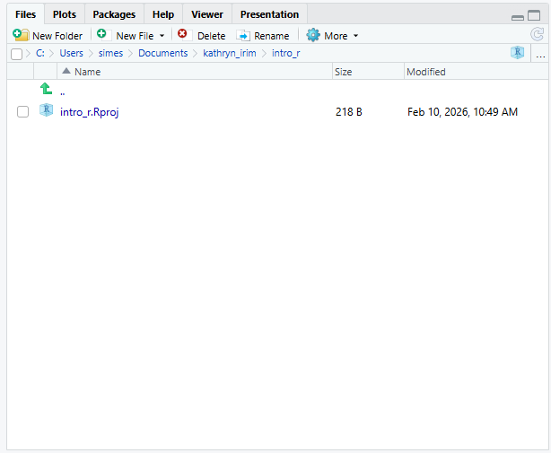

::: questions
- Та яагаад `R` болон `RStudio` ашиглах ёстой вэ?
- Та `R` болон `RStudio` дээр хэрхэн ажиллаж эхлэх вэ?
:::

::: objectives
- `R` болон `RStudio` хоёрын ялгааг ойлгоорой
- Өөр `RStudio` самбаруудын зорилгыг тайлбарлана уу
- Файл болон лавлахуудыг `R` төсөл болгон зохион байгуул
:::

## Хүлээн зөвшөөрөлт

Энэ семинарыг Мэдээллийн мужааны хичээлүүдийн [`R for Ecologists`](https://datacarpentry.github.io/R-ecology-lesson/index.html), ялангуяа [`introduction-r-rstudio`](https://datacarpentry.github.io/R-ecology-lesson/introduction-r-r-r)-ын материалыг ашиглан тохируулсан.

## Бусад материал

[Зөвлөгөөний 1-р слайдыг эндээс үзнэ үү](https://irimmn.sharepoint.com/:p:/s/IRIMRWorkshops/IQC2QIi5hSalQ4WFU1qTaduaAdYxB4Gd0f7Y7wTtaKn6AnQ?e=gjZViL)

[Зөвлөгөөний 1-р бичлэгийг эндээс үзнэ үү](https://irimmn.sharepoint.com/:v:/s/IRIMRWorkshops/IQBf8NThi-iKQ4Et5uw4_-b9ATUDqsI7om6Dp0YSSVZBXBI?e=A4d0fQ)

## `R` ба `RStudio` гэж юу вэ?

`R` нь програмчлалын хэл болон `R` кодыг ажиллуулдаг програм хангамжийг хэлдэг.

[`RStudio`](https://posit.co/download/rstudio-desktop/) нь R скрипт бичих болон `R` программ хангамжтай харилцахад хялбар болгох програм хангамжийн интерфейс юм. Энэ бол маш алдартай платформ бөгөөд RStudio нь бидний эдгээр семинарт ашиглах [`tidyverse`](https://www.tidyverse.org/) цуврал багцуудыг хадгалдаг.

## Яагаад `R` сурах вэ?

<br>

::: instructor
Хэрэв та хүсвэл энэ зүйрлэлийг үзэж болно, хэрэв танд хэрэг болохгүй бол алгасаж болно.
:::

::: solution
## Таны шинэ хамтрагч ...

Таны зөвлөх таныг олон жилийн хамтран ажиллагсдын нэгтэй нь хамтран ажиллахыг санал болгосноор та төсөл дээр ажиллаж байна. Таны зөвлөхийн хэлснээр, энэ хамтрагч маш авъяастай, гэхдээ зөвхөн таны мэдэхгүй хэлээр ярьдаг. Таны зөвлөх таныг хэл сурч эхэлсэн гэж дүгнэхгүй бөгөөд таны асуултад баяртайгаар хариулах болно гэдгийг баталж байна. Гэсэн хэдий ч, хамтран ажиллагч нь бас нэлээд педантик юм. Таныг одоохондоо тэдний хэлээр чөлөөтэй ярьж чадахгүй байгаад тэд дургүйцэхгүй ч тэд үргэлж танд шууд утгаараа хариулах болно.

Та хамтрагчтайгаа холбогдохоор шийдсэн. Тэд танд маш хурдан, бараг тэр даруй ихэнх цагаа и-мэйл илгээдэг. Та тэдний хэлийг дөнгөж сурч байгаа болохоор алдаа гаргах нь элбэг. Заримдаа тэд таныг дүрмийн алдаа гаргасан гэж хэлэх эсвэл таны асуусан зүйл тийм ч утгагүй байгааг анхааруулдаг. Заримдаа эдгээр сэрэмжлүүлгийг ойлгоход хэцүү байдаг, учир нь та үндсэн дүрмээ сайн ойлгодоггүй. Заримдаа танд ямар ч сануулгагүйгээр хариу ирдэг ч энэ нь утгагүй гэдгийг ойлгодог, учир нь таны асуусан зүйл таны *хүссэн* ​​зүйл биш юм. Энэ хамтрагч ядрахгүйгээр бараг тэр даруй хариулдаг тул та асуултаа хурдан боловсруулж, дахин илгээх боломжтой.

Ингэснээр та хамтрагчынхаа ярьдаг хэл, мөн тэдний ажлын талаар ямар бодолтой байдаг талаар суралцаж эхэлдэг. Эцэст нь та хоёрт хэрхэн үр дүнтэй асуулт асуух, харилцааны явцад гарч болох аливаа асуудлыг хэрхэн шийдвэрлэх талаар ойлгодог сайн ажлын харилцаа бий болно.

Энэ хамтрагчийн нэр `R`.

Та `R` руу тушаал илгээх үед танд хариу ирэх болно. Заримдаа, та алдаа гаргахад танд сайхан, мэдээлэл сайтай алдааны мессеж эсвэл анхааруулга буцаж ирдэг. Гэсэн хэдий ч заримдаа анхааруулга нь `R`-ийн таны мэддэг байснаас хамаагүй "гүнзгий" түвшнийг илтгэж байх шиг байна. Эсвэл бүр ч дордвол таны илгээсэн тушаал бүрэн хүчинтэй боловч таны хүссэн зүйл биш учраас та ямар ч анхааруулгагүйгээр буруу хариулт авч болно. Та эхлээд `R`-тэй тодорхой тушаалуудыг цээжлэх эсвэл өөр скриптийг дахин ашиглах замаар амжилттай ажиллаж магадгүй ч энэ нь харилцан яриа хийхдээ жуулчны хэллэг эсвэл урьдчилан бичсэн мэдэгдлийн цуглуулга ашиглахтай адил юм. Та алдаа гаргаж магадгүй (угаалгын өрөө хэрэгтэй үед номын сан руу явах чиглэл авах гэх мэт), таны уян хатан байдал хязгаарлагдмал байх болно ("хямдхан дэлгүүр" гэсэн нэр томъёог хайж буй жуулчны гарын авлагаас улайран хайх гэх мэт).

Энэ нь бид `R` хэлний зарим үндсэн талуудыг судлахад бага зэрэг цаг зарцуулах болно гэдгийг хэлж байгаа бөгөөд эдгээр ойлголтууд нь `ggplot2`-ээр зураглал хийж сурахтай адил хэрэг болохгүй байж магадгүй юм. Гэсэн хэдий ч эдгээр илүү үндсэн ойлголтуудыг сурснаар `R` өгөгдөл болон кодын талаар хэрхэн боддог, алдааны мэдээг хэрхэн тайлбарлах, шинэ нөхцөл байдалд ур чадвараа хэрхэн уян хатан байдлаар өргөжүүлэх талаар ойлголттой болоход тусална.
:::

### `R` нь олон удаа зааж, товших шаардлагагүй бөгөөд энэ нь сайн хэрэг

`R` нь програмчлалын хэл тул таны шинжилгээний үр дүн нь дараалсан заах, товших үйлдлийг санахад тулгуурладаггүй, харин дараалсан бичсэн командуудад тулгуурладаг бөгөөд энэ нь сайн хэрэг! Тиймээс, хэрэв та илүү их мэдээлэл цуглуулсан тул дүн шинжилгээгээ дахин хийхийг хүсвэл үр дүнгээ авахын тулд аль товчлуур дээр дарсанаа санах шаардлагагүй; та зүгээр л скриптээ дахин ажиллуулах хэрэгтэй.

Скрипттэй ажиллах нь таны дүн шинжилгээ хийхдээ ашигласан алхмуудыг тодорхой болгодог бөгөөд таны бичсэн кодыг өөр хүн шалгаж, танд санал хүсэлт өгч, алдааг олж илрүүлэх боломжтой.

Скрипттэй ажиллах нь юу хийж байгаагаа илүү гүнзгий ойлгоход хүргэдэг бөгөөд таны хэрэглэж буй арга барилд суралцах, ойлгоход тусална.

### `R` код нь дахин давтагдахад тохиромжтой

Дахин давтагдах чадвар гэдэг нь өөр хэн нэгэн (таны ирээдүйн өөрийгөө оруулаад) ижил дүн шинжилгээг ашиглах үед ижил өгөгдлийн багцаас ижил үр дүнг авч болохыг хэлнэ.

`R` нь таны кодоос гар бичмэл үүсгэхийн тулд бусад хэрэгслүүдтэй нэгддэг. Хэрэв та илүү их мэдээлэл цуглуулах эсвэл өгөгдлийн багц дахь алдааг засвал таны гар бичмэл дэх тоонууд болон статистик тестүүд автоматаар шинэчлэгддэг.

Өсөн нэмэгдэж буй сэтгүүлүүд болон санхүүжүүлэгч агентлагууд дүн шинжилгээг дахин давтагдах боломжтой гэж найдаж байгаа тул `R`-ийг мэдэх нь эдгээр шаардлагуудыг биелүүлэх боломжийг танд олгоно.

### `R` нь салбар дундын шинж чанартай бөгөөд өргөтгөх боломжтой

`R` нь өөрийн чадавхийг өргөжүүлэхийн тулд суулгаж болох хэдэн арван мянган багцын хамт олон шинжлэх ухааны салбаруудын статистик хандлагыг нэгтгэн өгөгдөлдөө дүн шинжилгээ хийхэд шаардлагатай аналитик системд хамгийн сайн тохирох тогтолцоог бий болгодог. Жишээлбэл, `R` нь зургийн дүн шинжилгээ, GIS, цагийн цуваа, популяцийн генетик болон бусад олон багцтай.

### `R` нь бүх хэлбэр, хэмжээтэй өгөгдөл дээр ажилладаг

`R` ашиглан сурсан ур чадвар тань өгөгдлийн багцын хэмжээгээр хялбархан хэмжигддэг. Таны өгөгдлийн багц хэдэн зуун эсвэл сая сая мөртэй эсэхээс үл хамааран энэ нь танд тийм ч их ялгаагүй.

`R` нь өгөгдөлд дүн шинжилгээ хийхэд зориулагдсан. Энэ нь тусгай өгөгдлийн бүтэц, өгөгдлийн төрлүүдийн хамт ирдэг бөгөөд энэ нь дутуу өгөгдөл болон статистик хүчин зүйлсийг боловсруулахад хялбар болгодог.

`R` нь гео орон зайн өгөгдөл зэрэг олон төрлийн файлын өгөгдлийг уншиж, дотоод болон алсын мэдээллийн сантай холбогдох боломжтой.

### `R` нь өндөр чанартай график үүсгэдэг

`R` нь график зурах чадвар сайтай бөгөөд `ggplot2` багц нь өнөөдөр байгаа хамгийн хүчирхэг зураг зурах програм хангамжийн нэг юм. Хэрэв та хүсвэл бид `ggplot2`-г дараагийн сургалтуудад ашиглаж сурах боломжтой.

### `R` том, найрсаг хамт олонтой

Өдөр бүр олон мянган хүмүүс R ашигладаг. Тэдний олонх нь [`Stack Overflow`](https://stackoverflow.com/) эсвэл [`RStudio community`](https://community.rstudio.com/) гэх мэт захидлын жагсаалт болон вэбсайтаар дамжуулан танд туслахад бэлэн байна.

`R` судлаачдын дунд маш их алдартай байдаг тул ихэнх тусламжийн нийгэмлэг болон сургалтын хэрэглэгдэхүүн нь бусад судлаачдад чиглэгддэг. `Python` нь `R`-тэй төстэй хэл бөгөөд ижил төрлийн олон ажлыг гүйцэтгэх боломжтой боловч программ хангамж хөгжүүлэгчид болон программ хангамжийн инженерүүд өргөнөөр ашигладаг тул `Python`-ын нөөц болон нийгэмлэгүүд судлаачдад тийм ч чиглээгүй байдаг.

### `R` нь үнэ төлбөргүй төдийгүй нээлттэй эх сурвалж, хөндлөн платформ юм

`R` хэрхэн ажилладагийг харахын тулд хэн ч эх кодыг шалгаж болно. Энэхүү ил тод байдлын улмаас алдаа гарах магадлал бага байдаг бөгөөд хэрэв та (эсвэл өөр хэн нэгэн) алдааг олж мэдээд алдаагаа засах боломжтой.

## `RStudio` чиглүүлж байна

Бид `RStudio` хөгжүүлэлтийн нэгдсэн орчинг (`IDE`) ашиглан скрипт болгон код бичих, R кодыг ажиллуулах, компьютер дээрх файлуудыг удирдах, `R` дээр үүсгэсэн объектуудаа шалгах, хийсэн графикуудаа харах болно. RStudio нь хувилбарыг хянах, `R` багцуудыг хөгжүүлэх, `Shiny` програм бичих зэрэгт туслах олон боломжуудтай боловч бид энэ семинарт эдгээрийг авч үзэхгүй.

{alt="Screenshot of RStudio showing the 4 \"panes\"."}

Дээрх дэлгэцийн агшинд бид өгөгдмөл байрлал дахь 4 "цавх"-ыг харж болно:

- Зүүн дээд талд: скрипт болон бусад файлуудыг харуулдаг **`Source`** хэсэг.
    - Хэрэв танд зөвхөн 3 самбар байгаа бөгөөд Консолын хэсэг зүүн дээд талд байгаа бол <kbd>Shift+Cmd+N</kbd> (`Mac`) эсвэл <kbd>Shift+Ctrl+N</kbd> (`Windows`) товчлуурыг дарж `R` скриптийг нээвэл `Source` цонх гарч ирнэ.
- Баруун дээд талд: **`Environment/History`** самбар нь таны одоогийн R сесс (`Environment`) болон тушаалын түүх (`History`) доторх бүх объектыг харуулдаг.
    - энд `Connections`, `Build`, `Tutorial`, магадгүй `Git` зэрэг өөр хэдэн таб байна
    - Бид бусад табын аль нэгийг нь хамрахгүй, гэхдээ `RStudio` нь өөр олон ашигтай функцуудтай
- Зүүн доод талд: **`Console`** самбар, та `R` командыг тайлбарлаж, үр дүнг хэвлэдэг `R` консолтой шууд харилцах боломжтой.
    - `Terminal` болон `Jobs`-д зориулсан табууд бас бий
- Баруун доод талд: **`Files/Plots/Help/Viewer`** хэсэг нь файлууд руу шилжих эсвэл график болон тусламжийн хуудсыг үзэх

Та эдгээр цонхны байршлыг өөрчлөхөөс гадна `RStudio` өнгөний схем, фонт, тэр ч байтугай гарын товчлол зэрэг олон тохиргоог өөрчлөх боломжтой. Та цэсийн мөрөнд очоод `Tools → Global Options` дээр дарснаар эдгээр тохиргоонд хандах боломжтой.

`RStudio` нь `R` дээр ажиллахад шаардлагатай ихэнх зүйлсийг нэг цонхонд оруулахаас гадна гарын товчлол, кодыг автоматаар бөглөх, синтакс тодотгох зэрэг функцуудыг агуулдаг (янз бүрийн төрлийн кодууд өөр өөр өнгөтэй байдаг тул таны кодыг удирдахад хялбар болгодог).

## `RStudio`-д тохируулж байна

Төслөө эхнээс нь хавтас болгон зохион байгуулах нь сайн туршлага тул бид одооноос энэ зуршлыг бий болгож эхэлнэ. Сайн зохион байгуулалттай төслийг удирдахад илүү хялбар, дахин давтагдах боломжтой, бусадтай хуваалцахад хялбар байдаг. Таны төсөл дэд хавтас болгон зохион байгуулагдсан өгөгдөл, скрипт, зураг зэрэг төсөлд шаардлагатай бүх зүйлийг агуулсан дээд түвшний хавтсаас эхлэх ёстой.

`RStudio` нь `R` дахь бие даасан төсөл дээр ажиллахад хялбар болгох боломжтой `Projects` функцээр хангадаг. Бид `project`-ыг бий болгож, энэ семинарт зориулж бүх зүйлийг хадгалах болно.

1. `RStudio`-г эхлүүлнэ үү (та дээрх дэлгэцийн зурагтай төстэй харагдах болно).
2. Баруун дээд буланд та цэнхэр 3D шоо болон `Project: (None)` гэсэн үгсийг харах болно. Энэ дүрс дээр дарна уу.
3. Унждаг цэснээс **`New Project`** дээр дарна уу.
4. **`New Directory`**, дараа нь **`New Project`** дээр товшино уу.
5. `intro_r` гэх мэт төслийн нэрийг бичнэ үү
6. `Create project as a subdirectory of:` хэсгийг ашиглан тохиромжтой газар байрлуул. Бид таны `Desktop`-г санал болгож байна. Та төслийг дараа нь өөр газар шилжүүлж болно, учир нь энэ нь бие даасан байх болно.
7. **`Create Project`** дээр дарвал таны шинэ төсөл нээгдэнэ.

Дараагийн удаа та `RStudio`-г нээхдээ тэр 3D шоо дүрс дээр товших ба одоо байгаа төслүүдийг нээх сонголтууд гарч ирнэ, тухайлбал таны хийсэн төсөл.

RStudio Projects-ийн давуу талуудын нэг нь **ажлын лавлах**-ыг төслийн дээд түвшний хавтас руу автоматаар тохируулдаг явдал юм. Ажлын лавлах нь R-ийн ажиллаж байгаа хавтас тул бүх файлуудын (өгөгдөл, скриптийг оруулаад) байршлыг ажлын лавлахтай харьцуулан хардаг. Та ажлын лавлахыг шууд тохируулдаг `setwd("/Users/YourUserName/MyCoolProject")` гэх мэт скриптүүдтэй таарч магадгүй. Энэ нь ихэвчлэн зөөврийн хувьд хамаагүй бага байдаг, учир нь тухайн лавлах нь хэн нэгний компьютер дээр олдохгүй байж магадгүй (тэд тантай ижил хэрэглэгчийн нэргүй байж магадгүй). `RStudio` төслүүдийг ашигласнаар бид ажлын лавлахыг гараар тохируулах шаардлагагүй болно.

Бид ажлынхаа давтагдах чадварыг сайжруулахын тулд хэд хэдэн тохиргоог хийх шаардлагатай болно. Өөрийн цэс рүү очоод `Tools → Global Options` дээр дарж `Options` цонхыг нээнэ үү.

{alt="Screenshot of the RStudio Global Options, with \"Restore .RData into workspace at startup"unchecked, and \"Save workspace to .RData on exit"set to \"Never"\."}

Таны тохиргоо шараар тодруулсантай таарч байгаа эсэхийг шалгаарай. Бид `RStudio`-д бидний R сессийн одоогийн статусыг хадгалж, дараагийн удаа `R`-ийг эхлүүлэхэд дахин ачаалахыг хүсэхгүй байна. Энэ нь эвтэйхэн мэт санагдаж болох ч дахин давтагдахын тулд бид ажиллах бүртээ цэвэр, хоосон R сессээр эхлэхийг хүсдэг. Энэ нь бид хийсэн бүх зүйлээ скрипт болгон бичиж, шаардлагатай бүх өгөгдлийг файл болгон хадгалах, зураг гэх мэт гаралтыг файл болгон хадгалах ёстой гэсэн үг юм. Бид нэг `R` сессийн дотор үүсгэсэн бүх зүйлээ *нэг удаагийн* байхад дасахыг хүсч байна. Бид скриптүүдээ өгөгдөл гэх мэт "түүхий эд"-ээс өөр хэрэгцээтэй зүйлсийг сэргээх чадвартай байхыг хүсч байна.

## Төслийн лавлахыг зохион байгуулж байна

::: instructor
Хэрэв та зайнаас хичээл зааж байгаа бөгөөд зөвхөн `RStudio` цонхыг хуваалцаж байгаа бол фолдер үүсгэх явцад гарч ирэх шинэ цонхнуудыг Zoom-ээр хуваалцахгүй. Та дэлгэцээ бүхэлд нь хуваалцах горимд шилжих боломжтой бөгөөд ингэснээр суралцагчдад гарч ирэх цонхнуудыг харах боломжтой болно.
:::

Бүх шинэ төслүүд дээрээ хавтасны бүтцийг ашиглах нь өсөн нэмэгдэж буй төслийг эмх цэгцтэй байлгахад тусалж, ирээдүйд файл хайхад хялбар болгоно. Хэрэв та олон төсөл дээр ажиллаж байгаа бол энэ нь ялангуяа ашигтай байдаг, учир нь та тодорхой төрлийн файлуудыг хаанаас хайхаа мэддэг болно.

Бид энэ семинарт үндсэн бүтцийг ашиглах бөгөөд энэ нь ихэвчлэн эхлэхэд тохиромжтой газар бөгөөд таны тусгай хэрэгцээнд нийцүүлэн өргөтгөх боломжтой. Семинараар дамжих явцад бидний дуусгах бүтцийг тодорхойлсон диаграмм энд байна.

```         
intro_r
│
└── scripts
│
└── data
│    └── cleaned
│    └── raw
│
└─── images
│
└─── documents
```

Манай төслийн хавтсанд (`intro_r`) эхлээд бидний бичсэн скриптүүдийг хадгалах `scripts` хавтас бий. Мөн бид `cleaned` болон `raw` дэд хавтас агуулсан `data` хавтастай болно. Ерөнхийдөө та `raw`-н датаг бүрэн хөндөгдөөгүй байлгахыг хүсч байгаа тул тухайн хавтсанд өгөгдөл оруулсны дараа та үүнийг өөрчлөхгүй. Харин та үүнийг R дээр уншиж, хэрэв та ямар нэгэн өөрчлөлт хийвэл `cleaned` хавтас руу өөрчилсөн файлаа бичнэ. Бидэнд мөн бидний хийсэн зурагт зориулсан `images` хавтас, таны гаргаж болох бусад баримт бичигт зориулсан `documents` хавтас бий.

Шинэ скрипт хавтас хийж эхэлцгээе. **`Files`** хэсэг рүү (баруун доод талд) очиж, одоогийн лавлахыг шалгана уу. Та саяхан хийсэн төслийн лавлахад `intro_r` байх ёстой. Та энд ямар ч фолдер хараахан харагдахгүй байна.

{alt=RStudio Files pane."}

Дараа нь **`New Folder`** товчийг дараад `scripts` гэж бичээд `scripts` хавтсаа үүсгэнэ үү. Энэ нь одоо Файлуудын жагсаалтад гарч ирэх ёстой. **`Files`** хэсэг нь танд файл үүсгэх, олох, нээхэд тусалдаг боловч таны файлуудаар шилжихэд таны төслийн **ажлын директор** хаана байгааг өөрчлөхгүй гэдгийг тэмдэглэх нь зүйтэй.

## `R` болон `RStudio` дээр ажиллаж байна

Програмчлалын үндэс нь бид компьютерийг дагаж мөрдөх зааварчилгааг бичиж, дараа нь компьютерт эдгээр зааврыг дагахыг хэлдэг. Бид эдгээр зааврыг *код* хэлбэрээр бичдэг бөгөөд энэ нь компьютер болон хүмүүст ойлгомжтой нийтлэг хэл (зарим дасгал хийсний дараа). Бид эдгээр зааврыг *команд* гэж нэрлэдэг бөгөөд командуудыг *ажиллуулах* (мөн * гүйцэтгэх* гэж нэрлэдэг) зааврыг дагаж мөрдөхийг компьютерт хэлдэг.

### Консол ба скрипт

Та тушаалуудыг `R` консол дээр шууд ажиллуулж болно, эсвэл `R` скрипт рүү бичиж болно. Энэ нь консол дээр ажиллах, скрипт дээр ажиллахыг хоол хийхтэй адил зүйл гэж үзэхэд тустай байж болох юм. Консол нь шинэ жор зохиохтой адил боловч юу ч бичихгүй. Та хэд хэдэн алхмуудыг хийж, эцэст нь сайхан, амттай хоол хийж болно. Гэсэн хэдий ч та юу ч бичээгүй тул яг юу хийсэн, ямар дарааллаар хийснээ ойлгоход хэцүү байдаг.

Скрипт бичих нь хоол хийж байхдаа сайхан тэмдэглэл хөтлөхтэй адил юм- та хүссэн бүх жороо өөрчилж, засварлаж болно, 6 сарын дараа буцаж ирээд дахин оролдож болно, юу нь сайн болсон, юу нь болохгүй байсныг санах гэж оролдох шаардлагагүй. Энэ нь үнэндээ хоол хийхээс ч хялбар, учир нь та нэг товчлуур дээр дарахад компьютер бүх жорыг "хоол хийх" болно!

Скриптүүдийн нэмэлт давуу тал бол та өөртөө болон бусад хүмүүст **сэтгэгдэл** үлдээх боломжтой юм. `#`-оор эхэлсэн мөрүүдийг сэтгэгдэл гэж үзэх ба `R` код гэж тайлбарлахгүй.

#### Консол

- `R` консол нь кодыг ажиллуулах/гүйцэтгэх газар юм
- `>` тэмдэг болох **prompt** нь команд бичих боломжтой газар юм
- <kbd>Enter</kbd> товчийг дарснаар `R` эдгээр командуудыг гүйцэтгэж үр дүнг хэвлэнэ.
- Та энд ажиллах боломжтой бөгөөд таны түүхийг `History` хэсэгт хадгалах боловч цаашид үүнд хандах боломжгүй.

#### Скрипт

- Та `File → New File → R Script` дээр дарж, `RStudio`-ын зүүн дээд буланд байрлах ногоон `+` товчлуур дээр дарж, эсвэл <kbd>Shift+Cmd+N</kbd> (`Mac`) эсвэл <kbd>Shift+Ctrld+LACEHOLDER (</kbd) дарж шинэ `R` скрипт үүсгэж болно. Үүнийг хадгалахгүй бөгөөд `Untitled1` гэж нэрлэнэ
- Хэрэв та скриптэд `R` кодын мөрүүдийг бичвэл `R` консол руу илгээж, үнэлгээ өгөх боломжтой.
    - <kbd>Cmd+Enter</kbd> (`Mac`) эсвэл <kbd>Ctrl+Enter</kbd> (`Windows`) нь таны курсор дээр байгаа кодын мөрийг ажиллуулна.
    - Хэрэв та олон мөр кодыг тодруулбал <kbd>Cmd+Enter</kbd> (`Mac`) эсвэл <kbd>Ctrl+Enter</kbd> (`Windows`) дарж бүгдийг нь ажиллуулж болно.
    - Скрипт дэх командуудыг хадгалснаар та тэдгээрийг хурдан засварлаж, дахин ажиллуулж, дараа нь хадгалах, бусадтай хуваалцах боломжтой.
    - Та `#` гэсэн мөрийг эхлүүлснээр өөртөө сэтгэгдэл үлдээх боломжтой

#### Жишээ

Консол болон скрипт дээр зарим кодыг ажиллуулж үзье. Эхлээд Консолын хэсэгт доош товшоод `1+1` гэж бичнэ үү. Кодыг ажиллуулахын тулд <kbd>Enter</kbd> товчийг дарна уу. Та өөрийн кодыг цуурайтаж, `2`-ийн утга буцаж ирэхийг харах ёстой.

Одоо хоосон скрипт дээрээ дараад `1+1` гэж бичнэ үү. Курсороо энэ мөрөнд байхад <kbd>Cmd+Enter</kbd> (`Mac`) эсвэл <kbd>Ctrl+Enter</kbd> (`Windows`) дарж кодыг ажиллуулна уу. Таны кодыг скриптээс консол руу илгээсэн бөгөөд энэ нь `2`-ын утгыг буцаасныг харах болно, яг л та консол дээр кодоо шууд ажиллуулсан шиг.

::: keypoints
- `R` нь програмчлалын хэл ба тухайн хэл дээрх тушаалуудыг ажиллуулах программ хангамж юм
- `RStudio` нь `R`-д код бичих, ажиллуулахад хялбар болгох програм хангамж юм
- Ажлаа эмх цэгцтэй, бие даасан байлгахын тулд `R Projects`-г ашиглаарай
- Дахин давтагдах, зөөвөрлөхийн тулд кодоо скриптээр бичээрэй
:::