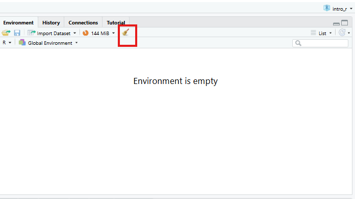
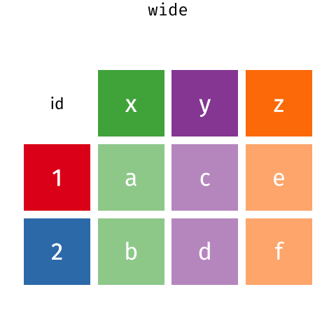
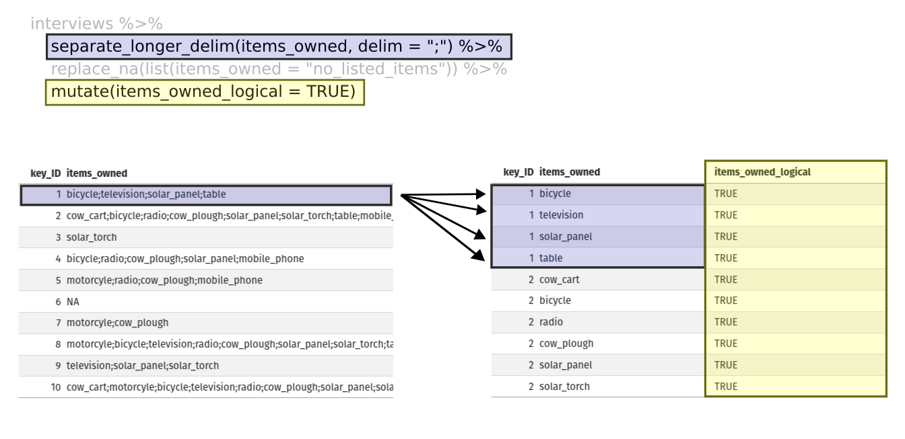

::: instructor
- Хэрэв танд `dplyr`-г харуулсан график байвал энэ хичээл илүү сайн ажиллана
тушаалууд. Та [`энэ Google слайдыг өөрчлөх боломжтой
тавцан`](https://docs.google.com/presentation/d/1A9abypFdFp8urAe9z7GCMjFr4aPeIb8mZAtJA2F7H0w/edit#slide=id.g652714585f_0_114)
мөн үүнийг семинартаа ашиглах.
- Энэ хичээлийн хувьд суралцагчид хоолой ашиглахад тухтай байгаа эсэхийг шалгаарай.
- Мөн ямар аргументуудын талаар зарим нэг төөрөгдөл байдаг
`group_by` байх ёстой бөгөөд хэзээ `filter()` болон `select()`-г ашиглах ёстой.
:::

::: objectives
- **`dplyr`** функцээр дата фреймийн тодорхой баганыг сонгоно уу
`select`.
- Шүүлтүүрийн нөхцлийн дагуу өгөгдлийн фреймийн тодорхой мөрүүдийг сонгоно уу
**`dplyr`** функцтэй `filter`.
- Нэг **`dplyr`** функцын гаралтыг нөгөөгийн оролттой холбоно уу
'хоолой' оператор `%>%`-тай функц.
- Дата фреймд одоо байгаа функцүүд болох шинэ багана нэмнэ
`mutate`-тай баганууд.
- Өгөгдлийн шинжилгээнд хуваах-хэрэглэх-комбинатлах үзэл баримтлалыг ашигла.
- Дата фреймийг хуваахын тулд `summarize`, `group_by` болон `count`-г ашиглана уу.
ажиглалтын бүлгүүд, бүлэг тус бүрийн хувьд хураангуй статистикийг ашиглах,
дараа нь үр дүнг нэгтгэнэ.
- Өргөн ба урт хүснэгтийн форматын тухай ойлголтыг тайлбарлана уу
Эдгээр форматууд нь ашигтай байдаг.
- Хувьсагчийн нэрсийн үүрэг, тэдгээртэй холбоотой утгуудыг тайлбарла
ширээг өөрчлөх үед.
- Дата фрэймийн хэлбэрийг уртаас өргөн хэлбэрт шилжүүлж, буцаана
**`tidyr`**-ын `pivot_wider` болон `pivot_longer` тушаалууд
багц.
- Дата фреймийг `.csv` файл руу экспортлох.
:::

::: questions
- Дата фреймээс тодорхой мөр ба/эсвэл баганыг хэрхэн сонгох вэ?
- Хэрхэн олон командыг нэг команд болгон нэгтгэх вэ?
- Би хэрхэн шинэ багана үүсгэх эсвэл одоо байгаа баганыг a
dataframe?
- Би өөрийн хэрэгцээг хангахын тулд өгөгдлийн хүрээг хэрхэн дахин форматлах вэ?
:::

**`dplyr`** нь хүснэгтэн мэдээлэл солилцоход хялбар болгох багц юм
гаргаж авахын тулд нэгтгэж болох хязгаарлагдмал багц функцуудыг ашиглан
өгөгдлөөсөө олж авсан мэдээллийг нэгтгэн дүгнэ. Энэ бол эмх цэгцтэй байдлын нэг хэсэг бөгөөд тийм ч юм
Хэрэв та `libary(tidyverse)`-тэй tidyverse-ийг ачаалах үед автоматаар ачаалагдана.

**`dplyr`** нь **`tidyr`**-тэй маш сайн хосолсон бөгөөд энэ нь танд хурдан шуурхай ажиллах боломжийг олгоно.
өөр өөр өгөгдлийн формат хооронд хөрвүүлэх (урт болон өргөн) график болон
шинжилгээ.

::: callout
## Анхаарна уу

**`dplyr`**, **`tidyr`** эмх цэгцтэй багцууд нь хоёуланг нь хүлээн зөвшөөрдөг.
Англи (жишээ нь * хураангуйлах*) ба америк (жишээ нь * хураангуйлах*) зөв бичгийн дүрэм
өөр өөр функц болон сонголтын нэрсийн хувилбарууд. Энэ хичээлийн хувьд бид
янз бүрийн чиг үүрэг бүхий америк үсгийг ашиглах; Гэсэн хэдий ч мэдрэх
Та зааж буй газартаа бүс нутгийн хувилбарыг үнэгүй ашиглах боломжтой.
:::

Энэхүү семинарын дараа та **`dplyr`**-ын талаар илүү ихийг мэдэхийг хүсч болно
Үүнийг үзээрэй [`**dplyr**-тай ашигтай өгөгдөл хувиргах
cheatsheet`](https://rstudio.github.io/cheatsheets/html/data-transformation.html?_gl=1*1ov7r49*_ga *MTgwMjI0NTA1LjE3NzMwMjUwNzQ.*_ga_2C0WZ1JHG0*czE3NzMyODY1ODUkbzMkZzAkdDE3NzMyODY1ODUkajYwJGwwJGgw).

Семинарын дараа **`tidyr`**-ын талаар илүү ихийг мэдэхийг хүсвэл
энийг шалгана уу [`handy data tidying with **tidyr** cheatsheet`](https://rstudio.github.io/cheatsheets/html/tidyr.html?_gl=1*1d6d96q*_ga*MTgwM jI0NTA1LjE3NzMwMjUwNzQ.*_ga_2C0WZ1JHG0*czE3NzMyODY1ODUkbzMkZzEkdDE3NzMyODcxMzkkajYwJGwwJGgw).

::: callout
## Анхаарна уу

Өгөгдлийн маргаантай холбоотой `tidyverse` багцаас өөр хувилбарууд байдаг.
багцыг оруулаад
[`data.table`](https://rdatatable.gitlab.io/data.table/). Үүнийг хар
[`comparison`](https://mgimond.github.io/rug_2019_12/Index.html) нь
Жишээ нь `base`-ийг ашиглах хоорондын ялгааг ойлгохын тулд,
`tidyverse`, `data.table`.
:::

## Талархал

Энэхүү семинарыг Дата мужааны хичээлүүдийн материалыг ашиглан тохируулсан
[`R for Social Scientists`](https://datacarpentry.github.io/r-socialsci/index.html),
ялангуяа [`lesson 03-dplyr`](https://datacarpentry.github.io/r-socialsci/03-dplyr.html),
болон [`lesson 04-tidyr`](https://datacarpentry.github.io/r-socialsci/04-tidyr.html)

## Бусад материал

[Workshop 4 слайдыг эндээс үзнэ үү](https://irimmn.sharepoint.com/:p:/s/IRIMRWorkshops/IQD8TzzpZnW6Q7_8n7MCaM-EAAXYeMs7SyqgNyvh2i4HUo8c?e=JyHKD1)

<!-- [Зөвлөгөөний 4-р бичлэгийг эндээс үзнэ үү]() -->

## Тохируулах

Өөрийн [өмнөх
workshop](https://irim-mongolia.github.io/irim-r-workshops/introduction-r-rstudio.html#getting-set-up-in-rstudio),
`intro_r` гэж нэрлэгддэг шинэ сесс. `global environment` байгаа эсэхийг шалгаарай
хоосон! Та мөн дээр дарж `global environment`-ээ "шүүрдэж" болно
`broom` дүрс тэмдэг.

{alt="Screenshot of RStudio showing the empty global environment."}

Шинэ `R Notebook` нээнэ үү: `Click File -> New File -> R Notebook`. Хадгалаарай
`R Notebook` гэх мэт утга учиртай файлын нэртэй
`manipulating_data.Rmd`, `scripts` фолдерт.

Та шинэ `R Notebook` нээх үед зарим тайлбар текстийг өгсөн болно. Энэ
устгаж болох тул та өөрийн текст болон кодыг оруулах боломжтой.

Бидний өмнө нь татсан `SAFI` өгөгдлийн багцаас уншина уу [`in a previous workshop`](https://irim-mongolia.github.io/irim-r-workshops/introduction-r-packages-markdown.html#download-data).

```{r, results="hide", purl=FALSE, message=FALSE}

## load the tidyverse
library(tidyverse)
library(here)

interviews <- read_csv(here("data", "raw", "SAFI_clean.csv"), na = "NULL")
interviews # preview the data
```

## Суралцаж байна **`dplyr`**

Бид хамгийн нийтлэг **`dplyr`** функцүүдийн заримыг сурах болно:

- `select()`: дэд багц баганууд
- `filter()`: нөхцөл дээрх дэд багц мөрүүд
- `mutate()`: бусдын мэдээллийг ашиглан шинэ багана үүсгэх
баганууд
- `group_by()` болон `summarize()`: бүлэглэсэн дээр хураангуй статистик үүсгэх
өгөгдөл
- `arrange()`: илэрцийг эрэмбэлэх
- `count()`: салангид утгыг тоолох

## Багануудыг сонгох, мөр шүүх

Датафрэймийн баганыг сонгохын тулд `select()`-г ашиглана уу. Эхний аргумент
Энэ функц нь өгөгдлийн фрейм (`interviews`) ба дараагийнх юм
аргументууд нь таслалаар тусгаарлагдсан хадгалах багана юм. Эсвэл,
Хэрэв та өөр хоорондоо зэргэлдээ багануудыг сонгож байгаа бол `:`-г ашиглаж болно
баганын мужийг сонгохын тулд "\_\_\_ баганыг сонгох" гэж уншина уу
\_\_\_."

```{r, results="hide", purl=FALSE}
# to select columns throughout the dataframe
select(interviews, village, no_membrs, months_lack_food)
# to do the same thing with subsetting
interviews[c("village","no_membrs","months_lack_food")]
# to select a series of connected columns
select(interviews, village:respondent_wall_type)
```

Тодорхой шалгуурын дагуу мөр сонгохын тулд бид `filter()`-г ашиглаж болно
функц. Датафрэймийн дараах аргумент нь бидний хүсч буй нөхцөл юм
дагаж мөрдөх эцсийн дата фрейм (жишээ нь тосгоны нэр `Chirodzo`):

```{r, purl=FALSE}
# filters observations where village name is "Chirodzo"
filter(interviews, village == "Chirodzo")
```


Мөн бид `filter()` функц дотор олон нөхцөлийг зааж өгч болно.
Бид "ба" эсвэл "эсвэл" хэллэгийг ашиглан нөхцөлүүдийг нэгтгэж болно. онд
"болон" мэдэгдэлд ажиглалт (мөр) нь **бүх** шалгуурыг хангасан байх ёстой
үр дүнгийн дата фреймд багтсан болно. Дотор нь "ба" мэдэгдлийг бий болгох
dplyr, бид хүссэн нөхцлөө `filter()`-д аргумент болгон дамжуулж болно
таслалаар тусгаарлагдсан функц:

```{r, purl=FALSE}

# filters observations with "and" operator (comma)
# output dataframe satisfies ALL specified conditions
filter(interviews, village == "Chirodzo",
                   rooms > 1,
                   no_meals > 2)
```

Мөн бид оронд нь `&` оператороор "ба" мэдэгдлийг үүсгэж болно
таслал:

```{r, purl=FALSE}
# filters observations with "&" logical operator
# output dataframe satisfies ALL specified conditions
filter(interviews, village == "Chirodzo" &
                   rooms > 1 &
                   no_meals > 2)
```

"Эсвэл" гэсэн мэдэгдэлд ажиглалт нь *дор хаяж нэгийг* хангасан байх ёстой
заасан нөхцөл. "Эсвэл" мэдэгдлийг бий болгохын тулд бид логикийг ашигладаг
босоо мөр (\|) болох "эсвэл"-ийн оператор:

```{r, purl=FALSE}
# filters observations with "|" logical operator
# output dataframe satisfies AT LEAST ONE of the specified conditions
filter(interviews, village == "Chirodzo" | village == "Ruaca")
```

## Хоолой

Хэрэв та нэгэн зэрэг сонгож, шүүхийг хүсвэл яах вэ? Гурав байна
Үүнийг хийх арга замууд: завсрын алхмууд, үүрлэсэн функцууд эсвэл хоолойг ашиглах.

Завсрын алхмуудыг хийснээр та түр зуурын дата фрейм үүсгэж, үүнийг ашиглана
Дараах функцийн оролт болгон дараах байдалтай байна:

```{r, purl=FALSE}
interviews2 <- filter(interviews, village == "Chirodzo")
interviews_ch <- select(interviews2, village:respondent_wall_type)
```

Энэ нь унших боломжтой боловч таны ажлын талбарыг олон объектоор дүүргэж болно
та тус тусад нь нэрлэх хэрэгтэй. Олон алхам хийснээр ийм байж болно
хянахад хэцүү.

Та мөн функцүүдийг (жишээ нь, нэг функцийг нөгөө функцийн дотор) үүрлэх боломжтой
энэ:

```{r, purl=FALSE}
interviews_ch <- select(filter(interviews, village == "Chirodzo"),
                         village:respondent_wall_type)
```

Энэ нь хялбар боловч хэт олон функцтэй бол уншихад хэцүү байж болно
`R` илэрхийллийг дотроос нь үнэлдэг тул үүрлэсэн (энэ тохиолдолд,
шүүж, дараа нь сонгох).

Сүүлийн сонголт бол * хоолой * юм. Хоолойнууд нь нэгнийх нь гаралтыг авах боломжийг олгодог
функц болон дараагийнх руу шууд илгээх нь танд хэрэгтэй үед хэрэг болно
нэг өгөгдлийн багцад олон зүйл хийх. Бид `tidyverse` хоолойг ашиглана
`%>%`-ийг дараах байдлаар бичиж болно:

- **ОРОН ЭХЛЭГЧ0**+**ОРН ЭХЛҮҮЛЭГЧ1**+**ОРОН ЭХЛЭГЧ2** (ОРОН ЭХЛЭГЧ3 ба ОРЛОГЧ4) эсвэл
**ОРОН ЭЗЭГЛЭГЧ0** +**ОРОН ЭХЛЭГЧ1** +**ОРОН ЭХЛЭГЧ2** (ОРОН ЭХЛЭГЧ3).

```{r, purl=FALSE}
# the following example is run using magrittr pipe but the output will be same with the native pipe
interviews %>%
    filter(village == "Chirodzo") %>%
    select(village:respondent_wall_type)

#interviews |>
#   filter(village == "Chirodzo") |>
#   select(village:respondent_wall_type)
```

Дээрх кодонд бид `interviews` өгөгдлийн багцыг илгээхийн тулд хоолойг ашигладаг
эхлээд `filter()`-р `village` `Chirodzo` байх мөрүүдийг хадгалахын тулд,
дараа нь `village`-ээс зөвхөн баганыг хадгалахын тулд `select()`-р дамжуулан
`respondent_wall_type`. `%>%` объектыг зүүн талд нь авч байгаа тул
үүнийг баруун талд байгаа функцийн эхний аргумент болгон дамжуулдаг, бид тэгдэггүй
-д аргумент болгон dataframe-г тодорхой оруулах шаардлагатай
`filter()` болон `select()` цаашид ажиллахгүй.

Зарим нь "дараа нь" гэсэн үг шиг гаансыг уншихад тустай байж магадгүй юм. Учир нь
Жишээ нь, дээрх жишээнд бид `interviews` дата фреймийг авч,
*дараа нь* бид `village == "Chirodzo"`-тэй мөрүүдэд `filter`, *дараа нь*
`select` багана `village:respondent_wall_type`. **`dplyr`**
функцууд нь зарим талаараа энгийн боловч тэдгээрийг нэгтгэснээр
хоолойтой шугаман ажлын урсгалын хувьд бид илүү төвөгтэй өгөгдлийг хийж чадна
маргаантай үйлдлүүд.

Хэрэв бид өгөгдлийн энэ жижиг хувилбараар шинэ объект үүсгэхийг хүсвэл,
Бид түүнд шинэ нэр өгч болно:

```{r, purl=FALSE}
interviews_ch <- interviews %>%
    filter(village == "Chirodzo") %>%
    select(village:respondent_wall_type)

interviews_ch

```

Эцсийн дата фрейм (`interviews_ch`) нь хамгийн зүүн хэсэг гэдгийг анхаарна уу
энэ илэрхийлэл.

:::: challenge
## Дасгал хийх

Хоолойг ашиглан `interviews`-н өгөгдлийг хаана ярилцлага оруулахаар дэд тохируулна уу
Судалгаанд оролцогчид нь усалгааны нийгэмлэгийн гишүүн байсан (ОРЧИН ЭЗЭН0) болон
зөвхөн `affect_conflicts`, `liv_count`, `no_meals` багануудыг хадгална.

::: solution
## Шийдэл

```{r}
interviews %>%
    filter(memb_assoc == "yes") %>%
    select(affect_conflicts, liv_count, no_meals)
```
:::
::::

## Мутаци хийх

Ихэнхдээ та доторх утгууд дээр тулгуурлан шинэ багана үүсгэхийг хүсэх болно
одоо байгаа баганууд, жишээ нь нэгж хөрвүүлэлт хийх, эсвэл олох
хоёр баганад байгаа утгуудын харьцаа. Үүний тулд бид `mutate()`-г ашиглана.

Бид өрхийн гишүүдийн тоо, харьцааг сонирхож магадгүй юм
Унтахад ашигладаг өрөөнүүд (өөрөөр хэлбэл нэг өрөөнд ногдох хүмүүсийн дундаж тоо):

```{r, purl=FALSE}
interviews %>%
    mutate(people_per_room = no_membrs / rooms)
```

Гишүүн байх эсэхийг судлах сонирхолтой байж магадгүй
Өрхийн гишүүдийн харьцаанд усалгааны холбоо ямар нэгэн нөлөө үзүүлсэн
өрөөнүүд рүү. Энэ харилцааг харахын тулд бид эхлээд өгөгдлийг устгах болно
эсэх гэсэн асуултад хариулагч хариулаагүй бидний мэдээллийн багц
Тэд усалгааны нийгэмлэгийн гишүүн байсан. Эдгээр тохиолдлууд
өгөгдлийн багцад `NULL` гэж бүртгэгдсэн.

Эдгээр тохиолдлыг арилгахын тулд бид `filter()`-г гинжин хэлхээнд оруулж болно:

```{r, purl=FALSE}
interviews %>%
    filter(!is.na(memb_assoc)) %>%
    mutate(people_per_room = no_membrs / rooms)
```

`!` тэмдэг нь `is.na()` функцийн үр дүнг үгүйсгэдэг. Тиймээс, хэрэв
`is.na()` нь `TRUE`-ийн утгыг буцаана (учир нь `memb_assoc` нь
байхгүй), `!` тэмдэг нь үүнийг үгүйсгэж, бид зөвхөн утгыг хүсч байна гэж хэлдэг
`memb_assoc` **дугагүй** байгаа `FALSE`.

:::: challenge
## Дасгал хийх

`interviews` өгөгдлөөс шинэ дата фрейм үүсгэнэ үү
дараах шалгуурууд: зөвхөн `village` багана болон шинэ баганыг агуулна
нийттэй тэнцүү утгыг агуулсан `total_meals` гэж нэрлэдэг
Өрхөд өдөрт дунджаар идсэн хоолны тоо (`no_membrs`
удаа `no_meals`). Зөвхөн `total_meals` нь 20-оос их байгаа мөрүүд
эцсийн өгөгдлийн фреймд харуулах ёстой.

**Зөвлөгөө**: Үүнийг гаргахын тулд тушаалуудыг хэрхэн захиалах талаар бодож үзээрэй
өгөгдлийн хүрээ!

::: solution
## Шийдэл

```{r}
interviews_total_meals <- interviews %>%
    mutate(total_meals = no_membrs * no_meals) %>%
    filter(total_meals > 20) %>%
    select(village, total_meals)
```
:::
::::

## `Split-apply-combine` өгөгдлийн шинжилгээ болон `summarize()` функц

Мэдээллийн дүн шинжилгээ хийх олон даалгаврыг ашиглан хандаж болно
*`split-apply-combine`* парадигм: өгөгдлийг бүлэг болгон хувааж, заримыг нь хэрэглээрэй
бүлэг бүрт дүн шинжилгээ хийж, дараа нь үр дүнг нэгтгэнэ. **`dplyr`** хийдэг
`group_by()` функцийг ашигласнаар энэ нь маш хялбар юм.

### `summarize()` функц

`group_by()` нь ихэвчлэн `summarize()`-тэй хамт ашиглагддаг бөгөөд энэ нь нурдаг
бүлэг бүрийг тухайн бүлгийн нэг эгнээний хураангуй болгон. `group_by()` авдаг
**категорийн** хувьсагчдыг агуулсан баганын нэрийг аргумент болгон бичнэ
Үүний тулд та хураангуй статистикийг тооцоолохыг хүсч байна. Тиймээс тооцоолох
Өрхийн дундаж хэмжээ тосгоноор:

```{r, purl=FALSE}
interviews %>%
    group_by(village) %>%
    summarize(mean_no_membrs = mean(no_membrs))
```

Та мөн олон баганаар бүлэглэж болно:

```{r, purl=FALSE}
interviews %>%
    group_by(village, memb_assoc) %>%
    summarize(mean_no_membrs = mean(no_membrs))
```

Гаралт нь гурван баганаар есөн эгнээ бүхий бүлэглэсэн tibble гэдгийг анхаарна уу
Үүнийг `#`-тэй эхний хоёр мөрөнд заана. авахын тулд
бүлэггүй tibble, `ungroup` функцийг ашиглана уу:

```{r, purl=FALSE}
interviews %>%
    group_by(village, memb_assoc) %>%
    summarize(mean_no_membrs = mean(no_membrs)) %>%
    ungroup()
```

`#`-тэй хоёр дахь мөрөнд өмнө нь тэмдэглэсэн болохыг анхаарна уу
бүлэглэл алга болж, бид одоо зөвхөн 9х3-ийн хэмжээтэй хэсэгтэй
бүлэглэх. `village` болон `membr_assoc`-ээр хоёуланг нь бүлэглэх үед бид мөрүүдийг хардаг
эсэхээ тодорхойлоогүй хариулагчдын хувьд манай хүснэгтэд а
усжуулалтын холбооны гишүүн. Бид эдгээр өгөгдлийг манайхаас хасч болно
шүүлтүүрийн алхам ашиглан хүснэгт.

```{r, purl=FALSE}
interviews %>%
    filter(!is.na(memb_assoc)) %>%
    group_by(village, memb_assoc) %>%
    summarize(mean_no_membrs = mean(no_membrs))
```

Өгөгдлийг бүлэглэсний дараа та олон хувьсагчийг товчлох боломжтой
ижил хугацаанд (мөн нэг хувьсагч дээр байх албагүй). Тухайлбал,
Бид тус бүрийн өрхийн хамгийн бага хэмжээг харуулсан багана нэмж болно
Бүлэг тус бүрийн тосгон (усжуулалтын нийгэмлэгийн гишүүд болон бусад гишүүд):

```{r, purl=FALSE}
interviews %>%
    filter(!is.na(memb_assoc)) %>%
    group_by(village, memb_assoc) %>%
    summarize(mean_no_membrs = mean(no_membrs),
              min_membrs = min(no_membrs))
```

Үүнийг шалгахын тулд асуулгын үр дүнг дахин цэгцлэх нь заримдаа ашигтай байдаг
үнэт зүйлс. Жишээлбэл, бид бүлгийг `min_membrs` дээр эрэмбэлэх боломжтой
хамгийн жижиг өрх эхлээд:

```{r, purl=FALSE}
interviews %>%
    filter(!is.na(memb_assoc)) %>%
    group_by(village, memb_assoc) %>%
    summarize(mean_no_membrs = mean(no_membrs),
              min_membrs = min(no_membrs)) %>%
    arrange(min_membrs)
```

Буурах дарааллаар эрэмбэлэхийн тулд бид `desc()` функцийг нэмэх шаардлагатай. Хэрэв бид
Өрхийн хамгийн бага хэмжээний дарааллаар үр дүнг эрэмбэлэхийг хүсч байна:

```{r, purl=FALSE}
interviews %>%
    filter(!is.na(memb_assoc)) %>%
    group_by(village, memb_assoc) %>%
    summarize(mean_no_membrs = mean(no_membrs),
              min_membrs = min(no_membrs)) %>%
    arrange(desc(min_membrs))
```

### Тоолж байна

Өгөгдөлтэй ажиллахдаа бид ажиглалтын тоог мэдэхийг хүсдэг
хүчин зүйл эсвэл хүчин зүйлийн хослол тус бүрээр олдсон. Энэ даалгаврын хувьд,
**`dplyr`** нь `count()`-ийг хангадаг. Жишээлбэл, хэрэв бид тоолохыг хүсвэл
Тосгон тус бүрийн өгөгдлийн мөрийн тоог бид хийх болно:

```{r, purl=FALSE}
interviews %>%
    count(village)
```

Тохиромжтой болгох үүднээс `count()` үр дүнд хүрэхийн тулд `sort` аргументыг өгдөг.
буурах дарааллаар:

```{r, purl=FALSE}
interviews %>%
    count(village, sort = TRUE)
```

:::::: challenge
## Дасгал хийх

Судалгаанд хамрагдсан хэдэн өрх өдөрт дунджаар хоёр удаа хооллодог вэ?
Өдөрт гурван удаа хооллох уу? Хоолны өөр тоо байгаа юу?

::: solution
## Шийдэл

```{r}
interviews %>%
   count(no_meals)
```
:::

`group_by()` болон `summarize()`-ийг ашиглан дундаж, мин, хамгийн их тоог олоорой
тосгон бүрийн өрхийн гишүүдийн тоо. Мөн тоог нэмнэ
ажиглалт (санамж: `?n`-г үзнэ үү).

::: solution
## Шийдэл

```{r}
interviews %>%
  group_by(village) %>%
  summarize(
      mean_no_membrs = mean(no_membrs),
      min_no_membrs = min(no_membrs),
      max_no_membrs = max(no_membrs),
      n = n()
  )
```
:::

Сар бүр ярилцлагад орсон хамгийн том өрх юу байсан бэ?

::: solution
## Шийдэл

```{r}
# if not already included, add month, year, and day columns
library(lubridate) # load lubridate if not already loaded
interviews %>%
    mutate(month = month(interview_date),
           day = day(interview_date),
           year = year(interview_date)) %>%
    group_by(year, month) %>%
    summarize(max_no_membrs = max(no_membrs))
```
:::
::::::

## Суралцаж байна **`tidyr`**

## `pivot_wider()` болон `pivot_longer()`-р хэлбэрээ өөрчилж байна

"Цэвэрхэн" өгөгдлийн багцыг тодорхойлох үндсэн гурван дүрэм байдаг:

1. Хувьсагч бүр өөрийн гэсэн баганатай
2. Ажиглалт бүр өөрийн гэсэн мөртэй байдаг
3. Утга бүр өөрийн нүдтэй байх ёстой

Энэхүү график нь "цэвэрлэг" байдлыг тодорхойлдог гурван дүрмийг дүрслэн харуулж байна.
өгөгдлийн багц:

 *R for Data Science*, Wickham H and
Grolemund G (<https://r4ds.had.co.nz/index.html>) © Wickham, Grolemund
2017 Энэ зургийг Attribution-NonCommercial-NoDerivs 3.0-ийн дагуу лицензжүүлсэн.
АНУ (CC-BY-NC-ND 3.0 US)

Энэ хэсэгт бид эдгээр дүрэм журамтай хэрхэн холбогдож байгааг судлах болно
Янз бүрийн өгөгдлийн форматыг судлаачид ихэвчлэн сонирхдог: "өргөн" ба
"урт". Энэхүү заавар нь таны өгөгдлийг үр дүнтэй хувиргахад тусална
анхны хэлбэрээс үл хамааран хэлбэр. Эхлээд бид чанаруудыг судлах болно
`interviews` өгөгдөл болон тэдгээр нь эдгээр өөр төрлийн мэдээлэлтэй хэрхэн холбогдож байна
өгөгдлийн форматууд.

### Урт ба өргөн мэдээллийн формат

`interviews` өгөгдлийн мөр бүр хувьсагчийн утгыг агуулна
цуглуулсан бичлэг бүртэй холбоотой (тосгонд хийсэн ярилцлага бүр).
`key_ID`-г "өвөрмөц Id өгөхийн тулд нэмсэн" гэж мэдэгджээ
ажиглалт бүр" болон `instanceID` "үүнийг мөн хийдэг боловч тийм биш
хэрэглэхэд тохиромжтой."

`key_ID` болон `instanceID` хоёулаа өвөрмөц гэдгийг бид тогтоосны дараа
Бид аль нэг хувьсагчийг 131-д тохирох танигч болгон ашиглаж болно
ярилцлагын бичлэгүүд.

```{r, purl=FALSE}
interviews %>% 
  select(key_ID) %>% 
  distinct() %>%
  nrow()
```

Доорх кодоос харахад тосгон бүрийн ярилцлагын огноо бүрт №
`instanceID` нь адилхан. Тиймээс энэ форматыг "урт" гэж нэрлэдэг.
өгөгдлийн формат, ажиглалт бүр нь зөвхөн нэг мөрийг эзэлдэг
өгөгдлийн хүрээ.

```{r, purl=FALSE}
interviews %>%
  filter(village == "Chirodzo") %>%
  select(key_ID, village, interview_date, instanceID) %>%
  sample_n(size = 10)
```

`interviews` өгөгдлийн байршил эсвэл формат нь a дотор байгааг бид анзаарч байна
1-3 дүрэмд нийцсэн формат, хаана

- багана бүр нь хувьсагч юм
- мөр бүр нь ажиглалт юм
- утга бүр өөрийн нүдтэй

Үүнийг "урт" өгөгдлийн формат гэж нэрлэдэг. Гэхдээ бид багана бүрийг анзаарч байна
өөр хувьсагчийг илэрхийлдэг. Тэнд "хамгийн урт" өгөгдлийн форматаар
зөвхөн гурван багана байх болно, нэг нь id хувьсагч, нэг нь
ажиглагдсан хувьсагч, нэг нь ажиглагдсан утгад (тэр хувьсагчийн).
Энэ өгөгдлийн формат нь нэлээд үзэмжгүй, ажиллахад хэцүү тул та
ашиглах нь ховор байх болно.

Эсвэл "өргөн" өгөгдлийн форматаар бид 1-р дүрмийн өөрчлөлтийг харж байна.
багана бүр нэг хувьсагчийг илэрхийлэхээ больсон. Үүний оронд,
багана нь хувьсагчийн янз бүрийн түвшин/утгыг илэрхийлж болно. Учир нь
Жишээ нь, зарим өгөгдөлд судлаачид сонгосон байж магадгүй
судалгааны огноо бүр өөр багана байх ёстой.

Эдгээр нь эрс өөр өгөгдлийн зохион байгуулалт шиг сонсогдож магадгүй ч бас байдаг
Эдгээр байршлын хооронд шилжих шилжилтийг илүү хялбар болгодог зарим хэрэгслүүд
Та бодож магадгүй! Доорх `gif` нь эдгээр хоёр форматтай хэрхэн холбогдож байгааг харуулж байна
Бид `R`-ыг нэгээс шилжүүлэхийн тулд хэрхэн ашиглах талаар санааг өгдөг
нөгөө рүү форматлах.



Дата фреймийн урт ба өргөн байршил нь унших чадварт голчлон нөлөөлдөг. Та олж магадгүй
Энэ нь та "өргөн" форматыг илүүд үзэж болно, учир нь та илүү ихийг харж болно
дэлгэц дээрх өгөгдлүүдийн . Гэсэн хэдий ч бидний ашигласан `R` бүх функц
Одоогоор таны өгөгдөл "урт" өгөгдлийн форматтай байна гэж найдаж байна. Энэ бол
Учир нь урт формат нь машинд илүү уншигдах боломжтой бөгөөд форматтай ойр байдаг
мэдээллийн санг форматлах.

### Өөр өөр өгөгдлийн форматыг баталгаажуулах асуултууд

Ярилцлагад мөр бүр нь холбоотой хувьсагчдын утгыг агуулна
бүртгэл тус бүр (нэгж), хариуцагчийн тосгон гэх мэт утгууд,
өрхийн гишүүдийн тоо, эсвэл тэдний байшингийн хана хэрэм байсан.
Энэ формат нь бид бие даасан судалгааны хооронд харьцуулалт хийх боломжийг олгодог.
харин өрхүүдийн ялгааг ангилж үзвэл яасан юм
өөр өөр төрлийн эд зүйлсийг эзэмшдэг үү?

Энэ харьцуулалтыг хөнгөвчлөхийн тулд бид шинэ хүснэгт үүсгэх хэрэгтэй болно
мөр бүр (нэгж) нь холбогдох хувьсагчдын утгуудаас бүрдсэн
эзэмшдэг зүйлс (жишээ нь, `items_owned`). Практик утгаараа энэ нь
`items_owned` доторх зүйлсийн үнэ цэнэ (жишээ нь: дугуй, радио, ширээ гэх мэт)
баганын хувьсагчдын нэр болж, нүднүүдэд агуулагдах болно
`TRUE` эсвэл `FALSE`-ийн утгууд, тухайн айлд тухайн зүйл байгаа эсэх.

Бид энэ шинэ хүснэгтийг үүсгэсний дараа бид харилцааг судлах боломжтой
тосгон дотор ба хооронд. Энд байгаа гол зүйл бол бид хэвээрээ байгаа явдал юм
эмх цэгцтэй өгөгдлийн бүтцийг дагаж мөрддөг боловч бид өгөгдлийг **шинэчилсэн**
сонирхсон ажиглалтын дагуу.

Өөрөөр хэлбэл, ярилцлагын огноог олон янзаар тараасан бол
багана, бид тосгон болгонд хэрхэн яаж байгааг төсөөлөхийг сонирхож байсан
услалтын зөрчил цаг хугацааны явцад өөрчлөгдсөн. Энэ нь шаардлагатай болно
ярилцлагын огноог тараахаас илүүтэйгээр нэг баганад оруулна
олон багана дээр. Тиймээс бид баганыг өөрчлөх хэрэгтэй болно
хувьсагчийн утга болгон нэрлэнэ.

Бид `tidyr` хоёр функцээр эдгээр хувиргалтыг хоёуланг нь хийж чадна.
`pivot_wider()` болон `pivot_longer()`.

## Илүү өргөн эргэлддэг

`pivot_wider()` нь гурван үндсэн аргумент авдаг:

1. `data`
2. утга нь шинэ багана болох *`names_from`* баганын хувьсагч
нэрс.
3. утгууд нь шинийг дүүргэх *`values_from`* баганын хувьсагч
баганын хувьсагчид.

Нэмэлт аргументуудад `values_fill` орсон бөгөөд хэрэв тохируулсан бол дутууг нөхнө
өгөгдсөн утга бүхий утгууд.

`pivot_wider()`-г ашиглан ярилцлагуудыг шинэ багана үүсгэхийн тулд өөрчилье
өрхийн өмчлөлийн эд зүйл тус бүрээр. Хэд хэдэн шинэ ойлголт бий
энэ хувиргалтанд байгаа тул үүнийг мөр мөрөөр нь алхцгаая. Эхлээд бид
`interviews` дээр тулгуурлан шинэ объект (`interviews_items_owned`) үүсгэ
өгөгдлийн хүрээ.

```{r, eval=FALSE}
interviews_items_owned <- interviews %>%
```

Дараа нь бид өгөгдлийн хүрээгээ уртасгах хэрэгтэй болно, учир нь бид
нэг нүдэнд олон зүйл байна. Бид шинэ функц ашиглах болно,
`separate_longer_delim()`, **`tidyr`** багцаас тусгаарлана
цэг таслал (`;`) байгаа байдал дээр үндэслэн `items_owned`-ын утгууд. The
Энэ хувьсагчийн утгууд нь цэг таслалаар тусгаарлагдсан олон зүйл байсан тул
Энэ үйлдэл нь өрхийн жагсаалтад орсон зүйл бүрийн эгнээ үүсгэдэг
эзэмшил. Тиймээс бид өгөгдлийн багцын урт форматтай хувилбартай болж байна.
хариулагч бүрийн хувьд олон эгнээтэй. Жишээлбэл, хэрэв хариуцагчид байгаа бол
зурагт болон нарны зайн хавтан, тэр хариулагч одоо хоёр эгнээтэй болно,
Нэг нь "телевизтэй", нөгөө нь "нарны хавтан"-тай
`items_owned` багана.

```{r, eval=FALSE}
separate_longer_delim(items_owned, delim = ";") %>%
```

Энэ өөрчлөлтийн дараа `items_owned` багана байгааг анзаарч магадгүй
`NA` утгыг агуулж байна. Учир нь судалгаанд оролцогчдын зарим нь тэгээгүй
ярилцлага авагчийн жагсаалтын аль нэг зүйлийг эзэмших. Бид ашиглаж болно
`replace_na()` функц нь эдгээр `NA` утгыг өөр зүйл болгон өөрчилнө
утга учиртай. `replace_na()` функц нь танд үүнийг өгөхийг хүлээж байна
`NA` утгыг солихыг хүсэж буй `list()` багана,
болон `NA`-ыг солихыг хүсэж буй утга. Энэ дуусна
иймэрхүү харагдаж байна:

```{r, eval=FALSE}
replace_na(list(items_owned = "no_listed_items")) %>%
```

Дараа нь бид `items_owned_logical` нэртэй шинэ хувьсагчийг үүсгэнэ
мөр бүрт нэг утга (`TRUE`). Энэ нь утга учиртай, учир нь бүх зүйл дотор байна
эгнээ бүр тэр айлын өмч байсан. Бид энэ хувьсагчийг бүтээж байна
Ингэснээр бид `items_owned`-г олон багананд тараахад боломжтой
эсэхийг тайлбарлах логик утгуудаар тэдгээр баганын утгыг бөглөнө үү
тухайн өрх (`TRUE`) эсвэл эзэмшээгүй (`FALSE`)
зүйл.

```{r, eval=FALSE}
mutate(items_owned_logical = TRUE) %>%
```

{alt="Two tables shown side-by-side. The first row of the left table is highlighted in blue, and the first four rows of the right table are also highlighted in blue to show how each of the values of 'items owned' are given their own row with the separate longer delim function. The 'items owned logical' column is highlighted in yellow on the right table to show how the mutate function adds a new column."}

Энэ үед бид тус бүрийн эзэмшдэг зүйлийн тоог бас тоолж болно
өрх, энэ нь `key_ID`-д ногдох мөрийн тоотой тэнцэнэ. Бид
үүнийг ажиллаж байгаа `group_by()` болон `mutate()` дамжуулах шугамаар хийж болно
Өмнөх хэсэгт хэлэлцсэн `group_by()` болон `summarize()`-тэй төстэй
анги, гэхдээ бид хураангуй хүснэгт үүсгэхийн оронд өөр нэгийг нэмэх болно
`number_items` нэртэй багана. Бид `n()` функцийг ашиглан тоолох
бүлэг тус бүрийн эгнээний тоо. Гэсэн хэдий ч бидэнд нэг бэрхшээл бий
Бүрдүүлээгүй өрхүүдийг харгалзан үзэх шаардлагатай
зүйлс. Эдгээр өрх одоо `"no_listed_items"`-ийн доор байна
`items_owned`. Бид үүнийг зүйл гэж тооцохгүй, харин харуулахыг хүсч байна
тэг зүйл. Бид **`dplyr`-н** `if_else()`-ийг ашиглан үүнийг хийж чадна
нөхцөлийг үнэлж, үнэн бол нэг утгыг буцаадаг функц ба
худал бол өөр. Энд `items_owned` багана байгаа бол
`"no_listed_items"`, дараа нь 0, эс бөгөөс мөрийн тоог буцаана
бүлэг тус бүрийг `n()` ашиглан буцаана.

```{r, eval=FALSE}
group_by(key_ID) %>% 
  mutate(number_items = if_else(items_owned == "no_listed_items", 0, n())) %>% 

```

Эцэст нь бид `pivot_wider()`-г ашиглан урт форматаас өргөн рүү шилжинэ
формат. Энэ нь доторх өвөрмөц утгууд бүрт шинэ багана үүсгэдэг
`items_owned` багана бөгөөд эдгээр баганыг утгуудаар дүүргэнэ
`items_owned_logical`. Мөн дутуу байгаа зүйлсийн хувьд бид мэдэгдэж байна.
бид тэдгээр нүднүүдийг `NA`-ийн оронд `FALSE`-ийн утгаар дүүргэхийг хүсэж байна.

```{r, eval=FALSE}
pivot_wider(names_from = items_owned,
            values_from = items_owned_logical,
            values_fill = list(items_owned_logical = FALSE))

```

{alt="Two tables shown side-by-side. The 'items owned' column is highlighted in blue on the left table, and the column names are highlighted in blue on the right table to show how the values of the 'items owned' become the column names in the output of the pivot wider function. The 'items owned logical' column is highlighted in yellow on the left table, and the values of the bicycle, television, and solar panel columns are highlighted in yellow on the right table to show how the values of the 'items owned logical' column became the values of all three of the aforementioned columns."}

Дээрх алхмуудыг хослуулснаар хэсэг нь иймэрхүү харагдаж байна. Хоёр шинэ гэдгийг анхаарна уу
баганууд нь ижил `mutate()` дуудлагын дотор үүсгэгддэг.

```{r}
interviews_items_owned <- interviews %>%
  separate_longer_delim(items_owned, delim = ";") %>%
  replace_na(list(items_owned = "no_listed_items")) %>%
  group_by(key_ID) %>%
  mutate(items_owned_logical = TRUE,
         number_items = if_else(items_owned == "no_listed_items", 0, n())) %>%
  pivot_wider(names_from = items_owned,
              values_from = items_owned_logical,
              values_fill = list(items_owned_logical = FALSE))
```

`interviews_items_owned` өгөгдлийн хүрээг харах. Энэ нь байх ёстой
`r nrow(interviews)` мөр (таны өмнө байсан мөрүүдийн тоо ижил),
гэхдээ зүйл бүрийн нэмэлт багана. Хэдэн багана нэмэгдсэн бэ? Анхаар
`items_owned` гэсэн багана байхгүй болсон. Учир нь
`pivot_wider()`-д эх хувийг унагадаг өгөгдмөл параметр байна
багана. Тэр баганад байсан утгууд одоо багана болсон
`television`, `solar_panel`, `table` гэх мэт нэртэй. Та ашиглаж болно.
`dim(interviews)` болон `dim(interviews_wide)`-ийн тоог харна уу
хоёр өгөгдлийн багцын хооронд багана өөрчлөгдсөн.

Өгөгдлийн энэ формат нь бидэнд хийх гэх мэт сонирхолтой зүйлсийг хийх боломжийг олгодог
эзэмшдэг тосгон тус бүрийн судалгаанд оролцогчдын тоог харуулсан хүснэгт
тодорхой зүйл:

```{r, purl=FALSE}
interviews_items_owned %>%
  filter(bicycle) %>%
  group_by(village) %>%
  count(bicycle)
```

Эсвэл доор нь бид эзэмшдэг жагсаалтаас байгаа зүйлийн дундаж тоог тооцоолно
Бидний үүсгэсэн `number_items` баганыг ашиглан тосгон бүрийн санал асуулга
өрх бүрээр жагсаасан зүйлсийг тоолох.

```{r, purl=FALSE}
interviews_items_owned %>%
    group_by(village) %>%
    summarize(mean_items = mean(number_items))
```

:::: challenge
## Дасгал хийх

Бид өгөгдлийн хэлбэрийг өөрчлөх замаар `interviews_items_owned`-г үүсгэсэн: эхлээд урт
дараа нь илүү өргөн. Энэ процессыг `months_lack_food`-тай давт
`interviews` датафрэймийн багана. Шинэ дата фрейм үүсгэ
логик вектороор дүүрсэн сар бүрийн багана (`TRUE` эсвэл
`FALSE`) болон `number_months_lack_food` нэртэй хураангуй багана
өрх бүр хэдэн сарын хоол хүнс дутагдаж байгааг тооцдог.

Өмнөх 12 сарын хугацаанд тухайн өрх хоол хүнсээр дутагдаж байгаагүй гэдгийг анхаарна уу.
Оруулсан утга нь `none` байсан.

::: solution
## Шийдэл

```{r}
months_lack_food <- interviews %>%
  separate_longer_delim(months_lack_food, delim = ";") %>%
  group_by(key_ID) %>%
  mutate(months_lack_food_logical = TRUE,
         number_months_lack_food = if_else(months_lack_food == "none", 0, n())) %>%
  pivot_wider(names_from = months_lack_food,
              values_from = months_lack_food_logical,
              values_fill = list(months_lack_food_logical = FALSE))
```
:::
::::

## Илүү урт эргүүлэх

Хэрэв бидэнд мэдээлэл өгсөн бол эсрэг нөхцөл байдал үүсч магадгүй юм
`interviews_wide` маягт, өмчлөлд байгаа зүйлс нь баганын нэр,
гэхдээ бид тэдгээрийг `items_owned` хувьсагчийн утга гэж үзэхийг хүсч байна
оронд нь.

Ийм нөхцөлд бид эдгээр багануудыг цуглуулж, тэдгээрийг a болгон хувиргаж байна
хос шинэ хувьсагч. Нэг хувьсагч нь баганын нэрийг утга болгон агуулна.
нөгөө хувьсагч нь нүд тус бүрийн өмнөх утгуудыг агуулна
баганын нэртэй холбоотой. Үүнийг хийхийн тулд бид хоёр алхам хийх болно
Энэ үйл явц арай ойлгомжтой.

`pivot_longer()` нь дөрвөн үндсэн аргумент авдаг:

1. `data`
2. *`cols`* нь шинэ утгыг бөглөхөд ашигладаг баганын нэрс юм
хувьсагч (эсвэл буурах).
3. *`cols`*-ээс үүсгэхийг хүссэн *`names_to`* баганын хувьсагч
өгсөн.
4. Бидний үүсгэж бөглөхийг хүссэн *`values_to`* баганын хувьсагч
өгсөн *`cols`*-тай холбоотой утгууд.

```{r, purl=FALSE}
interviews_long <- interviews_items_owned %>%
  pivot_longer(cols = bicycle:car,
               names_to = "items_owned",
               values_to = "items_owned_logical")
```

`interviews_long` болон `interviews_items_owned` хоёуланг нь харж, харьцуул
тэдгээрийн бүтэц.

:::: challenge
## Дасгал хийх

Бид `count` ашиглан `interviews_items_owned` дээр хураангуй хүснэгт үүсгэсэн
болон `summarise`. Бид `interviews_long` дээр ижил хүснэгтүүдийг үүсгэж болно, гэхдээ
энэ нь өөр процесс шаардах болно.

Өмчлөгдсөн тосгон тус бүрийн судалгаанд оролцогчдын тоог харуулсан хүснэгт гарга
тодорхой зүйл, бүх зүйлийг багтаана. Үүний ялгаа
формат ба өргөн формат нь та одоо бүх зүйлийг `count` болгож болно
`items_owned` хувьсагчийг ашиглан.

::: solution
## Шийдэл

```{r}
interviews_long %>%
  filter(items_owned_logical) %>% 
  group_by(village) %>% 
  count(items_owned)
```
:::
::::

## Өгөгдлөө цэвэрлэхийн тулд сурсан зүйлээ ашиглаж байна

Одоо бид `pivot_longer()` болон талаар нэгэн зэрэг сурсан
`pivot_wider()`, бидний өгөгдлийн бүтэцтэй холбоотой асуудлыг зассан.
Энэ өгөгдлийн багцад бид a-д олон утгыг хадгалдаг өөр баганатай байна
нэг эс. `months_lack_food` баганын зарим нүд агуулагдаж байна
өмнөх шигээ цэг таслалаар тусгаарлагдсан олон сар (`;`).

Багана бүр нь зөвхөн нэг утгыг агуулсан өгөгдлийн хүрээ үүсгэх
нүд бүрт бид `items_owned`-д ашигласан алхмуудыг давтаж, хэрэглэх боломжтой
тэдгээрийг `months_lack_food` руу оруулна. Бид энэ өгөгдлийг зураг зурахдаа ашиглаж болно
(Ирээдүйн семинарт), тиймээс бид үүнийг `interviews_plotting` гэж нэрлэх болно.

```{r, purl=FALSE}
## Plotting data ##
interviews_plotting <- interviews %>%
  ## pivot wider by items_owned
  separate_longer_delim(items_owned, delim = ";") %>%
  replace_na(list(items_owned = "no_listed_items")) %>%
  ## Use of grouped mutate to find number of rows
  group_by(key_ID) %>% 
  mutate(items_owned_logical = TRUE,
         number_items = if_else(items_owned == "no_listed_items", 0, n())) %>% 
  pivot_wider(names_from = items_owned,
              values_from = items_owned_logical,
              values_fill = list(items_owned_logical = FALSE)) %>% 
  ## pivot wider by months_lack_food
  separate_longer_delim(months_lack_food, delim = ";") %>%
  mutate(months_lack_food_logical = TRUE,
         number_months_lack_food = if_else(months_lack_food == "none", 0, n())) %>%
  pivot_wider(names_from = months_lack_food,
              values_from = months_lack_food_logical,
              values_fill = list(months_lack_food_logical = FALSE))

```

## Өгөгдлийг экспортлож байна

Одоо та **`dplyr`** болон **`tidyr`**-г хэрхэн ашиглахыг сурсан.
Түүхий өгөгдлөө маргаж байгаа бол та эдгээр шинэ өгөгдлийн багцыг экспортлохыг хүсч болно
тэдгээрийг хамтран ажиллагчидтайгаа эсвэл архивын зорилгоор хуваалцаарай.

CSV файлуудыг R руу уншихад ашигладаг `read_csv()` функцтэй адил,
өгөгдлөөс CSV файл үүсгэдэг `write_csv()` функц байдаг
хүрээ.

`write_csv()`-г ашиглахын өмнө бид шинэ хавтас үүсгэх гэж байна.
`data/cleaned`, бидний үүсгэсэн үүнийг хадгалах ажлын лавлах
Хэрэв та энэ фолдерыг [`previous workshop`]-д үүсгээгүй бол өгөгдлийн багц (https://irim-mongolia.github.io/irim-r-workshops/introduction-r-packages-markdown.html#download-data)

Бид үүсгэсэн өгөгдлийн багцыг манайхтай ижил санд бичихийг хүсэхгүй байна
түүхий өгөгдөл. Тэднийг тусад нь байлгах нь сайн туршлага юм. `data/raw`
хавтас нь зөвхөн бидний татаж авсан түүхий, өөрчлөгдөөгүй өгөгдлийг агуулсан байх ёстой
устгах эсвэл өөрчлөхгүй байхын тулд ганцаараа үлдэх ёстой. онд
Үүний эсрэгээр манай скрипт нь `data/cleaned`-ын агуулгыг үүсгэх болно
лавлах, тиймээс дотор нь байгаа файлууд устгагдсан ч бид үргэлж боломжтой
тэдгээрийг дахин үүсгэх.

Бид дараагийн хуйвалдааны хичээлдээ бэлтгэхдээ -ийн хувилбарыг бүтээсэн
багана тус бүр зөвхөн нэг өгөгдлийн утгыг агуулсан өгөгдлийн багц. Одоо
бид энэ өгөгдлийн хүрээг `data/cleaned` лавлахдаа хадгалах боломжтой.

```{r, purl=FALSE, eval=TRUE, echo=FALSE}
if (!dir.exists("data/cleaned")) dir.create("data/cleaned")
write_csv(interviews_plotting, "data/cleaned/interviews_plotting.csv")
```

```{r, purl=FALSE, eval=FALSE}
write_csv(interviews_plotting, file = "data/cleaned/interviews_plotting.csv")
```

::: keypoints
- Дата фреймийг удирдахын тулд `dplyr` багцыг ашиглана уу.
- Дата фреймээс хувьсагчийг сонгохын тулд `select()`-г ашиглана уу.
- `filter()` ашиглан утгууд дээр тулгуурлан өгөгдлийг сонгоно уу.
- Дэд багц өгөгдөлтэй ажиллахын тулд `group_by()` болон `summarize()`-г ашиглана уу.
- Шинэ хувьсагч үүсгэхийн тулд `mutate()` ашиглана уу.
- Өгөгдлийн хүрээний байршлыг өөрчлөхийн тулд `tidyr` багцыг ашиглана уу.
- Уртаас өргөн формат руу шилжихийн тулд `pivot_wider()`-г ашиглана уу.
- Өргөнөөс урт формат руу шилжихийн тулд `pivot_longer()`-г ашиглана уу.
:::