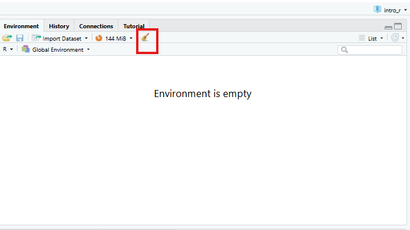

::: objectives
-   Read in data and ensure variables have the correct data type
-   Perform exploratory data analysis
-   Identify the correct statistical test for a given variable type and research question
-   Run chi-square tests, t-tests, and one-way ANOVAs in R Notebooks
-   Interpret p-values, test statistics, and effect sizes in context
-   Write clear explanatory text in R Notebooks to document analytical
    decisions
-   Recognise the assumptions underlying each test and check them in R
:::

::: questions
-   What statistical tests should I use?
-   How can I run multiple tests at once?
:::

## Other materials

[See Workshop 5 Slides
here](https://irimmn.sharepoint.com/:p:/s/IRIMRWorkshops/IQAu_EPJ2JxWSKEWpe68tf12Ac_tkOYCOrSG-ls8oE8Qcro?e=0kUTeI)

[See Workshop 5 recording here -
1](https://irimmn.sharepoint.com/:v:/s/IRIMRWorkshops/IQDDs6ewnFXFSZFVox-GZ6UrAc-0RSCVDCZGcEEp3_aZJbs?e=zdebp3)

## Dataset Overview

This workshop uses a generated (made-up) dataset containing 1005
responses to a survey on flexible working and work-life balance, with a
number of different data types.

The schema is included in the following table.

**Flexible working and work-life balance survey data schema** 

| Section | Variable | Type | Description |
|---|---|---|---|
| **A (Demographics)** | A1 – Gender | Factor (male, female) | What is your gender? |
| | A2 – Age Group | Ordered Factor (18–34, 35–54, 55+) | What is your age? |
| | A3 – Education | Ordered Factor (primary, secondary, tertiary+) | What is your highest level of education? |
| | A4 – Income | Ordered Factor (low, middle, high) | What is your annual income? |
| | A5 – Region | Factor (region 1, 2, 3) | What is your region of residence? |
| | A6 – Area Type | Factor (rural, urban) | Is your region of residence urban or rural? |
| **B (Policy Views)** | B1 | Character | What should be the main goal of flexible working policies? (Select up to 3) |
| | B1_1 | Logical | Improve employee wellbeing & work-life balance |
| | B1_2 | Logical | Boost productivity & business performance |
| | B1_3 | Logical | Attract & retain top talent |
| | B1_4 | Logical | Reduce costs & office overhead |
| | B1_5 | Logical | Support diversity, equity & inclusion |
| | B2 | Character | Who should benefit most from flexible working arrangements? (Select up to 3) |
| | B2_1 | Logical | All employees equally, regardless of role or seniority |
| | B2_2 | Logical | Parents and caregivers with dependants |
| | B2_3 | Logical | Employees with disabilities or chronic health conditions |
| | B2_4 | Logical | Junior/entry-level employees building their careers |
| | B2_5 | Logical | Senior/experienced employees with proven track records |
| | B2_6 | Logical | Employees with long commutes or remote locations |
| | B2_7 | Logical | Employees from underrepresented or marginalised groups |
| | B2_8 | Logical | High performers and those meeting targets consistently |
| **C (Satisfaction)** | C1 | Integer (1–5) | How satisfied are you with your current flexible working arrangements? (1 = least satisfied, 5 = most satisfied) |
| | C2 | Integer (1–5) | To what extent do flexible working options improve your work-life balance? (1 = very little, 5 = very much) |
| | C3 | Integer (1–5) | How strongly do you agree that your employer supports flexible working in practice? (1 = very little, 5 = very much) |
| **D (Commute)** | D1 | Numeric | What is your commute time to work in minutes? |
| | D2 | Numeric | What is your commute distance in km? |
| **E (Outcomes)** | E1 | Ordered Factor (strongly dissatisfied → strongly satisfied) | How satisfied are you with your current work-life balance? |
| | E2 | Free text | What makes you most satisfied in your personal life? |


## Set up

Start by opening up your `RStudio` project that you created in a
[previous
workshop](https://irim-mongolia.github.io/irim-r-workshops/introduction-r-rstudio.html#getting-set-up-in-rstudio),
called `intro_r`, in a new session. Ensure your `global environment` is
empty! You can also 'sweep' your `global environment` by clicking the
`broom` icon.

{alt="Screenshot of RStudio showing the empty global environment."}

Open a new `R Notebook`: `Click File -> New File -> R Notebook`. Save
your `R Notebook` with a filename that makes sense, such as
`quantitative_analysis.Rmd`, in the `scripts` folder.

When you open a new `R Notebook`, some explanatory text is provided.
This can be deleted so you can enter your own text and code.

### Load packages and download data

Download packages (if needed) and load libraries. We'll be using the
`gtsummary` package for the first time, so this will need to be
installed.

```{r  eval=TRUE, message=FALSE, purl=FALSE}
for (pkg in c("tidyverse", "here", "gtsummary", "scales", "corrplot", "epitools", "rcompanion")) {
  if (!requireNamespace(pkg, quietly = TRUE)) install.packages(pkg)
}

library(tidyverse)
library(here)
library(gtsummary) # summary tables
library(scales) # percent formatting for axes
library(corrplot) # correlation plots
library(rcompanion) # Cramér's V effect size
library(epitools) # odds ratios for 2×2 tables

```

Then, download the the generated survey dataset using the following
code:

`download.file("https://raw.githubusercontent.com/IRIM-Mongolia/irim-r-workshops/main/episodes/data/raw/generated_survey_data.csv", here("data/raw/generated_survey_data.csv"), mode = "wb")`

Then, read in the survey csv file and preview the data.

```{r read-data}

survey <- read_csv(here("data", "raw", "generated_survey_data.csv"))
                   
survey # preview the data

```

Let's inspect the dataframe and see how R classified the data types.

```{r inspect-str}

str(survey)

```

From the information available in our data schema, we know that we have
several columns that will need to be converted to factors before we can
proceed with our analysis. We'll use `mutate` and `factor` to convert
the columns as needed.

We'll start with the Demographic data in section A.

```{r convert-factors-A}
survey <- survey %>% 
  mutate(
    A1 = factor(A1,
                levels = c("female", "male")),
    A2 = factor(A2,
                levels = c("18-34", "35-54", "55+"),
                ordered = TRUE),
    A3 = factor(A3,
                levels = c("primary", "secondary", "tertiary or higher"),
                ordered = TRUE),
    A4 = factor(A4,
                levels = c("low", "middle", "high"),
                ordered = TRUE),
    A5 = factor(A5,
                levels = c("region1", "region2", "region3")),
    A6 = factor(A6,
                levels = c("Rural", "Urban"))
  )

```

Let's take a quick look at the dataframe.

```{r inspect2}

str(survey)

```

We have one more column `E1` to convert to a factor. If we're not sure
of the levels we need to set, we can use `unique` to extract the unique
responses from the column. You can use the `$` operator to subset the
column, or double brackets `[["colname"]]`.

```{r unique}

unique(survey$E1)
unique(survey[["E1"]])

```

Now let's convert `E1` to an ordered factor.

```{r convert-factors-E}

survey <- survey %>% 
  mutate(E1 = factor(E1,
                     levels = c("Strongly dissatisfied", "Dissatisfied", "Neutral", "Satisfied", "Strongly satisfied"),
                     ordered = TRUE))

```

And check column `E1`.

```{r class}
class(survey[["E1"]])
```

```{r levels}
levels(survey[["E1"]])
```

## Exploratory data analysis

Before running any statistical tests, it is important to carry out some
exploratory data analysis (EDA) to understand the structure and quality
of your data.

EDA helps you check that variables have been read in with the correct
types, identify missing values, spot unexpected categories or data entry
errors, and understand the distribution of responses across key
variables.

For categorical variables like those in the survey data, frequency
tables and proportion summaries reveal how respondents are spread across
groups, which is important, as some tests (like chi-square) require
minimum cell counts to be valid.

Let's investigate the proportion of missing data `NA` in our columns.

```{r summarise-missing}
survey %>% 
  summarise(across(everything(), ~ sum(is.na(.)))) %>% 
  pivot_longer(everything(),
               names_to  = "variable",
               values_to = "n_missing") %>% 
  mutate(pct_missing = round(n_missing / nrow(survey) * 100, 1))  %>% 
  filter(n_missing > 0) %>% 
  arrange(desc(n_missing))
```

### Frequency tables and proportions for categorical responses

Before stratifying by any grouping variable, it is useful to first
examine the overall distribution of responses across all categorical
variables in the dataset.

We'll use the function `tbl_summary()` from the `gtsummary` package to
produce a single frequency table covering every factor column,
displaying counts and column percentages for each response category.

This gives us a quick snapshot of sample composition and response
patterns, such as how respondents are distributed across age groups,
income levels, and regions.

```{r frequency}
# Overall frequency table for all factor columns
survey %>% 
  select(where(is.factor)) %>% 
  tbl_summary(
    statistic = list(all_categorical() ~ "{n} ({p}%)"), # count and proportion
    missing = "ifany" # show missing if present
  )

```


The survey data has a slightly female-majority, with a younger age distribution. We should keep this in mind when interpreting any later results that break down by gender and age.

#### Breakdown by demographics

We can also use the `tbl_summary()` function to add statistical tests by using `add_p()`.

Adding `add_p()` runs a chi-square test (or Fisher's exact test where
cell counts are small) for each categorical variable automatically, allowing us to quickly identify which variables show statistically significant
differences by gender before conducting more detailed analysis.

We'll select all of the demographics columns that start with "A", and the multi-select columns for questions "B1" and "B2".

```{r demographic-freq}
# Breakdown by demographics (section A)
survey %>% 
  select(starts_with("A"), matches("_\\d+$")) %>% 
  tbl_summary(
    by = A1,
    statistic = list(all_categorical() ~ "{n} ({p}%)"),
    missing = "ifany"
  ) %>% 
  add_p() %>% # adds chi-square/Fisher's automatically
  add_overall() %>% # adds total column
  bold_labels()
```

We can expand this code further to use a `for loop` to generate summary tables stratified by each demographic column.  We'll select all of the demographics columns that start with "A", the multi-select columns for questions `B1` and `B2`, and column `E1`.


```{r demographic-all-freq}

demo_vars <- survey %>%
  select(starts_with("A")) %>% # names of all demographic columns
  names()

tables_list <- list() # initialise empty list first

for (by_var in demo_vars) {
  row_vars <- survey %>% 
    select(starts_with("A"), matches("_\\d+$"), "E1") %>% 
    select(-all_of(by_var)) %>% 
    names()
  
  tables_list[[by_var]] <- survey %>%
    tbl_summary(
      by = all_of(by_var),
      include = all_of(row_vars),
      statistic = list(all_categorical() ~ "{n} ({p}%)"),
      missing = "ifany"
    ) %>% 
    add_p() %>% 
    add_overall() %>% 
    bold_labels() %>% 
    modify_caption(glue::glue("**Stratified by {by_var}**"))
}

# uncomment out this code when running locally
# walk(tables_list, print) # prints each table in the list


```
```{r print-1,  echo=FALSE}
print(tables_list[[1]])
```

```{r print-2,  echo=FALSE}
print(tables_list[[2]])
```

```{r print-3, echo=FALSE}
print(tables_list[[3]])
```

```{r print-4,  echo=FALSE}
print(tables_list[[4]])
```

```{r print-5,  echo=FALSE}
print(tables_list[[5]])
```

```{r print-6,  echo=FALSE}
print(tables_list[[6]])
```


We can see that there are some statistical differences when stratifying by column `A1`, gender. We'll explore these in more detail shortly.

We can also look at the mean and standard deviation of our continuous
variables, stratified by demographics. Let's loop through all demographic variables for continuous variables `D1` and`D2`. We'll make a few changes with this code- we'll only display results for the variables `D1` and`D2`, and we'll use the statistic `all_continuous`.

```{r demographic-contin results='asis'}

tables_cont_list <- list() # initialise empty list first

for (by_var in demo_vars) {
  
  tables_cont_list[[by_var]] <- survey %>%
    tbl_summary(
      by = all_of(by_var),
      include = c(D1, D2), # only these two rows
      statistic = list(
        all_continuous() ~ "{mean} ({sd})"
      ),
      digits = all_continuous() ~ 1,
      missing = "ifany",
      label = list(
        D1 ~ "D1 Commute time (minutes)",
        D2 ~ "D2 Commute distance (km)"
      )
    ) %>%
    add_p() %>%
    add_overall() %>%
    bold_labels() %>%
    modify_caption(glue::glue("**Stratified by {by_var}**"))
}

# uncomment out this code when running locally
# walk(tables_cont_list, print) # prints each table in the list

```

```{r print-1,  echo=FALSE}
print(tables_cont_list[[1]])
```

```{r print-2,  echo=FALSE}
print(tables_cont_list[[2]])
```

```{r print-3, echo=FALSE}
print(tables_cont_list[[3]])
```

```{r print-4,  echo=FALSE}
print(tables_cont_list[[4]])
```

```{r print-5,  echo=FALSE}
print(tables_cont_list[[5]])
```

```{r print-6,  echo=FALSE}
print(tables_cont_list[[6]])
```


We can see that there are some statistical differences when stratifying by column `A2`, age group. We'll explore these in more detail shortly.


::: callout
## Statistical tests used by `gtsummary`

When`add_p()` is called, `gtsummary` automatically selects a statistical
test based on the variable type and the number of groups being compared.
It defaults to conservative non-parametric tests for continuous
variables. Specifically, for continuous variables with two groups it
applies a Wilcoxon rank-sum test, and with three or more groups it
applies a Kruskal-Wallis test.

For categorical and logical variables, it uses a chi-square test,
switching automatically to Fisher's exact test when expected cell counts
are too small (typically when any cell has an expected count below 5).

These defaults can be overridden using the test argument in add_p(). For
example, specifying `test = list(all_continuous() ~ "aov")` to use ANOVA
instead of Kruskal-Wallis.

The choice of whether to accept the default or override it should be
guided by checking your distributions first. If continuous variables are
approximately normally distributed and sample sizes are adequate,
parametric tests (t-test, ANOVA) are appropriate and will generally be
more statistically powerful than their non-parametric equivalents.
:::

## Analysing multi-select data

### Proportions

Questions `B1` and `B2` allowed respondents to select more than one answer (up to 3). Each option has been dummy-coded into its own boolean column (`TRUE` = selected, `FALSE` = not selected). The raw `B1` and `B2` columns contain the original response strings and can be ignored for analysis.

Let's start by looking at the **proportion of respondents who selected each option**.

```{r multiselect-B1}
survey %>%
  select(starts_with("B1_")) %>%
  summarise(across(everything(), mean)) %>%
  pivot_longer(everything(),
               names_to  = "option",
               values_to = "proportion") %>%
  ggplot(aes(x = reorder(option, proportion), y = proportion)) +
  geom_col(fill = "steelblue") +
  geom_text(aes(label = percent(proportion, accuracy = 1)),
            hjust = -0.15, size = 3.5) +
  coord_flip() +
  scale_y_continuous(labels = percent, limits = c(0, 0.7)) +
  labs(title = "B1: Proportion of respondents selecting each option",
       x = NULL, y = "% selecting") +
  theme_minimal(base_size = 12)
```

The `reorder()` call sorts the bars from lowest to highest proportion, making it easy to rank options by popularity. `B1_1` is the most commonly selected option and `B1_2` the least- a difference worth investigating when we run chi-square tests shortly.

Let's now plot the results for `B2`.

```{r multiselect-B2}
survey %>%
  select(starts_with("B2_")) %>%
  summarise(across(everything(), mean)) %>%
  pivot_longer(everything(),
               names_to  = "option",
               values_to = "proportion") %>%
  ggplot(aes(x = reorder(option, proportion), y = proportion)) +
  geom_col(fill = "coral") +
  geom_text(aes(label = percent(proportion, accuracy = 1)),
            hjust = -0.15, size = 3.5) +
  coord_flip() +
  scale_y_continuous(labels = percent, limits = c(0, 0.6)) +
  labs(title = "B2: Proportion of respondents selecting each option",
       x = NULL, y = "% selecting") +
  theme_minimal(base_size = 12)

```

`B2_6` is the most commonly selected option and `B2_2` the least.
 
### Correlation matrix 
A correlation matrix is a useful diagnostic tool when working with multiple-response (multi-select) questions. Although each boolean column is structurally independent (meaning there is no logical rule preventing a respondent from selecting any combination of options), respondents' choices in practice often cluster together. 

We can use a correlation plot from the `corrplot` package to visualise the pairwise phi coefficients (Pearson correlation applied to 0/1 data) for all `B1` and `B2` option columns simultaneously. 

The colour hue indicates direction: blue cells mean two options tend to be co-selected, while red cells mean selecting one option is associated with not selecting the other. Colour intensity encodes strength; darker shades indicate stronger associations, paler shades near-zero relationships. 

As a practical guide, coefficients with an absolute value above 0.3 are worth flagging, and values above 0.6 suggest two options may be capturing the same underlying preference and could potentially be combined.

This step should always precede any analysis that treats the `B` section columns as independent predictors, since strong co-selection patterns can distort results if not investigated.

Let's code a `corrplot` for `B1_*` columns. As a reminder, the options were:

**Question B1:** What should be the main goal of flexible working policies? (Select up to 3) 
- B1_1: Improve employee wellbeing & work-life balance
- B1_2: Boost productivity & business performance
- B1_3: Attract & retain top talent
- B1_4: Reduce costs & office overhead
- B1_5: Support diversity, equity & inclusion

 
```{r corrplot}
survey %>%
  select(starts_with("B1_")) %>%
  mutate(across(everything(), as.integer)) %>%   # TRUE/FALSE → 1/0
  cor(method = "pearson") %>%                    # phi coefficient for binary vars
  corrplot(method = "color", type = "upper",
           addCoef.col = "black", tl.col = "black")
```

This `corrplot` demonstrates that questions `B1_1` and `B1_3` show a mild positive correlation, with a co-efficient of *0.38*, meaning respondents may be more likely to co-select these two options, while `B1_1` and `B1_5` and `B1_3` and `B1_5` show a mild negative correlation, meaning respondents may be more likely to not co-select these two options. The coefficients are all less than 0.6, but we'll keep these associations in mind.

Now let's code a `corrplot` for `B2_*` columns. As a reminder, the options were:

**Question B2:** Who should benefit most from flexible working?
(Select up to 3) 

- B2_1: All employees equally, regardless of role or seniority
- B2_2: Parents and caregivers with dependants
- B2_3: Employees with disabilities or chronic health conditions
- B2_4: Junior/entry-level employees building their careers
- B2_5: Senior/experienced employees with proven track records
- B2_6: Employees with long commutes or remote locations
- B2_7: Employees from underrepresented or marginalised groups
- B2_8: High performers and those meeting targets consistently

 
```{r corrplot2}

survey %>%
  select(starts_with("B2_")) %>%
  mutate(across(everything(), as.integer)) %>%   # TRUE/FALSE → 1/0
  cor(method = "pearson") %>%                    # phi coefficient for binary vars
  corrplot(method = "color", type = "upper",
           addCoef.col = "black", tl.col = "black")
```

Again, no coefficients are > 0.6, but we'll be mindful of any coefficients > 0.3.

## Chi-square tests of independence

The **Chi-square test of independence** (χ²) tests whether two categorical variables are associated with each other, or whether any observed differences in proportions are plausibly due to chance.

::: callout
## When to use a Chi-Square Test

- Both variables are categorical (nominal or ordinal). 
- You are testing association, not causation. 
- Each cell in your contingency table should have an expected frequency of at least 5. 
- Your sample size is reasonably large (n > 30 as a general guide).
:::

### When is the Chi-square test appropriate?

The Chi-square test of independence applies when:

1. Observations are independent: each respondent contributes exactly one row.
2. Both variables are categorical (nominal or ordinal).
3. The **expected** count in each cell of the contingency table is at least 5 (the test becomes unreliable with smaller expected counts).

We will check assumption 3 explicitly for every test by examining `chisq.test()$expected`.

### Effect size: Cramér's V

A p-value only tells us whether an association exists; it does not tell us how strong it is. **Cramér's V** is the standard effect size for Chi-square tests. It ranges from 0 (no association) to 1 (perfect association) and is comparable across tables of different sizes.

| Cramér's V | Interpretation |
|------------|----------------|
| 0.1        | Small effect   |
| 0.3        | Medium effect  |
| 0.5        | Large effect   |

We compute it with `cramerV()` from the `rcompanion` package.

### Test 1: A boolean B-item × Gender (B1_1 × A1)

Let's use the Chi-square test to answer this **Research question:** Are men and women equally likely to select option 1 of question B1?

Because `B1_1` is coded as TRUE/FALSE, we convert it to a factor before tabulating.

```{r chisq-B1-A1}

tbl_B1_A1 <- table(survey$B1_1, survey$A1)
tbl_B1_A1

chi4 <- chisq.test(tbl_B1_A1)
chi4
chi4$expected   # for a 2×2 table, four cells
cramerV(tbl_B1_A1)
```

For a 2×2 contingency table, we can also compute an **odds ratio** to express the association in a more interpretable way: the odds of selecting B1_1 for one gender relative to the other.

```{r oddsratio-B1-A1}
oddsratio(tbl_B1_A1)$measure
```

An odds ratio of 1 means equal odds for both groups. Values above 1 mean the
first row group has higher odds; values below 1 mean lower odds.


::: Callout
## Reporting checklist

When writing up Chi-square results for a report, include the following:

1. **The research question**: what association are you testing?
2. **The contingency table**: row percentages to show the pattern
3. **Test statistic and degrees of freedom**: χ²(df) = X.XX.
4. **p-value**: exact value to three decimal places (or < .001)
5. **Assumption check**: confirm expected counts ≥ 5 in all (or at least 80%) of cells
6. **Effect size**: Cramér's V with interpretation (small / medium / large)
7. **Odds ratio** if significant): identify the association
7. **Standardised residuals** (if significant): identify which cells drive the association

An example sentence:

"There was a statistically significant association between age group and the selection of   'Improve employee wellbeing & work-life balance', χ²(1) = 377.63, p-value < 0.001. Cramér's V = 0.615, indicating a large effect. 

"Age group was significantly associated with the selection of 'Improve employee wellbeing & work-life balance' as a main goal of flexible working policies (χ²(1) = 377.63, p < 0.001), with a large effect size (Cramér's V = 0.615).

Older employees had substantially lower odds of selecting this priority compared to their younger counterparts (OR = 0.055, 95% CI [0.040, 0.076]), indicating that older employees were approximately 18 times less likely to select this option than younger employees. This strong and statistically robust difference suggests that improving employee wellbeing and work-life balance is a considerably more pressing concern for younger employees."
::: 

We can expand on this code to run Chi-square, Cramér's, and odd's for all `B1_*` columns, and report the results out in an easy to read table.

### Test 2: A boolean B-item × Gender (All B1_* × A1)

```{r test2}
# Select all B1_ columns
b1_vars <- survey %>%
  select(starts_with("B1_")) %>%
  names()

results_B1_A1 <- tibble(b1_var = b1_vars) %>%
  rowwise() %>%
  mutate(
    tbl = list(table(survey[[b1_var]], survey[["A1"]])),
    chi_test = list(chisq.test(tbl)),
    n_cells_low = sum(chi_test$expected < 5),
    chi_stat = chi_test$statistic,
    chi_df = chi_test$parameter,
    chi_p = chi_test$p.value,
    cramers_v = cramerV(tbl),
    or_result = list( # run Fishers test in the event any cells are < 5
      tryCatch(
        fisher.test(tbl)$conf.int |>
          (function(ci) tibble(
            or        = fisher.test(tbl)$estimate,
            or_lower  = ci[1],
            or_upper  = ci[2]
          ))(),
        error = function(e) tibble(or = NA_real_, or_lower = NA_real_, or_upper = NA_real_)
      )
    )
  ) %>%
  unnest(or_result) %>%
  ungroup() %>%
  select(-tbl, -chi_test) %>%
  arrange(chi_p) %>%
  mutate(across(c(chi_stat, chi_p, cramers_v, or, or_lower, or_upper), ~round(., 4)))

results_B1_A1
```

::: callout
## Multiple comparisons
Running multiple chi-square tests simultaneously inflates the probability of
at least one false positive. To address this, we apply the **Benjamini-Hochberg
False Discovery Rate (FDR)** correction using p.adjust(method = "fdr"), which
controls the expected proportion of false positives among significant results.

Unlike the Bonferroni correction, which controls the probability of any
false positive and can be overly conservative when running many correlated tests, FDR offers a better balance between sensitivity and specificity, making it well suited to survey data where items tend to be correlated. Adjusted p-values are interpreted against the same α threshold of 0.05.

:::

Let's repeat our above analysis and include the **FDR correction**.

```{r test2-fdr}
results_B1_A1_fdr <- tibble(b1_var = b1_vars) %>%
  rowwise() %>%
  mutate(
    tbl = list(table(survey[[b1_var]], survey[["A1"]])),
    chi_test = list(chisq.test(tbl)),
    n_cells_low = sum(chi_test$expected < 5),
    chi_stat = chi_test$statistic,
    chi_df = chi_test$parameter,
    chi_p = chi_test$p.value,
    cramers_v = cramerV(tbl),
    or_result = list(
      tryCatch(
        fisher.test(tbl)$conf.int |>
          (function(ci) tibble(
            or = fisher.test(tbl)$estimate,
            or_lower = ci[1],
            or_upper = ci[2]
          ))(),
        error = function(e) tibble(or = NA_real_, or_lower = NA_real_, or_upper = NA_real_)
      )
    )
  ) %>%
  unnest(or_result) %>%
  ungroup() %>%
  select(-tbl, -chi_test) %>%
  mutate(chi_p_fdr = p.adjust(chi_p, method = "fdr")) %>%  # FDR correction across all tests
  arrange(chi_p_fdr) %>%
  mutate(across(c(chi_stat, chi_p, chi_p_fdr, cramers_v, or, or_lower, or_upper), ~round(., 4)))

results_B1_A1_fdr
```

Our reporting would now include the fact that the p-value was correctd.
"After FDR correction, age group remained significantly associated with the selection of 'Improve employee wellbeing & work-life balance' as a main goal of flexible working policies (χ²(1) = 377.63, p_adj < 0.001), with a large effect size (Cramér's V = 0.615).

Older employees had substantially lower odds of selecting this priority compared to their younger counterparts (OR = 0.055, 95% CI [0.040, 0.076]), indicating that older employees were approximately 18 times less likely to select this option than younger employees. This strong and statistically robust difference suggests that improving employee wellbeing and work-life balance is a considerably more pressing concern for younger employees."


### When Chi-square assumptions fail — Fisher's exact test

If any expected cell count falls below 5, the chi-square approximation becomes unreliable. This is most likely to happen with small subgroups, such as when we cross region (three levels, potentially unequal) with education (three levels) — some combinations may be rare.

```{r fisher-A5-A3}
tbl_A5_A2 <- table(survey$A5, survey$A2)
chisq.test(tbl_A5_A2)$expected   # check first
```

If any expected count is below 5, switch to Fisher's exact test (not necessary in our case, but let's write the code anyway as a demonstration). For tables larger than 2×2, base R's exact computation is impractical, so we use a Monte Carlo simulation (`simulate.p.value = TRUE`).

```{r fisher-test-monte}
fisher.test(tbl_A5_A2,
            simulate.p.value = TRUE,
            B = 10000)   # B = number of Monte Carlo replicates
```

The Monte Carlo p-value is based on 10,000 random permutations of the table and is a reliable substitute for the asymptotic chi-square approximation when cell counts are small.

For 2X2 tables, just use the Fisher's Exact Test with no simulation. Again, our expected cell counts are > 5, so this is just a demonstration.

```{r fisher-test}
tbl_A1_B1_1 <- table(survey$A1, survey$B1_1)
chisq.test(tbl_A1_B1_1)$expected   # check first

fisher.test(tbl_A1_B1_1)

```

::: callout

**Interpreting a 2×3 table**

A significant Chi-square result tells us that the overall pattern of income
differs between urban and rural areas. It does **not** tell us which specific income category drives the difference. To find that, examine the standardised residuals (see Test 3 below).

:::


### Test 3: Satisfaction × Age group (E1 × A2), with standardised residuals

**Research question:** Does overall satisfaction (E1) vary across age groups (A2)?

This test introduces a powerful diagnostic tool: **standardised residuals**.
After a significant Chi-square test, standardised residuals tell us which
cells contribute most to the result; that is, where the observed count differs
most from what we would expect under independence.

A standardised residual beyond ±2 (roughly corresponding to a two-tailed
p < 0.05) flags a cell that is "doing more than its share" of the chi-square
statistic.

```{r chisq-E1-A2}
# Note: 4 respondents have a missing E1 value; drop them with na.omit()
df_E1 <- survey %>%
  filter(!is.na(E1)) %>%
  mutate(E1 = factor(E1, levels = c(
    "Strongly dissatisfied", "Dissatisfied",
    "Neutral", "Satisfied", "Strongly satisfied"
  )))

tbl_E1_A2 <- table(df_E1$E1, df_E1$A2)

chi3 <- chisq.test(tbl_E1_A2)
chi3
chi3$expected   # check assumption
cramerV(tbl_E1_A2)
```

Now examine the standardised residuals:

```{r residuals-E1-A2}
round(chi3$stdres, 2)
```

We can also visualise them using `corrplot`, which makes the pattern immediately
apparent:

```{r residuals-plot-E1-A2, fig.width=10}
corrplot(chi3$stdres,
         is.corr = FALSE,
         method = "color",
         col = colorRampPalette(c("royalblue", "white", "firebrick"))(200),
         tl.col = "black",
         tl.srt = 45,
         tl.cex = 0.85,        # increase/decrease label size (default is 0.8)
         cl.cex = 0.85,        # match colour legend text size
         cl.ratio = 0.4,        # widens the legend bar giving labels more room
         title = "Standardised residuals: E1 satisfaction × A2 age group",
         mar = c(0, 0, 2, 0))
```

In this plot, red cells indicate that a combination is observed *more* often
than expected under independence; blue cells indicate it is observed *less*
often. Cells with residuals beyond ±2 are where the association is "happening".

Example results sentence:

"Overall satisfaction differed significantly across age groups (χ²(8) = 58.52, p < 0.001), though the association was small in magnitude (Cramér's V = 0.171). Satisfaction tended to increase with age: older employees (55+) were more likely than expected to report being satisfied (residual = 2.72) or strongly satisfied (residual = 3.01), while younger employees (18-34) were substantially more likely than expected to report strong dissatisfaction (residual = 6.07) and less likely to report satisfaction (residual = −3.26) or strong satisfaction (residual = −2.35). Employees aged 35–54 showed little deviation from expected counts, with only a modest tendency toward neutrality (residual = 2.19)."
