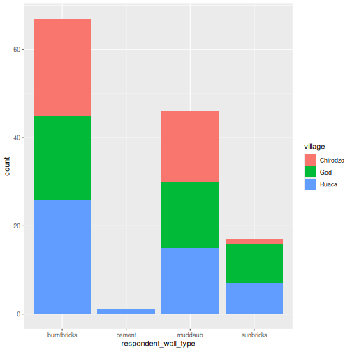
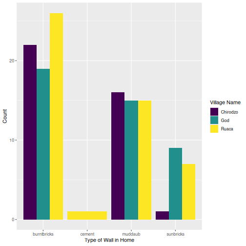

::: objectives
-   Understand what an R package is
-   Install packages using the packages tab.
-   Install packages using R code.
-   Understand basic syntax of R Markdown and R Notebooks
:::

::: questions
-   What is an R package?
-   How to install R packages?
-   What is R Markdown and R Notebooks?
-   How can I integrate my R code with text and plots?
-   How can I convert .Rmd files to .html?
:::

## Acknowledgement

This workshop was adapted using material from the Data Carpentry lessons
[R for Social
Scientists](https://datacarpentry.github.io/r-socialsci/index.html),
specifically [lesson
00-intro](https://datacarpentry.github.io/r-socialsci/00-intro.html) and
[lesson
06-rmarkdown](https://datacarpentry.github.io/r-socialsci/06-rmarkdown.html).

## Other Materials

[See Workshop 2 Slides
here](https://irimmn.sharepoint.com/:p:/s/IRIMRWorkshops/IQAqoM4BmLU6R6UjbycjaZmtAaafTMrG87jL2YfVwXwb5vc?e=FZkIgq)

## What are R packages?

[R Packages](https://r-pkgs.org/) are the fundamental units of
reproducible R code. They are collections of reusable R functions,
sample data, and the documentation that describes how to use the
functions.

## What is the difference between base R and packages?

The [“base” R
package](https://cran.r-project.org/doc/manuals/r-patched/packages/base/refman/base.html)
contains the basic functions which let R function as a language:

-   Arithmetic
-   Input/output
-   Basic programming support, etc

The R software is distributed with the `base` R package installed. In
addition to the base R installation, there are in excess of 20,000
additional packages which can be used to extend the functionality of R.
Many of these have been written by R users and have been made available
in central repositories, like the one hosted at the Comprehensive R
Archive Network
[CRAN](https://cran.r-project.org/web/packages/available_packages_by_name.html),
for anyone to download and install into their own R environment.

[CRAN](https://cran.r-project.org/#:~:text=What%20are%20R%20and%20CRAN%3F,provides%20a%20wide%20variety%20of)
is a network of ftp and web servers around the world that store
identical, up-to-date, versions of code and documentation for R.

## Installing packages using R code and the packages tab

We'll use the `tidyverse` and `here` packages in this workshop.

You can install these packages from the console by typing the command
`install.packages()`, or from the `packages` tab.

We'll install `tidyverse` from the console, and `here` from the packages
tab.


``` r
install.packages("tidyverse")
```

``` output
The following package(s) will be installed:
- tidyverse [2.0.0]
These packages will be installed into "/__w/irim-r-workshops/irim-r-workshops/renv/profiles/lesson-requirements/renv/library/linux-ubuntu-noble/R-4.5/x86_64-pc-linux-gnu".

# Installing packages --------------------------------------------------------
- Installing tidyverse 2.0.0 ...                OK [linked from cache]
Successfully installed 1 package in 5.5 milliseconds.
```

You can see if you have a package installed by looking in the `packages`
tab (on the lower-right by default). You can also type the command
`installed.packages()` into the console and examine the output.

{alt="Screenshot of Packages pane"}

Packages can also be installed from the ‘packages' tab. On the packages
tab, click the ‘Install' icon and start typing the name of the package
you want in the text box. As you type, packages matching your starting
characters will be displayed in a drop-down list so that you can select
them.

{alt="Screenshot of Install Packages Window"}

At the bottom of the Install Packages window is a check box to ‘Install'
dependencies. This is ticked by default, which is usually what you want.
Packages can (and do) make use of functionality built into other
packages, so for the functionality contained in the package you are
installing to work properly, there may be other packages which have to
be installed with them. The ‘Install dependencies' option makes sure
that this happens.

:::: challenge
## Exercise

Use the Packages tab to confirm that you have both the `tidyverse` and
`here` packages installed.

::: solution
## Solution

Scroll through packages tab down to ‘tidyverse'. You can also type a few
characters into the searchbox. The ‘tidyverse' package is really a
package of packages, including 'ggplot2' and 'dplyr', both of which
require other packages to run correctly. All of these packages will be
installed automatically. Depending on what packages have previously been
installed in your R environment, the install of ‘tidyverse' could be
very quick or could take several minutes. As the install proceeds,
messages relating to its progress will be written to the console. You
will be able to see all of the packages which are actually being
installed.
:::
::::

Because the install process accesses the CRAN repository, you will need
an Internet connection to install packages.

It is also possible to install packages from other repositories, as well
as Github or the local file system, but we won't be looking at these
options in this workshop.

## R Markdown and R Notebooks

R Markdown is a flexible type of document that allows you to seamlessly
combine executable R code, and its output, with text in a single
document.

An R Notebook is a specific interactive execution mode for an R Markdown
(Rmd) document. Code chunks are executed independently and interactively
within the RStudio editor.

R Markdown documents can be readily converted to multiple static and
dynamic output formats, including PDF (.pdf), Word (.docx), and HTML
(.html).

The benefit of a well-prepared R Markdown or Notebook document is full
reproducibility. This also means that, if you notice a data
transcription error, or you are able to add more data to your analysis,
you will be able to recompile the report without making any changes in
the actual document.


## Creating an R Notebook file

To create a new R Markdown document in RStudio, click File -\> New File
-\> R Notebook. You may be prompted to install required packages the
first time you do this.

## Basic components of an R Notebook

### YAML Header

To control the output, a YAML (YAML Ain't Markup Language) header is
needed:

```         
---
title: "My Awesome Report"
output: html_document
---
```

The header is defined by the three hyphens at the beginning (`---`) and
the three hyphens at the end (`---`).

In the YAML, the only required field is the `output:`, which specifies
the type of output you want. This can be an `html_document`, a
`pdf_document`, or a `word_document`. We will start with an HTML
document and discuss the other options later.

After the header, to begin the body of the document, you start typing
after the end of the YAML header (i.e. after the second `---`).

### Markdown syntax

Markdown is a popular markup language that allows you to add formatting
elements to text, such as **bold**, *italics*, and `code`. The
formatting will not be immediately visible in a markdown (.md) document,
like you would see in a Word document. Rather, you add Markdown syntax
to the text, which can then be converted to various other files that can
translate the Markdown syntax. Markdown is useful because it is
lightweight, flexible, and platform independent.

RStudio provides a real time preview of the formatting- click the
`Visual` tab to view the rendered markdown, or `Source` to view the raw
markdown.

#### Headings

A `#` in front of text indicates to Markdown that this text is a
heading. Adding more `#`s make the heading smaller, i.e. one `#` is a
first level heading, two `##`s is a second level heading, etc. upto the
6th level heading.

```         
# Title
## Section
### Sub-section
#### Sub-sub section
##### Sub-sub-sub section
###### Sub-sub-sub-sub section
```

(only use a level if the one above is also in use)

#### Formatting

You can make things **bold** by surrounding the word with double
asterisks, `**bold**`, or double underscores, `__bold__`; and
*italicize* using single asterisks, `*italics*`, or single underscores,
`_italics_`.

You can also combine **bold** and *italics* to write something
***really*** important with triple-asterisks, `***really***`, or
underscores, `___really___`; and, if you're feeling bold (pun intended),
you can also use a combination of asterisks and underscores,
`**_really_**`, `**_really_**`.

To create `code-type` font, surround the word with backticks,
`` `code-type` ``.

### Code Chunks

Code chunks are blocks where you write and execute R code. They start
with ```` ```{r} and end with ``` ````.

To insert a Chunk, click the small arrow next to the Insert button in
the editor toolbar and select R.

To run a Chunk, click the small green play arrow on the right side of
the chunk, or use the keyboard shortcut Ctrl + Alt + I (or Cmd +
Option + I on Mac).

#### Viewing output

Once you execute a code chunk, the results, including plots or data
summaries, will appear immediately below the code chunk within the
editor.

### Render and Share Your Notebook

Once your analysis is complete, you can generate a final, polished
report.

Click the Preview (or Render) button in the RStudio editor toolbar.

This creates a self-contained HTML file (or PDF/Word document, depending
on your settings in your YAML header) that includes both the narrative
text and the final results.

You can easily share this output file with others, even if they don't
use R.

Now that we've learned a couple of things, it might be useful to
implement them.

## Create your own new R Notebook

Start by opening a new R notebook: Click File -\> New File -\> R
Notebook

When you open a new R Notebook, some explanatory text is provided. This
can be deleted so you can enter your own text and code.

### Download data

We will be using a dataset called `SAFI_clean.csv`. The direct download
link for this file is:
<https://github.com/datacarpentry/r-socialsci/blob/main/episodes/data/SAFI_clean.csv>.
This data is a slightly cleaned up version of the SAFI Survey Results
available on
[figshare](https://figshare.com/articles/dataset/SAFI_Survey_Results/6262019).

First, we need to create a new folder called `data` to store this
dataset. Go to the Files pane, and create a new folder named `data`, and
two subfolders called `cleaned` and `raw`.

```         
intro_r
│
└── scripts
│
└── data
│    └── cleaned
│    └── raw
│
└─── images
│
└─── documents
```

You can either download the `SAFI_clean.csv` dataset used for this
workshop from the GitHub link or with R. You can download the file from
this [GitHub
link](https://github.com/datacarpentry/r-socialsci/blob/main/episodes/data/SAFI_clean.csv)
and save it as `SAFI_clean.csv` in the `data/raw` directory you just
created. Or you can do this directly from R by copying and pasting this
in your console:

`download.file(   "https://raw.githubusercontent.com/datacarpentry/r-socialsci/main/episodes/data/SAFI_clean.csv",   "data/raw/SAFI_clean.csv", mode = "wb"   )`

### Start an Introduction section

Make a header called `Introduction`, and insert some explanatory text
about the dataset that will be in your report. For example:

This report uses the **tidyverse** package along with the *SAFI*
dataset, which has columns that include:

```         
-   village
-   interview_date
-   no_members
-   years_liv
-   respondent_wall_type
-   rooms
```

You can also create an ordered list using numbers:

```         

1.  village
2.  interview_date
3.  no_members
4.  years_liv
5.  respondent_wall_type
6.  rooms
```

And nested items by tab-indenting:

```         

-   village
    -   Name of village
-   interview_date
    -   Date of interview
-   no_members
    -   How many family members lived in a house
-   years_liv
    -   How many years respondent has lived in village or neighbouring
        village
-   respondent_wall_type
    -   Type of wall of house
-   rooms
    -   Number of rooms in house
```

For more Markdown syntax see [the following reference
guide](https://www.markdownguide.org/basic-syntax).

Now we can render the document into HTML by clicking the **preview**
button in the top of the Source pane (top left). If you haven't saved
the document yet, you will be prompted to do so when you **preview** for
the first time.

### Writing an R Markdown report

Now we will add some R code to demonstrate (we will learn more about
this code in the next workshop!).

First, we need to make sure **tidyverse** is loaded. It is not enough to
load **tidyverse** from the console, we will need to load it within our
R Markdown document. The same applies to our data. To load these, we
will need to create a 'code chunk' at the top of our document (below the
YAML header).

A code chunk can be inserted by clicking Code \> Insert Chunk, or by
using the keyboard shortcuts <kbd>Ctrl</kbd>+<kbd>Alt</kbd>+<kbd>I</kbd>
on Windows and Linux, and <kbd>Cmd</kbd>+<kbd>Option</kbd>+<kbd>I</kbd>
on Mac.

The syntax of a code chunk is:


```` markdown
```{r chunk-name}
"Here is where you place the R code that you want to run."
```
````

An R Markdown document knows that this text is not part of the report
from the ```` ``` ```` that begins and ends the chunk. It also knows
that the code inside of the chunk is R code from the `r` inside of the
curly braces (`{}`). After the `r` you can add a name for the code chunk
. Naming a chunk is optional, but recommended. Each chunk name must be
unique, and only contain alphanumeric characters and `-`.


To load **tidyverse** and our `SAFI_clean.csv` file, we will insert a
chunk and call it 'setup'. Since we don't want this code or the output
to show in our rendered HTML document, we add an `include = FALSE`
option after the code chunk name (`{r setup, include = FALSE}`).


```` markdown
```{r setup, include = FALSE}
library(tidyverse)
library(here)
interviews <- read_csv(here("data/raw/SAFI_clean.csv"), na = "NULL")
```
````

::: callout
## Important Note!

The file paths you give in a .Rmd document, e.g. to load a .csv file,
are relative to the .Rmd document, **not** the project root.

We highly recommend the use of the `here()` function to keep the file
paths consistent within your project.
:::

### Insert table

Next, we will create a table which shows the average household size
grouped by `village` and `memb_assoc`. We can do this by creating a new
code chunk and calling it 'interview-tbl'. Or, you can come up with
something more creative (just remember to stick to the naming rules).

We will learn more about this code later!

To see the output, run the code chunk with the green triangle in the top
right corner of the the chunk, or with the keyboard shortcuts:
<kbd>Ctrl</kbd>+<kbd>Alt</kbd>+<kbd>C</kbd> on Windows and Linux, or
<kbd>Cmd</kbd>+<kbd>Option</kbd>+<kbd>C</kbd> on Mac.

To make sure the table is formatted nicely in our output document, we
will need to use the `kable()` function from the **knitr** package. The
`kable()` function takes the output of your R code and knits it into a
nice looking HTML table. You can also specify different aspects of the
table, e.g. the column names, a caption, etc.

Run the code chunk to make sure you get the desired output.


``` r
interviews %>%
    filter(!is.na(memb_assoc)) %>%
    group_by(village, memb_assoc) %>%
    summarize(mean_no_membrs = mean(no_membrs)) %>%
  knitr::kable(caption = "We can also add a caption.", 
               col.names = c("Village", "Member Association", 
                             "Mean Number of Members"))
```


Table: We can also add a caption.

|Village  |Member Association | Mean Number of Members|
|:--------|:------------------|----------------------:|
|Chirodzo |no                 |               8.062500|
|Chirodzo |yes                |               7.818182|
|God      |no                 |               7.133333|
|God      |yes                |               8.000000|
|Ruaca    |no                 |               7.178571|
|Ruaca    |yes                |               9.500000|

Many different R packages can be used to generate tables. Some of the
more commonly used options are listed in the table below.

| Name | Creator(s) | Description |
|------------------------|------------------------|------------------------|
| [condformat](https://condformat.sergioller.com/index.html) | [Oller Moreno (2022)](https://cran.rstudio.com/web/packages/condformat/index.html) | Apply and visualize conditional formatting to data frames in R. It renders a data frame with cells formatted according to criteria defined by rules, using a tidy evaluation syntax. |
| [DT](https://rstudio.github.io/DT/) | [Xie et al. (2023)](https://cran.r-project.org/web/packages/DT/index.html) | Data objects in R can be rendered as HTML tables using the JavaScript library 'DataTables' (typically via R Markdown or Shiny). The 'DataTables' library has been included in this R package. |
| [formattable](https://github.com/renkun-ken/formattable) | [Ren and Russell (2021)](https://cran.r-project.org/web/packages/formattable/index.html) | Provides functions to create formattable vectors and data frames. 'Formattable' vectors are printed with text formatting, and formattable data frames are printed with multiple types of formatting in HTML to improve the readability of data presented in tabular form rendered on web pages. |
| [flextable](https://davidgohel.github.io/flextable/) | [Gohel and Skintzos (2023)](https://cran.r-project.org/web/packages/flextable/index.html) | Use a grammar for creating and customizing pretty tables. The following formats are supported: 'HTML', 'PDF', 'RTF', 'Microsoft Word', 'Microsoft PowerPoint' and R 'Grid Graphics'. 'R Markdown', 'Quarto', and the package 'officer' can be used to produce the result files. |
| [gt](https://gt.rstudio.com/) | [Iannone et al. (2022)](https://cloud.r-project.org/web/packages/gt/index.html) | Build display tables from tabular data with an easy-to-use set of functions. With its progressive approach, we can construct display tables with cohesive table parts. Table values can be formatted using any of the included formatting functions. |
| [huxtable](https://hughjonesd.github.io/huxtable/) | [Hugh-Jones (2022)](https://cran.r-project.org/web/packages/huxtable/index.html) | Creates styled tables for data presentation. Export to HTML, LaTeX, RTF, 'Word', 'Excel', and 'PowerPoint'. Simple, modern interface to manipulate borders, size, position, captions, colours, text styles and number formatting. |
| [pander](https://rapporter.github.io/pander/) | [Daróczi and Tsegelskyi (2022)](https://cran.r-project.org/web/packages/pander/index.html) | Contains some functions catching all messages, 'stdout' and other useful information while evaluating R code and other helpers to return user specified text elements (e.g., header, paragraph, table, image, lists etc.) in 'pandoc' markdown or several types of R objects similarly automatically transformed to markdown format. |
| [pixiedust](https://pixiedust.github.io/pixiedust/) | [Nutter and Kretch (2021)](https://cran.rstudio.com/web/packages/pixiedust/index.html) | 'pixiedust' provides tidy data frames with a programming interface intended to be similar to 'ggplot2's system of layers with fine-tuned control over each cell of the table. |
| [reactable](https://glin.github.io/reactable/) | [Lin et al. (2023)](https://cran.r-project.org/web/packages/reactable/index.html) | Interactive data tables for R, based on the 'React Table' JavaScript library. Provides an HTML widget that can be used in 'R Markdown' or 'Quarto' documents, 'Shiny' applications, or viewed from an R console. |
| [rhandsontable](http://jrowen.github.io/rhandsontable/) | [Owen et al. (2021)](https://cran.r-project.org/web/packages/rhandsontable/index.html) | An R interface to the 'Handsontable' JavaScript library, which is a minimalist Excel-like data grid editor. |
| [stargazer](https://github.com/cran/stargazer) | [Hlavac (2022)](https://cran.r-project.org/web/packages/stargazer/index.html) | Produces LaTeX code, HTML/CSS code and ASCII text for well-formatted tables that hold regression analysis results from several models side-by-side, as well as summary statistics. |
| [tables](https://github.com/dmurdoch/tables) | [Murdoch (2022)](https://cran.r-project.org/web/packages/tables/index.html) | Computes and displays complex tables of summary statistics. Output may be in LaTeX, HTML, plain text, or an R matrix for further processing. |
| [tangram](https://github.com/spgarbet/tangram) | [Garbett et al. (2023)](https://cran.r-project.org/web/packages/tangram/index.html) | Provides an extensible formula system to quickly and easily create production quality tables. The processing steps are a formula parser, statistical content generation from data defined by a formula, and rendering into a table. |
| [xtable](https://github.com/cran/xtable) | [Dahl et al. (2019)](https://cran.r-project.org/web/packages/xtable/index.html) | Coerce data to LaTeX and HTML tables. |
| [ztable](https://github.com/cardiomoon/ztable) | [Moon (2021)](https://cran.r-project.org/web/packages/ztable/index.html) | Makes zebra-striped tables (tables with alternating row colors) in LaTeX and HTML formats easily from a data.frame, matrix, lm, aov, anova, glm, coxph, nls, fitdistr, mytable and cbind.mytable objects. |

### Customising chunk output

We mentioned using `include = FALSE` in a code chunk to prevent the code
and output from printing in the knitted document. There are additional
options available to customise how the code-chunks are presented in the
output document. The options are entered in the code chunk after
`chunk-name` and separated by commas, e.g.
`{r chunk-name, eval = FALSE, echo = TRUE}`.

| Option | Options | Output |
|------------------------|------------------------|------------------------|
| `eval` | `TRUE` or `FALSE` | Whether or not the code within the code chunk should be run. |
| `echo` | `TRUE` or `FALSE` | Choose if you want to show your code chunk in the output document. `echo = TRUE` will show the code chunk. |
| `include` | `TRUE` or `FALSE` | Choose if the output of a code chunk should be included in the document. `FALSE` means that your code will run, but will not show up in the document. |
| `warning` | `TRUE` or `FALSE` | Whether or not you want your output document to display potential warning messages produced by your code. |
| `message` | `TRUE` or `FALSE` | Whether or not you want your output document to display potential messages produced by your code. |
| `fig.align` | `default`, `left`, `right`, `center` | Where the figure from your R code chunk should be output on the page |

:::: challenge
## Exercise

Play around with the different options in the chunk with the code for
the table, and see what each option does to the output.

What happens if you use `eval = FALSE` and `echo = FALSE`? What is the
difference between this and `include = FALSE`?

::: solution
## Solution to Exercise

Create a chunk with `{r eval = FALSE, echo = FALSE}`, then create
another chunk with `{r include = FALSE}` to compare. `eval = FALSE` and
`echo = FALSE` will neither run the code in the chunk, nor show the code
in the knitted document. The code chunk essentially doesn't exist in the
rendered document as it was never run. Whereas `include = FALSE` will
run the code and store the output for later use.
:::
::::

### In-line R code

Now we will use some in-line R code to present some descriptive
statistics. To use in-line R-code, we use the same backticks that we
used in the Markdown section, with an `r` to specify that we are
generating R-code. The difference between in-line code and a code chunk
is the number of backticks. In-line R code uses one backtick
(`` `r` ``), whereas code chunks use three backticks
(```` ```r``` ````).

For example, today's date is ``` `r Sys.Date()` ```, will be
rendered as: today's date is 2026-02-24.\
The code will display today's date in the output document (well,
technically the date the document was last knitted).

The best way to use in-line R code, is to minimise the amount of code
you need to produce the in-line output by preparing the output in code
chunks. Let's say we're interested in presenting the average household
size in a village.


``` r
# create a summary data frame with the mean household size by village
mean_household <- interviews %>%
    group_by(village) %>%
    summarize(mean_no_membrs = mean(no_membrs))

# and select the village we want to use
mean_chirodzo <- mean_household %>%
  filter(village == "Chirodzo")
```

Now we can make an informative statement on the means of each village,
and include the mean values as in-line R-code. For example:

The average household size in the village of Chirodzo is
``` `r round(mean_chirodzo$mean_no_membrs, 2)` ```

becomes...

The average household size in the village of Chirodzo is
7.08.

Because we are using in-line R code instead of the actual values, we
have created a dynamic document that will automatically update if we
make changes to the dataset and/or code chunks.

## Plots

Finally, we will also include a plot, so our document is a little more
colourful and a little less boring. We will create some code to use in
the plotting.


``` r
interviews_plotting <- interviews %>%
  ## pivot wider by items_owned
  separate_rows(items_owned, sep = ";") %>%
  ## if there were no items listed, changing NA to no_listed_items
  replace_na(list(items_owned = "no_listed_items")) %>%
  mutate(items_owned_logical = TRUE) %>%
  pivot_wider(names_from = items_owned, 
              values_from = items_owned_logical, 
              values_fill = list(items_owned_logical = FALSE)) %>%
  ## pivot wider by months_lack_food
  separate_rows(months_lack_food, sep = ";") %>%
  mutate(months_lack_food_logical = TRUE) %>%
  pivot_wider(names_from = months_lack_food, 
              values_from = months_lack_food_logical, 
              values_fill = list(months_lack_food_logical = FALSE)) %>%
  ## add some summary columns
  mutate(number_months_lack_food = rowSums(select(., Jan:May))) %>%
  mutate(number_items = rowSums(select(., bicycle:car)))
```


``` r
interviews_plotting %>%
  ggplot(aes(x = respondent_wall_type)) +
  geom_bar(aes(fill = village))
```



We can also create a caption with the chunk option `fig.cap`.


``` r
interviews_plotting %>%
  ggplot(aes(x = respondent_wall_type)) +
  geom_bar(aes(fill = village), position = "dodge") + 
  labs(x = "Type of Wall in Home", y = "Count", fill = "Village Name") +
  scale_fill_viridis_d() # add colour deficient friendly palette
```

<div class="figure" style="text-align: center">

<p class="caption">I made this plot!</p>
</div>

## Other output options

You can convert R Markdown to a PDF or a Word document (among others).
Click the little triangle next to the **Preview** button to get a
drop-down menu. Or you could put `pdf_document` or `word_document` in
the initial header of the file.

```         
---
title: "My Awesome Report"
author: "Author name"
date: ""
output: word_document
---
```

::: callout
## Note: Creating PDF documents

Creating .pdf documents may require installation of some extra software.
The R package `tinytex` provides some tools to help make this process
easier for R users. With `tinytex` installed, run
`tinytex::install_tinytex()` to install the required software (you'll
only need to do this once) and then when you **Knit** to pdf `tinytex`
will automatically detect and install any additional LaTeX packages that
are needed to produce the pdf document. Visit the [tinytex
website](https://yihui.org/tinytex/) for more information.
:::

::: callout
## Note: Inserting citations into an R Markdown file

It is possible to insert citations into an R Markdown file using the
editor toolbar. The editor toolbar includes commonly seen formatting
buttons generally seen in text editors (e.g., bold and italic buttons).
The toolbar is accessible by using the settings dropdown menu (next to
the 'Preview' dropdown menu) to select 'Use Visual Editor', also
accessible through the shortcut 'Crtl+Shift+F4'. From here, clicking
'Insert' allows 'Citation' to be selected (shortcut: 'Crtl+Shift+F8').
For example, searching '10.1007/978-3-319-24277-4' in 'From DOI' and
inserting will provide the citation for `ggplot2` [@wickham2016]. This
will also save the citation(s) in 'references.bib' in the current
working directory. Visit the [R Studio
website](https://rstudio.github.io/visual-markdown-editing/) for more
information. Tip: obtaining citation information from relevant packages
can be done by using `citation("package")`.
:::

## Resources

-   [R Markdown documentation](https://rmarkdown.rstudio.com)
-   [R Markdown cheat
    sheet](https://github.com/rstudio/cheatsheets/blob/master/rmarkdown-2.0.pdf)
-   [Getting started with R
    Markdown](https://www.rstudio.com/resources/webinars/getting-started-with-r-markdown/)
-   [Introduction to R
    Markdown](https://rmarkdown.rstudio.com/lesson-1.html?_gl=1*1e2p8mh*_up*MQ..*_ga*MjExNzU1MjM2NS4xNzcwOTEwMTgx*_ga_X64JZVV9NC*czE3NzA5MTAxODAkbzEkZzEkdDE3NzA5MTAyMDgkajMyJGwwJGgw)
-   [R Markdown: The Definitive
    Guide](https://bookdown.org/yihui/rmarkdown/) (book by Rstudio team)

::: keypoints
-   Use `install.packages()` to install packages (libraries)
-   Use `library()` to load packages
-   R Markdown is a useful language for creating reproducible documents
    combining text and executable R-code
-   Specify chunk options to control formatting of the output document
:::
