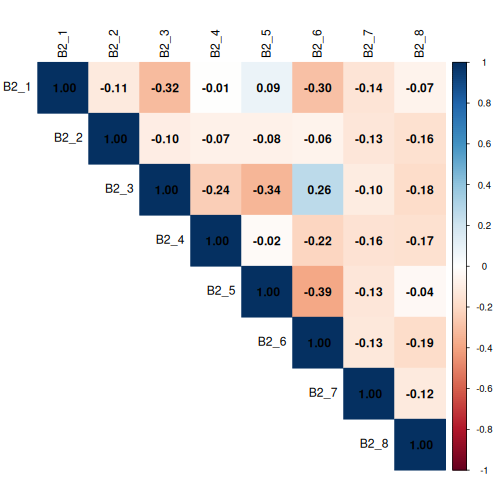

::: objectives
-   Read in data and ensure variables have the correct data type
-   Perform exploratory data analysis
-   Identify the correct statistical test for a given variable type and research question
-   Run chi-square tests, t-tests, and one-way ANOVAs in R Notebooks
-   Interpret p-values, test statistics, and effect sizes in context
-   Write clear explanatory text in R Notebooks to document analytical
    decisions
-   Recognise the assumptions underlying each test and check them in R
:::

::: questions
-   What statistical tests should I use?
-   How can I run multiple tests at once?
:::

## Other materials

[See Workshop 5 Slides
here](https://irimmn.sharepoint.com/:p:/s/IRIMRWorkshops/IQAu_EPJ2JxWSKEWpe68tf12Ac_tkOYCOrSG-ls8oE8Qcro?e=0kUTeI)

[See Workshop 5 recording here -
1](https://irimmn.sharepoint.com/:v:/s/IRIMRWorkshops/IQDDs6ewnFXFSZFVox-GZ6UrAc-0RSCVDCZGcEEp3_aZJbs?e=zdebp3)

## Dataset Overview

This workshop uses a generated (made-up) dataset containing 1005
responses to a survey on flexible working and work-life balance, with a
number of different data types.

The schema is included in the following table.

**Flexible working and work-life balance survey data schema** 

| Section | Variable | Type | Description |
|---|---|---|---|
| **A (Demographics)** | A1 – Gender | Factor (male, female) | What is your gender? |
| | A2 – Age Group | Ordered Factor (18–34, 35–54, 55+) | What is your age? |
| | A3 – Education | Ordered Factor (primary, secondary, tertiary+) | What is your highest level of education? |
| | A4 – Income | Ordered Factor (low, middle, high) | What is your annual income? |
| | A5 – Region | Factor (region 1, 2, 3) | What is your region of residence? |
| | A6 – Area Type | Factor (rural, urban) | Is your region of residence urban or rural? |
| **B (Policy Views)** | B1 | Character | What should be the main goal of flexible working policies? (Select up to 3) |
| | B1_1 | Logical | Improve employee wellbeing & work-life balance |
| | B1_2 | Logical | Boost productivity & business performance |
| | B1_3 | Logical | Attract & retain top talent |
| | B1_4 | Logical | Reduce costs & office overhead |
| | B1_5 | Logical | Support diversity, equity & inclusion |
| | B2 | Character | Who should benefit most from flexible working arrangements? (Select up to 3) |
| | B2_1 | Logical | All employees equally, regardless of role or seniority |
| | B2_2 | Logical | Parents and caregivers with dependants |
| | B2_3 | Logical | Employees with disabilities or chronic health conditions |
| | B2_4 | Logical | Junior/entry-level employees building their careers |
| | B2_5 | Logical | Senior/experienced employees with proven track records |
| | B2_6 | Logical | Employees with long commutes or remote locations |
| | B2_7 | Logical | Employees from underrepresented or marginalised groups |
| | B2_8 | Logical | High performers and those meeting targets consistently |
| **C (Satisfaction)** | C1 | Integer (1–5) | How satisfied are you with your current flexible working arrangements? (1 = least satisfied, 5 = most satisfied) |
| | C2 | Integer (1–5) | To what extent do flexible working options improve your work-life balance? (1 = very little, 5 = very much) |
| | C3 | Integer (1–5) | How strongly do you agree that your employer supports flexible working in practice? (1 = very little, 5 = very much) |
| **D (Commute)** | D1 | Numeric | What is your commute time to work in minutes? |
| | D2 | Numeric | What is your commute distance in km? |
| **E (Outcomes)** | E1 | Ordered Factor (strongly dissatisfied → strongly satisfied) | How satisfied are you with your current work-life balance? |
| | E2 | Free text | What makes you most satisfied in your personal life? |


## Set up

Start by opening up your `RStudio` project that you created in a
[previous
workshop](https://irim-mongolia.github.io/irim-r-workshops/introduction-r-rstudio.html#getting-set-up-in-rstudio),
called `intro_r`, in a new session. Ensure your `global environment` is
empty! You can also 'sweep' your `global environment` by clicking the
`broom` icon.

{alt="Screenshot of RStudio showing the empty global environment."}

Open a new `R Notebook`: `Click File -> New File -> R Notebook`. Save
your `R Notebook` with a filename that makes sense, such as
`quantitative_analysis.Rmd`, in the `scripts` folder.

When you open a new `R Notebook`, some explanatory text is provided.
This can be deleted so you can enter your own text and code.

### Load packages and download data

Download packages (if needed) and load libraries. We'll be using the
`gtsummary` package for the first time, so this will need to be
installed.


``` r
for (pkg in c("tidyverse", "here", "gtsummary", "scales", "corrplot", "epitools", "rcompanion")) {
  if (!requireNamespace(pkg, quietly = TRUE)) install.packages(pkg)
}
```

``` output
- Querying repositories for available source packages ... Done!
The following package(s) will be installed:
- bigD       [0.3.1]
- bitops     [1.0-9]
- cards      [0.7.1]
- cardx      [0.3.2]
- gt         [1.3.0]
- gtsummary  [2.5.0]
- juicyjuice [0.1.0]
- reactable  [0.4.5]
- reactR     [0.6.1]
These packages will be installed into "/__w/irim-r-workshops/irim-r-workshops/renv/profiles/lesson-requirements/renv/library/linux-ubuntu-noble/R-4.5/x86_64-pc-linux-gnu".

# Downloading packages -------------------------------------------------------
✔ bitops 1.0-9                             [11 kB in 0.23s]
✔ cards 0.7.1                              [321 kB in 0.28s]
✔ reactR 0.6.1                             [712 kB in 0.29s]
✔ juicyjuice 0.1.0                         [1.1 MB in 0.32s]
✔ bigD 0.3.1                               [1.3 MB in 0.33s]
✔ cardx 0.3.2                              [200 kB in 0.35s]
✔ reactable 0.4.5                          [981 kB in 0.39s]
✔ gtsummary 2.5.0                          [935 kB in 0.4s]
✔ gt 1.3.0                                 [3.4 MB in 0.42s]
Successfully downloaded 9 packages in 0.7 seconds.

# Installing packages --------------------------------------------------------
✔ juicyjuice 0.1.0                         [built from source in 5.5s]
✔ bitops 1.0-9                             [built from source in 7.0s]
✔ reactR 0.6.1                             [built from source in 6.8s]
✔ cards 0.7.1                              [built from source in 18s]
✔ reactable 0.4.5                          [built from source in 9.4s]
✔ bigD 0.3.1                               [built from source in 28s]
✔ cardx 0.3.2                              [built from source in 11s]
✔ gt 1.3.0                                 [built from source in 18s]
✔ gtsummary 2.5.0                          [built from source in 9.2s]
Successfully installed 9 packages in 55 seconds.
The following package(s) will be installed:
- corrplot [0.95]
These packages will be installed into "/__w/irim-r-workshops/irim-r-workshops/renv/profiles/lesson-requirements/renv/library/linux-ubuntu-noble/R-4.5/x86_64-pc-linux-gnu".

# Downloading packages -------------------------------------------------------
✔ corrplot 0.95                            [3.7 MB in 0.24s]
Successfully downloaded 1 package in 0.49 seconds.

# Installing packages --------------------------------------------------------
✔ corrplot 0.95                            [built from source in 2.1s]
Successfully installed 1 package in 2.2 seconds.
The following package(s) will be installed:
- epitools [0.5-10.1]
These packages will be installed into "/__w/irim-r-workshops/irim-r-workshops/renv/profiles/lesson-requirements/renv/library/linux-ubuntu-noble/R-4.5/x86_64-pc-linux-gnu".

# Downloading packages -------------------------------------------------------
✔ epitools 0.5-10.1                        [91 kB in 0.42s]
Successfully downloaded 1 package in 0.68 seconds.

# Installing packages --------------------------------------------------------
✔ epitools 0.5-10.1                        [built from source in 3.8s]
Successfully installed 1 package in 3.9 seconds.
The following package(s) will be installed:
- coin         [1.4-3]
- DescTools    [0.99.60]
- e1071        [1.7-17]
- Exact        [3.3]
- expm         [1.0-0]
- gld          [2.6.8]
- libcoin      [1.0-12]
- lmom         [3.3]
- lmtest       [0.9-40]
- matrixStats  [1.5.0]
- modeltools   [0.2-24]
- multcomp     [1.4-30]
- multcompView [0.1-11]
- mvtnorm      [1.3-7]
- nortest      [1.0-4]
- plyr         [1.8.9]
- proxy        [0.4-29]
- rcompanion   [2.5.2]
- rootSolve    [1.8.2.4]
- sandwich     [3.1-1]
- TH.data      [1.1-5]
- zoo          [1.8-15]
These packages will be installed into "/__w/irim-r-workshops/irim-r-workshops/renv/profiles/lesson-requirements/renv/library/linux-ubuntu-noble/R-4.5/x86_64-pc-linux-gnu".

# Downloading packages -------------------------------------------------------
✔ nortest 1.0-4                            [6 kB in 0.4s]
✔ e1071 1.7-17                             [318 kB in 0.41s]
✔ plyr 1.8.9                               [401 kB in 0.41s]
✔ gld 2.6.8                                [55 kB in 0.44s]
✔ multcompView 0.1-11                      [157 kB in 0.44s]
✔ matrixStats 1.5.0                        [212 kB in 36s]
✔ lmom 3.3                                 [347 kB in 0.45s]
✔ coin 1.4-3                               [1.0 MB in 0.47s]
✔ zoo 1.8-15                               [806 kB in 66s]
✔ Exact 3.3                                [45 kB in 76s]
✔ proxy 0.4-29                             [71 kB in 46s]
✔ lmtest 0.9-40                            [230 kB in 40s]
✔ libcoin 1.0-12                           [866 kB in 62s]
✔ sandwich 3.1-1                           [1.4 MB in 0.51s]
✔ mvtnorm 1.3-7                            [976 kB in 0.53s]
✔ expm 1.0-0                               [141 kB in 0.53s]
✔ rootSolve 1.8.2.4                        [504 kB in 0.54s]
✔ multcomp 1.4-30                          [689 kB in 0.54s]
✔ modeltools 0.2-24                        [15 kB in 0.55s]
✔ rcompanion 2.5.2                         [162 kB in 0.56s]
✔ DescTools 0.99.60                        [2.7 MB in 0.57s]
✔ TH.data 1.1-5                            [8.6 MB in 0.67s]
Successfully downloaded 22 packages in 0.97 seconds.

# Installing packages --------------------------------------------------------
✔ modeltools 0.2-24                        [built from source in 13s]
✔ lmom 3.3                                 [built from source in 22s]
✔ multcompView 0.1-11                      [built from source in 9.1s]
✔ expm 1.0-0                               [built from source in 29s]
✔ nortest 1.0-4                            [built from source in 6.8s]
✔ proxy 0.4-29                             [built from source in 15s]
✔ mvtnorm 1.3-7                            [built from source in 30s]
✔ matrixStats 1.5.0                        [built from source in 1.1m]
✔ TH.data 1.1-5                            [built from source in 15s]
✔ plyr 1.8.9                               [built from source in 39s]
✔ rootSolve 1.8.2.4                        [built from source in 38s]
✔ libcoin 1.0-12                           [built from source in 20s]
✔ zoo 1.8-15                               [built from source in 26s]
✔ e1071 1.7-17                             [built from source in 27s]
✔ Exact 3.3                                [built from source in 14s]
✔ lmtest 0.9-40                            [built from source in 12s]
✔ sandwich 3.1-1                           [built from source in 14s]
✔ gld 2.6.8                                [built from source in 12s]
✔ multcomp 1.4-30                          [built from source in 9.6s]
✔ coin 1.4-3                               [built from source in 15s]
✔ DescTools 0.99.60                        [built from source in 53s]
✔ rcompanion 2.5.2                         [built from source in 9.7s]
Successfully installed 22 packages in 170 seconds.
```

``` r
library(tidyverse)
library(here)
library(gtsummary) # summary tables
library(scales) # percent formatting for axes
library(corrplot) # correlation plots
library(rcompanion) # Cramér's V effect size
library(epitools) # odds ratios for 2×2 tables
```

Then, download the the generated survey dataset using the following
code:

`download.file("https://raw.githubusercontent.com/IRIM-Mongolia/irim-r-workshops/main/episodes/data/raw/generated_survey_data.csv", here("data/raw/generated_survey_data.csv"), mode = "wb")`

Then, read in the survey csv file and preview the data.


``` r
survey <- read_csv(here("data", "raw", "generated_survey_data.csv"))
```

``` output
Rows: 1005 Columns: 28
── Column specification ────────────────────────────────────────────────────────
Delimiter: ","
chr (10): A1, A2, A3, A4, A5, A6, B1, B2, E1, E2
dbl  (5): C1, C2, C3, D1, D2
lgl (13): B1_1, B1_2, B1_3, B1_4, B1_5, B2_1, B2_2, B2_3, B2_4, B2_5, B2_6, ...

ℹ Use `spec()` to retrieve the full column specification for this data.
ℹ Specify the column types or set `show_col_types = FALSE` to quiet this message.
```

``` r
survey # preview the data
```

``` output
# A tibble: 1,005 × 28
   A1    A2    A3    A4    A5    A6    B1    B1_1  B1_2  B1_3  B1_4  B1_5  B2   
   <chr> <chr> <chr> <chr> <chr> <chr> <chr> <lgl> <lgl> <lgl> <lgl> <lgl> <chr>
 1 male  18-34 seco… low   regi… Urban <NA>  FALSE FALSE FALSE FALSE FALSE 1 4 7
 2 male  35-54 seco… midd… regi… Rural 2 4 5 FALSE TRUE  FALSE TRUE  TRUE  1 4 6
 3 fema… 35-54 tert… low   regi… Rural 2 3 4 FALSE TRUE  TRUE  TRUE  FALSE 3 6 7
 4 male  18-34 tert… low   regi… Urban 5     FALSE FALSE FALSE FALSE TRUE  3 5 8
 5 male  35-54 seco… high  regi… Rural 5     FALSE FALSE FALSE FALSE TRUE  2 5 6
 6 fema… 18-34 tert… high  regi… Urban 1 3 5 TRUE  FALSE TRUE  FALSE TRUE  3 6  
 7 male  35-54 seco… high  regi… Urban 2 4 5 FALSE TRUE  FALSE TRUE  TRUE  2 6 7
 8 fema… 18-34 tert… midd… regi… Rural 3 4 5 FALSE FALSE TRUE  TRUE  TRUE  6 7 8
 9 male  18-34 tert… low   regi… Urban 2 4   FALSE TRUE  FALSE TRUE  FALSE 2 5 8
10 male  18-34 prim… midd… regi… Urban 5     FALSE FALSE FALSE FALSE TRUE  5 8  
# ℹ 995 more rows
# ℹ 15 more variables: B2_1 <lgl>, B2_2 <lgl>, B2_3 <lgl>, B2_4 <lgl>,
#   B2_5 <lgl>, B2_6 <lgl>, B2_7 <lgl>, B2_8 <lgl>, C1 <dbl>, C2 <dbl>,
#   C3 <dbl>, D1 <dbl>, D2 <dbl>, E1 <chr>, E2 <chr>
```

Let's inspect the dataframe and see how R classified the data types.


``` r
str(survey)
```

``` output
spc_tbl_ [1,005 × 28] (S3: spec_tbl_df/tbl_df/tbl/data.frame)
 $ A1  : chr [1:1005] "male" "male" "female" "male" ...
 $ A2  : chr [1:1005] "18-34" "35-54" "35-54" "18-34" ...
 $ A3  : chr [1:1005] "secondary" "secondary" "tertiary or higher" "tertiary or higher" ...
 $ A4  : chr [1:1005] "low" "middle" "low" "low" ...
 $ A5  : chr [1:1005] "region3" "region1" "region1" "region3" ...
 $ A6  : chr [1:1005] "Urban" "Rural" "Rural" "Urban" ...
 $ B1  : chr [1:1005] NA "2 4 5" "2 3 4" "5" ...
 $ B1_1: logi [1:1005] FALSE FALSE FALSE FALSE FALSE TRUE ...
 $ B1_2: logi [1:1005] FALSE TRUE TRUE FALSE FALSE FALSE ...
 $ B1_3: logi [1:1005] FALSE FALSE TRUE FALSE FALSE TRUE ...
 $ B1_4: logi [1:1005] FALSE TRUE TRUE FALSE FALSE FALSE ...
 $ B1_5: logi [1:1005] FALSE TRUE FALSE TRUE TRUE TRUE ...
 $ B2  : chr [1:1005] "1 4 7" "1 4 6" "3 6 7" "3 5 8" ...
 $ B2_1: logi [1:1005] TRUE TRUE FALSE FALSE FALSE FALSE ...
 $ B2_2: logi [1:1005] FALSE FALSE FALSE FALSE TRUE FALSE ...
 $ B2_3: logi [1:1005] FALSE FALSE TRUE TRUE FALSE TRUE ...
 $ B2_4: logi [1:1005] TRUE TRUE FALSE FALSE FALSE FALSE ...
 $ B2_5: logi [1:1005] FALSE FALSE FALSE TRUE TRUE FALSE ...
 $ B2_6: logi [1:1005] FALSE TRUE TRUE FALSE TRUE TRUE ...
 $ B2_7: logi [1:1005] TRUE FALSE TRUE FALSE FALSE FALSE ...
 $ B2_8: logi [1:1005] FALSE FALSE FALSE TRUE FALSE FALSE ...
 $ C1  : num [1:1005] 5 1 4 1 1 5 3 4 4 3 ...
 $ C2  : num [1:1005] 3 5 3 3 2 2 3 5 3 2 ...
 $ C3  : num [1:1005] 3 1 2 3 4 4 1 1 1 5 ...
 $ D1  : num [1:1005] 99 44 52 77 80 99 56 102 79 86 ...
 $ D2  : num [1:1005] 40 34 12 43 13 25 36 37 48 28 ...
 $ E1  : chr [1:1005] "Neutral" "Strongly satisfied" "Dissatisfied" "Neutral" ...
 $ E2  : chr [1:1005] "I really enjoy meeting up with friends and would recommend it" "I really enjoy meeting up with friends and find it rewarding" "I would say reading in my spare time as much as I can" "I often find myself cooking at home and would recommend it" ...
 - attr(*, "spec")=
  .. cols(
  ..   A1 = col_character(),
  ..   A2 = col_character(),
  ..   A3 = col_character(),
  ..   A4 = col_character(),
  ..   A5 = col_character(),
  ..   A6 = col_character(),
  ..   B1 = col_character(),
  ..   B1_1 = col_logical(),
  ..   B1_2 = col_logical(),
  ..   B1_3 = col_logical(),
  ..   B1_4 = col_logical(),
  ..   B1_5 = col_logical(),
  ..   B2 = col_character(),
  ..   B2_1 = col_logical(),
  ..   B2_2 = col_logical(),
  ..   B2_3 = col_logical(),
  ..   B2_4 = col_logical(),
  ..   B2_5 = col_logical(),
  ..   B2_6 = col_logical(),
  ..   B2_7 = col_logical(),
  ..   B2_8 = col_logical(),
  ..   C1 = col_double(),
  ..   C2 = col_double(),
  ..   C3 = col_double(),
  ..   D1 = col_double(),
  ..   D2 = col_double(),
  ..   E1 = col_character(),
  ..   E2 = col_character()
  .. )
 - attr(*, "problems")=<externalptr> 
```

From the information available in our data schema, we know that we have
several columns that will need to be converted to factors before we can
proceed with our analysis. We'll use `mutate` and `factor` to convert
the columns as needed.

We'll start with the Demographic data in section A.


``` r
survey <- survey %>% 
  mutate(
    A1 = factor(A1,
                levels = c("female", "male")),
    A2 = factor(A2,
                levels = c("18-34", "35-54", "55+"),
                ordered = TRUE),
    A3 = factor(A3,
                levels = c("primary", "secondary", "tertiary or higher"),
                ordered = TRUE),
    A4 = factor(A4,
                levels = c("low", "middle", "high"),
                ordered = TRUE),
    A5 = factor(A5,
                levels = c("region1", "region2", "region3")),
    A6 = factor(A6,
                levels = c("Rural", "Urban"))
  )
```

Let's take a quick look at the dataframe.


``` r
str(survey)
```

``` output
tibble [1,005 × 28] (S3: tbl_df/tbl/data.frame)
 $ A1  : Factor w/ 2 levels "female","male": 2 2 1 2 2 1 2 1 2 2 ...
 $ A2  : Ord.factor w/ 3 levels "18-34"<"35-54"<..: 1 2 2 1 2 1 2 1 1 1 ...
 $ A3  : Ord.factor w/ 3 levels "primary"<"secondary"<..: 2 2 3 3 2 3 2 3 3 1 ...
 $ A4  : Ord.factor w/ 3 levels "low"<"middle"<..: 1 2 1 1 3 3 3 2 1 2 ...
 $ A5  : Factor w/ 3 levels "region1","region2",..: 3 1 1 3 1 3 3 1 3 3 ...
 $ A6  : Factor w/ 2 levels "Rural","Urban": 2 1 1 2 1 2 2 1 2 2 ...
 $ B1  : chr [1:1005] NA "2 4 5" "2 3 4" "5" ...
 $ B1_1: logi [1:1005] FALSE FALSE FALSE FALSE FALSE TRUE ...
 $ B1_2: logi [1:1005] FALSE TRUE TRUE FALSE FALSE FALSE ...
 $ B1_3: logi [1:1005] FALSE FALSE TRUE FALSE FALSE TRUE ...
 $ B1_4: logi [1:1005] FALSE TRUE TRUE FALSE FALSE FALSE ...
 $ B1_5: logi [1:1005] FALSE TRUE FALSE TRUE TRUE TRUE ...
 $ B2  : chr [1:1005] "1 4 7" "1 4 6" "3 6 7" "3 5 8" ...
 $ B2_1: logi [1:1005] TRUE TRUE FALSE FALSE FALSE FALSE ...
 $ B2_2: logi [1:1005] FALSE FALSE FALSE FALSE TRUE FALSE ...
 $ B2_3: logi [1:1005] FALSE FALSE TRUE TRUE FALSE TRUE ...
 $ B2_4: logi [1:1005] TRUE TRUE FALSE FALSE FALSE FALSE ...
 $ B2_5: logi [1:1005] FALSE FALSE FALSE TRUE TRUE FALSE ...
 $ B2_6: logi [1:1005] FALSE TRUE TRUE FALSE TRUE TRUE ...
 $ B2_7: logi [1:1005] TRUE FALSE TRUE FALSE FALSE FALSE ...
 $ B2_8: logi [1:1005] FALSE FALSE FALSE TRUE FALSE FALSE ...
 $ C1  : num [1:1005] 5 1 4 1 1 5 3 4 4 3 ...
 $ C2  : num [1:1005] 3 5 3 3 2 2 3 5 3 2 ...
 $ C3  : num [1:1005] 3 1 2 3 4 4 1 1 1 5 ...
 $ D1  : num [1:1005] 99 44 52 77 80 99 56 102 79 86 ...
 $ D2  : num [1:1005] 40 34 12 43 13 25 36 37 48 28 ...
 $ E1  : chr [1:1005] "Neutral" "Strongly satisfied" "Dissatisfied" "Neutral" ...
 $ E2  : chr [1:1005] "I really enjoy meeting up with friends and would recommend it" "I really enjoy meeting up with friends and find it rewarding" "I would say reading in my spare time as much as I can" "I often find myself cooking at home and would recommend it" ...
```

We have one more column `E1` to convert to a factor. If we're not sure
of the levels we need to set, we can use `unique` to extract the unique
responses from the column. You can use the `$` operator to subset the
column, or double brackets `[["colname"]]`.


``` r
unique(survey$E1)
```

``` output
[1] "Neutral"               "Strongly satisfied"    "Dissatisfied"         
[4] "Strongly dissatisfied" "Satisfied"             NA                     
```

``` r
unique(survey[["E1"]])
```

``` output
[1] "Neutral"               "Strongly satisfied"    "Dissatisfied"         
[4] "Strongly dissatisfied" "Satisfied"             NA                     
```

Now let's convert `E1` to an ordered factor.


``` r
survey <- survey %>% 
  mutate(E1 = factor(E1,
                     levels = c("Strongly dissatisfied", "Dissatisfied", "Neutral", "Satisfied", "Strongly satisfied"),
                     ordered = TRUE))
```

And check column `E1`.


``` r
class(survey[["E1"]])
```

``` output
[1] "ordered" "factor" 
```


``` r
levels(survey[["E1"]])
```

``` output
[1] "Strongly dissatisfied" "Dissatisfied"          "Neutral"              
[4] "Satisfied"             "Strongly satisfied"   
```

## Exploratory data analysis

Before running any statistical tests, it is important to carry out some
exploratory data analysis (EDA) to understand the structure and quality
of your data.

EDA helps you check that variables have been read in with the correct
types, identify missing values, spot unexpected categories or data entry
errors, and understand the distribution of responses across key
variables.

For categorical variables like those in the survey data, frequency
tables and proportion summaries reveal how respondents are spread across
groups, which is important, as some tests (like chi-square) require
minimum cell counts to be valid.

Let's investigate the proportion of missing data `NA` in our columns.


``` r
survey %>% 
  summarise(across(everything(), ~ sum(is.na(.)))) %>% 
  pivot_longer(everything(),
               names_to  = "variable",
               values_to = "n_missing") %>% 
  mutate(pct_missing = round(n_missing / nrow(survey) * 100, 1))  %>% 
  filter(n_missing > 0) %>% 
  arrange(desc(n_missing))
```

``` output
# A tibble: 3 × 3
  variable n_missing pct_missing
  <chr>        <int>       <dbl>
1 B1              23         2.3
2 E1               4         0.4
3 B2               1         0.1
```

### Frequency tables and proportions for categorical responses

Before stratifying by any grouping variable, it is useful to first
examine the overall distribution of responses across all categorical
variables in the dataset.

We'll use the function `tbl_summary()` from the `gtsummary` package to
produce a single frequency table covering every factor column,
displaying counts and column percentages for each response category.

This gives us a quick snapshot of sample composition and response
patterns, such as how respondents are distributed across age groups,
income levels, and regions.


``` r
# Overall frequency table for all factor columns
survey %>% 
  select(where(is.factor)) %>% 
  tbl_summary(
    statistic = list(all_categorical() ~ "{n} ({p}%)"), # count and proportion
    missing = "ifany" # show missing if present
  )
```

<!--html_preserve--><div id="ymplziqcjs" style="padding-left:0px;padding-right:0px;padding-top:10px;padding-bottom:10px;overflow-x:auto;overflow-y:auto;width:auto;height:auto;">
<style>#ymplziqcjs table {
  font-family: system-ui, 'Segoe UI', Roboto, Helvetica, Arial, sans-serif, 'Apple Color Emoji', 'Segoe UI Emoji', 'Segoe UI Symbol', 'Noto Color Emoji';
  -webkit-font-smoothing: antialiased;
  -moz-osx-font-smoothing: grayscale;
}

#ymplziqcjs thead, #ymplziqcjs tbody, #ymplziqcjs tfoot, #ymplziqcjs tr, #ymplziqcjs td, #ymplziqcjs th {
  border-style: none;
}

#ymplziqcjs p {
  margin: 0;
  padding: 0;
}

#ymplziqcjs .gt_table {
  display: table;
  border-collapse: collapse;
  line-height: normal;
  margin-left: auto;
  margin-right: auto;
  color: #333333;
  font-size: 16px;
  font-weight: normal;
  font-style: normal;
  background-color: #FFFFFF;
  width: auto;
  border-top-style: solid;
  border-top-width: 2px;
  border-top-color: #A8A8A8;
  border-right-style: none;
  border-right-width: 2px;
  border-right-color: #D3D3D3;
  border-bottom-style: solid;
  border-bottom-width: 2px;
  border-bottom-color: #A8A8A8;
  border-left-style: none;
  border-left-width: 2px;
  border-left-color: #D3D3D3;
}

#ymplziqcjs .gt_caption {
  padding-top: 4px;
  padding-bottom: 4px;
}

#ymplziqcjs .gt_title {
  color: #333333;
  font-size: 125%;
  font-weight: initial;
  padding-top: 4px;
  padding-bottom: 4px;
  padding-left: 5px;
  padding-right: 5px;
  border-bottom-color: #FFFFFF;
  border-bottom-width: 0;
}

#ymplziqcjs .gt_subtitle {
  color: #333333;
  font-size: 85%;
  font-weight: initial;
  padding-top: 3px;
  padding-bottom: 5px;
  padding-left: 5px;
  padding-right: 5px;
  border-top-color: #FFFFFF;
  border-top-width: 0;
}

#ymplziqcjs .gt_heading {
  background-color: #FFFFFF;
  text-align: center;
  border-bottom-color: #FFFFFF;
  border-left-style: none;
  border-left-width: 1px;
  border-left-color: #D3D3D3;
  border-right-style: none;
  border-right-width: 1px;
  border-right-color: #D3D3D3;
}

#ymplziqcjs .gt_bottom_border {
  border-bottom-style: solid;
  border-bottom-width: 2px;
  border-bottom-color: #D3D3D3;
}

#ymplziqcjs .gt_col_headings {
  border-top-style: solid;
  border-top-width: 2px;
  border-top-color: #D3D3D3;
  border-bottom-style: solid;
  border-bottom-width: 2px;
  border-bottom-color: #D3D3D3;
  border-left-style: none;
  border-left-width: 1px;
  border-left-color: #D3D3D3;
  border-right-style: none;
  border-right-width: 1px;
  border-right-color: #D3D3D3;
}

#ymplziqcjs .gt_col_heading {
  color: #333333;
  background-color: #FFFFFF;
  font-size: 100%;
  font-weight: normal;
  text-transform: inherit;
  border-left-style: none;
  border-left-width: 1px;
  border-left-color: #D3D3D3;
  border-right-style: none;
  border-right-width: 1px;
  border-right-color: #D3D3D3;
  vertical-align: bottom;
  padding-top: 5px;
  padding-bottom: 6px;
  padding-left: 5px;
  padding-right: 5px;
  overflow-x: hidden;
}

#ymplziqcjs .gt_column_spanner_outer {
  color: #333333;
  background-color: #FFFFFF;
  font-size: 100%;
  font-weight: normal;
  text-transform: inherit;
  padding-top: 0;
  padding-bottom: 0;
  padding-left: 4px;
  padding-right: 4px;
}

#ymplziqcjs .gt_column_spanner_outer:first-child {
  padding-left: 0;
}

#ymplziqcjs .gt_column_spanner_outer:last-child {
  padding-right: 0;
}

#ymplziqcjs .gt_column_spanner {
  border-bottom-style: solid;
  border-bottom-width: 2px;
  border-bottom-color: #D3D3D3;
  vertical-align: bottom;
  padding-top: 5px;
  padding-bottom: 5px;
  overflow-x: hidden;
  display: inline-block;
  width: 100%;
}

#ymplziqcjs .gt_spanner_row {
  border-bottom-style: hidden;
}

#ymplziqcjs .gt_group_heading {
  padding-top: 8px;
  padding-bottom: 8px;
  padding-left: 5px;
  padding-right: 5px;
  color: #333333;
  background-color: #FFFFFF;
  font-size: 100%;
  font-weight: initial;
  text-transform: inherit;
  border-top-style: solid;
  border-top-width: 2px;
  border-top-color: #D3D3D3;
  border-bottom-style: solid;
  border-bottom-width: 2px;
  border-bottom-color: #D3D3D3;
  border-left-style: none;
  border-left-width: 1px;
  border-left-color: #D3D3D3;
  border-right-style: none;
  border-right-width: 1px;
  border-right-color: #D3D3D3;
  vertical-align: middle;
  text-align: left;
}

#ymplziqcjs .gt_empty_group_heading {
  padding: 0.5px;
  color: #333333;
  background-color: #FFFFFF;
  font-size: 100%;
  font-weight: initial;
  border-top-style: solid;
  border-top-width: 2px;
  border-top-color: #D3D3D3;
  border-bottom-style: solid;
  border-bottom-width: 2px;
  border-bottom-color: #D3D3D3;
  vertical-align: middle;
}

#ymplziqcjs .gt_from_md > :first-child {
  margin-top: 0;
}

#ymplziqcjs .gt_from_md > :last-child {
  margin-bottom: 0;
}

#ymplziqcjs .gt_row {
  padding-top: 8px;
  padding-bottom: 8px;
  padding-left: 5px;
  padding-right: 5px;
  margin: 10px;
  border-top-style: solid;
  border-top-width: 1px;
  border-top-color: #D3D3D3;
  border-left-style: none;
  border-left-width: 1px;
  border-left-color: #D3D3D3;
  border-right-style: none;
  border-right-width: 1px;
  border-right-color: #D3D3D3;
  vertical-align: middle;
  overflow-x: hidden;
}

#ymplziqcjs .gt_stub {
  color: #333333;
  background-color: #FFFFFF;
  font-size: 100%;
  font-weight: initial;
  text-transform: inherit;
  border-right-style: solid;
  border-right-width: 2px;
  border-right-color: #D3D3D3;
  padding-left: 5px;
  padding-right: 5px;
}

#ymplziqcjs .gt_stub_row_group {
  color: #333333;
  background-color: #FFFFFF;
  font-size: 100%;
  font-weight: initial;
  text-transform: inherit;
  border-right-style: solid;
  border-right-width: 2px;
  border-right-color: #D3D3D3;
  padding-left: 5px;
  padding-right: 5px;
  vertical-align: top;
}

#ymplziqcjs .gt_row_group_first td {
  border-top-width: 2px;
}

#ymplziqcjs .gt_row_group_first th {
  border-top-width: 2px;
}

#ymplziqcjs .gt_summary_row {
  color: #333333;
  background-color: #FFFFFF;
  text-transform: inherit;
  padding-top: 8px;
  padding-bottom: 8px;
  padding-left: 5px;
  padding-right: 5px;
}

#ymplziqcjs .gt_first_summary_row {
  border-top-style: solid;
  border-top-color: #D3D3D3;
}

#ymplziqcjs .gt_first_summary_row.thick {
  border-top-width: 2px;
}

#ymplziqcjs .gt_last_summary_row {
  padding-top: 8px;
  padding-bottom: 8px;
  padding-left: 5px;
  padding-right: 5px;
  border-bottom-style: solid;
  border-bottom-width: 2px;
  border-bottom-color: #D3D3D3;
}

#ymplziqcjs .gt_grand_summary_row {
  color: #333333;
  background-color: #FFFFFF;
  text-transform: inherit;
  padding-top: 8px;
  padding-bottom: 8px;
  padding-left: 5px;
  padding-right: 5px;
}

#ymplziqcjs .gt_first_grand_summary_row {
  padding-top: 8px;
  padding-bottom: 8px;
  padding-left: 5px;
  padding-right: 5px;
  border-top-style: double;
  border-top-width: 6px;
  border-top-color: #D3D3D3;
}

#ymplziqcjs .gt_last_grand_summary_row_top {
  padding-top: 8px;
  padding-bottom: 8px;
  padding-left: 5px;
  padding-right: 5px;
  border-bottom-style: double;
  border-bottom-width: 6px;
  border-bottom-color: #D3D3D3;
}

#ymplziqcjs .gt_striped {
  background-color: rgba(128, 128, 128, 0.05);
}

#ymplziqcjs .gt_table_body {
  border-top-style: solid;
  border-top-width: 2px;
  border-top-color: #D3D3D3;
  border-bottom-style: solid;
  border-bottom-width: 2px;
  border-bottom-color: #D3D3D3;
}

#ymplziqcjs .gt_footnotes {
  color: #333333;
  background-color: #FFFFFF;
  border-bottom-style: none;
  border-bottom-width: 2px;
  border-bottom-color: #D3D3D3;
  border-left-style: none;
  border-left-width: 2px;
  border-left-color: #D3D3D3;
  border-right-style: none;
  border-right-width: 2px;
  border-right-color: #D3D3D3;
}

#ymplziqcjs .gt_footnote {
  margin: 0px;
  font-size: 90%;
  padding-top: 4px;
  padding-bottom: 4px;
  padding-left: 5px;
  padding-right: 5px;
}

#ymplziqcjs .gt_sourcenotes {
  color: #333333;
  background-color: #FFFFFF;
  border-bottom-style: none;
  border-bottom-width: 2px;
  border-bottom-color: #D3D3D3;
  border-left-style: none;
  border-left-width: 2px;
  border-left-color: #D3D3D3;
  border-right-style: none;
  border-right-width: 2px;
  border-right-color: #D3D3D3;
}

#ymplziqcjs .gt_sourcenote {
  font-size: 90%;
  padding-top: 4px;
  padding-bottom: 4px;
  padding-left: 5px;
  padding-right: 5px;
}

#ymplziqcjs .gt_left {
  text-align: left;
}

#ymplziqcjs .gt_center {
  text-align: center;
}

#ymplziqcjs .gt_right {
  text-align: right;
  font-variant-numeric: tabular-nums;
}

#ymplziqcjs .gt_font_normal {
  font-weight: normal;
}

#ymplziqcjs .gt_font_bold {
  font-weight: bold;
}

#ymplziqcjs .gt_font_italic {
  font-style: italic;
}

#ymplziqcjs .gt_super {
  font-size: 65%;
}

#ymplziqcjs .gt_footnote_marks {
  font-size: 75%;
  vertical-align: 0.4em;
  position: initial;
}

#ymplziqcjs .gt_asterisk {
  font-size: 100%;
  vertical-align: 0;
}

#ymplziqcjs .gt_indent_1 {
  text-indent: 5px;
}

#ymplziqcjs .gt_indent_2 {
  text-indent: 10px;
}

#ymplziqcjs .gt_indent_3 {
  text-indent: 15px;
}

#ymplziqcjs .gt_indent_4 {
  text-indent: 20px;
}

#ymplziqcjs .gt_indent_5 {
  text-indent: 25px;
}

#ymplziqcjs .katex-display {
  display: inline-flex !important;
  margin-bottom: 0.75em !important;
}

#ymplziqcjs div.Reactable > div.rt-table > div.rt-thead > div.rt-tr.rt-tr-group-header > div.rt-th-group:after {
  height: 0px !important;
}
</style>
<table class="gt_table" data-quarto-disable-processing="false" data-quarto-bootstrap="false">
  <thead>
    <tr class="gt_col_headings">
      <th class="gt_col_heading gt_columns_bottom_border gt_left" rowspan="1" colspan="1" scope="col" id="label"><span class='gt_from_md'><strong>Characteristic</strong></span></th>
      <th class="gt_col_heading gt_columns_bottom_border gt_center" rowspan="1" colspan="1" scope="col" id="stat_0"><span class='gt_from_md'><strong>N = 1,005</strong></span><span class="gt_footnote_marks" style="white-space:nowrap;font-style:italic;font-weight:normal;line-height:0;"><sup>1</sup></span></th>
    </tr>
  </thead>
  <tbody class="gt_table_body">
    <tr><td headers="label" class="gt_row gt_left">A1</td>
<td headers="stat_0" class="gt_row gt_center"><br /></td></tr>
    <tr><td headers="label" class="gt_row gt_left">    female</td>
<td headers="stat_0" class="gt_row gt_center">583 (58%)</td></tr>
    <tr><td headers="label" class="gt_row gt_left">    male</td>
<td headers="stat_0" class="gt_row gt_center">422 (42%)</td></tr>
    <tr><td headers="label" class="gt_row gt_left">A2</td>
<td headers="stat_0" class="gt_row gt_center"><br /></td></tr>
    <tr><td headers="label" class="gt_row gt_left">    18-34</td>
<td headers="stat_0" class="gt_row gt_center">497 (49%)</td></tr>
    <tr><td headers="label" class="gt_row gt_left">    35-54</td>
<td headers="stat_0" class="gt_row gt_center">416 (41%)</td></tr>
    <tr><td headers="label" class="gt_row gt_left">    55+</td>
<td headers="stat_0" class="gt_row gt_center">92 (9.2%)</td></tr>
    <tr><td headers="label" class="gt_row gt_left">A3</td>
<td headers="stat_0" class="gt_row gt_center"><br /></td></tr>
    <tr><td headers="label" class="gt_row gt_left">    primary</td>
<td headers="stat_0" class="gt_row gt_center">101 (10%)</td></tr>
    <tr><td headers="label" class="gt_row gt_left">    secondary</td>
<td headers="stat_0" class="gt_row gt_center">545 (54%)</td></tr>
    <tr><td headers="label" class="gt_row gt_left">    tertiary or higher</td>
<td headers="stat_0" class="gt_row gt_center">359 (36%)</td></tr>
    <tr><td headers="label" class="gt_row gt_left">A4</td>
<td headers="stat_0" class="gt_row gt_center"><br /></td></tr>
    <tr><td headers="label" class="gt_row gt_left">    low</td>
<td headers="stat_0" class="gt_row gt_center">394 (39%)</td></tr>
    <tr><td headers="label" class="gt_row gt_left">    middle</td>
<td headers="stat_0" class="gt_row gt_center">326 (32%)</td></tr>
    <tr><td headers="label" class="gt_row gt_left">    high</td>
<td headers="stat_0" class="gt_row gt_center">285 (28%)</td></tr>
    <tr><td headers="label" class="gt_row gt_left">A5</td>
<td headers="stat_0" class="gt_row gt_center"><br /></td></tr>
    <tr><td headers="label" class="gt_row gt_left">    region1</td>
<td headers="stat_0" class="gt_row gt_center">327 (33%)</td></tr>
    <tr><td headers="label" class="gt_row gt_left">    region2</td>
<td headers="stat_0" class="gt_row gt_center">201 (20%)</td></tr>
    <tr><td headers="label" class="gt_row gt_left">    region3</td>
<td headers="stat_0" class="gt_row gt_center">477 (47%)</td></tr>
    <tr><td headers="label" class="gt_row gt_left">A6</td>
<td headers="stat_0" class="gt_row gt_center"><br /></td></tr>
    <tr><td headers="label" class="gt_row gt_left">    Rural</td>
<td headers="stat_0" class="gt_row gt_center">528 (53%)</td></tr>
    <tr><td headers="label" class="gt_row gt_left">    Urban</td>
<td headers="stat_0" class="gt_row gt_center">477 (47%)</td></tr>
    <tr><td headers="label" class="gt_row gt_left">E1</td>
<td headers="stat_0" class="gt_row gt_center"><br /></td></tr>
    <tr><td headers="label" class="gt_row gt_left">    Strongly dissatisfied</td>
<td headers="stat_0" class="gt_row gt_center">220 (22%)</td></tr>
    <tr><td headers="label" class="gt_row gt_left">    Dissatisfied</td>
<td headers="stat_0" class="gt_row gt_center">217 (22%)</td></tr>
    <tr><td headers="label" class="gt_row gt_left">    Neutral</td>
<td headers="stat_0" class="gt_row gt_center">205 (20%)</td></tr>
    <tr><td headers="label" class="gt_row gt_left">    Satisfied</td>
<td headers="stat_0" class="gt_row gt_center">216 (22%)</td></tr>
    <tr><td headers="label" class="gt_row gt_left">    Strongly satisfied</td>
<td headers="stat_0" class="gt_row gt_center">143 (14%)</td></tr>
    <tr><td headers="label" class="gt_row gt_left">    Unknown</td>
<td headers="stat_0" class="gt_row gt_center">4</td></tr>
  </tbody>
  <tfoot>
    <tr class="gt_footnotes">
      <td class="gt_footnote" colspan="2"><span class="gt_footnote_marks" style="white-space:nowrap;font-style:italic;font-weight:normal;line-height:0;"><sup>1</sup></span> <span class='gt_from_md'>n (%)</span></td>
    </tr>
  </tfoot>
</table>
</div><!--/html_preserve-->


The survey data has a slightly female-majority, with a younger age distribution. We should keep this in mind when interpreting any later results that break down by gender and age.

#### Breakdown by demographics

We can also use the `tbl_summary()` function to add statistical tests by using `add_p()`.

Adding `add_p()` runs a chi-square test (or Fisher's exact test where
cell counts are small) for each categorical variable automatically, allowing us to quickly identify which variables show statistically significant
differences by gender before conducting more detailed analysis.

We'll select all of the demographics columns that start with "A", and the multi-select columns for questions "B1" and "B2".


``` r
# Breakdown by demographics (section A)
survey %>% 
  select(starts_with("A"), matches("_\\d+$")) %>% 
  tbl_summary(
    by = A1,
    statistic = list(all_categorical() ~ "{n} ({p}%)"),
    missing = "ifany"
  ) %>% 
  add_p() %>% # adds chi-square/Fisher's automatically
  add_overall() %>% # adds total column
  bold_labels()
```

<!--html_preserve--><div id="anwabjzclz" style="padding-left:0px;padding-right:0px;padding-top:10px;padding-bottom:10px;overflow-x:auto;overflow-y:auto;width:auto;height:auto;">
<style>#anwabjzclz table {
  font-family: system-ui, 'Segoe UI', Roboto, Helvetica, Arial, sans-serif, 'Apple Color Emoji', 'Segoe UI Emoji', 'Segoe UI Symbol', 'Noto Color Emoji';
  -webkit-font-smoothing: antialiased;
  -moz-osx-font-smoothing: grayscale;
}

#anwabjzclz thead, #anwabjzclz tbody, #anwabjzclz tfoot, #anwabjzclz tr, #anwabjzclz td, #anwabjzclz th {
  border-style: none;
}

#anwabjzclz p {
  margin: 0;
  padding: 0;
}

#anwabjzclz .gt_table {
  display: table;
  border-collapse: collapse;
  line-height: normal;
  margin-left: auto;
  margin-right: auto;
  color: #333333;
  font-size: 16px;
  font-weight: normal;
  font-style: normal;
  background-color: #FFFFFF;
  width: auto;
  border-top-style: solid;
  border-top-width: 2px;
  border-top-color: #A8A8A8;
  border-right-style: none;
  border-right-width: 2px;
  border-right-color: #D3D3D3;
  border-bottom-style: solid;
  border-bottom-width: 2px;
  border-bottom-color: #A8A8A8;
  border-left-style: none;
  border-left-width: 2px;
  border-left-color: #D3D3D3;
}

#anwabjzclz .gt_caption {
  padding-top: 4px;
  padding-bottom: 4px;
}

#anwabjzclz .gt_title {
  color: #333333;
  font-size: 125%;
  font-weight: initial;
  padding-top: 4px;
  padding-bottom: 4px;
  padding-left: 5px;
  padding-right: 5px;
  border-bottom-color: #FFFFFF;
  border-bottom-width: 0;
}

#anwabjzclz .gt_subtitle {
  color: #333333;
  font-size: 85%;
  font-weight: initial;
  padding-top: 3px;
  padding-bottom: 5px;
  padding-left: 5px;
  padding-right: 5px;
  border-top-color: #FFFFFF;
  border-top-width: 0;
}

#anwabjzclz .gt_heading {
  background-color: #FFFFFF;
  text-align: center;
  border-bottom-color: #FFFFFF;
  border-left-style: none;
  border-left-width: 1px;
  border-left-color: #D3D3D3;
  border-right-style: none;
  border-right-width: 1px;
  border-right-color: #D3D3D3;
}

#anwabjzclz .gt_bottom_border {
  border-bottom-style: solid;
  border-bottom-width: 2px;
  border-bottom-color: #D3D3D3;
}

#anwabjzclz .gt_col_headings {
  border-top-style: solid;
  border-top-width: 2px;
  border-top-color: #D3D3D3;
  border-bottom-style: solid;
  border-bottom-width: 2px;
  border-bottom-color: #D3D3D3;
  border-left-style: none;
  border-left-width: 1px;
  border-left-color: #D3D3D3;
  border-right-style: none;
  border-right-width: 1px;
  border-right-color: #D3D3D3;
}

#anwabjzclz .gt_col_heading {
  color: #333333;
  background-color: #FFFFFF;
  font-size: 100%;
  font-weight: normal;
  text-transform: inherit;
  border-left-style: none;
  border-left-width: 1px;
  border-left-color: #D3D3D3;
  border-right-style: none;
  border-right-width: 1px;
  border-right-color: #D3D3D3;
  vertical-align: bottom;
  padding-top: 5px;
  padding-bottom: 6px;
  padding-left: 5px;
  padding-right: 5px;
  overflow-x: hidden;
}

#anwabjzclz .gt_column_spanner_outer {
  color: #333333;
  background-color: #FFFFFF;
  font-size: 100%;
  font-weight: normal;
  text-transform: inherit;
  padding-top: 0;
  padding-bottom: 0;
  padding-left: 4px;
  padding-right: 4px;
}

#anwabjzclz .gt_column_spanner_outer:first-child {
  padding-left: 0;
}

#anwabjzclz .gt_column_spanner_outer:last-child {
  padding-right: 0;
}

#anwabjzclz .gt_column_spanner {
  border-bottom-style: solid;
  border-bottom-width: 2px;
  border-bottom-color: #D3D3D3;
  vertical-align: bottom;
  padding-top: 5px;
  padding-bottom: 5px;
  overflow-x: hidden;
  display: inline-block;
  width: 100%;
}

#anwabjzclz .gt_spanner_row {
  border-bottom-style: hidden;
}

#anwabjzclz .gt_group_heading {
  padding-top: 8px;
  padding-bottom: 8px;
  padding-left: 5px;
  padding-right: 5px;
  color: #333333;
  background-color: #FFFFFF;
  font-size: 100%;
  font-weight: initial;
  text-transform: inherit;
  border-top-style: solid;
  border-top-width: 2px;
  border-top-color: #D3D3D3;
  border-bottom-style: solid;
  border-bottom-width: 2px;
  border-bottom-color: #D3D3D3;
  border-left-style: none;
  border-left-width: 1px;
  border-left-color: #D3D3D3;
  border-right-style: none;
  border-right-width: 1px;
  border-right-color: #D3D3D3;
  vertical-align: middle;
  text-align: left;
}

#anwabjzclz .gt_empty_group_heading {
  padding: 0.5px;
  color: #333333;
  background-color: #FFFFFF;
  font-size: 100%;
  font-weight: initial;
  border-top-style: solid;
  border-top-width: 2px;
  border-top-color: #D3D3D3;
  border-bottom-style: solid;
  border-bottom-width: 2px;
  border-bottom-color: #D3D3D3;
  vertical-align: middle;
}

#anwabjzclz .gt_from_md > :first-child {
  margin-top: 0;
}

#anwabjzclz .gt_from_md > :last-child {
  margin-bottom: 0;
}

#anwabjzclz .gt_row {
  padding-top: 8px;
  padding-bottom: 8px;
  padding-left: 5px;
  padding-right: 5px;
  margin: 10px;
  border-top-style: solid;
  border-top-width: 1px;
  border-top-color: #D3D3D3;
  border-left-style: none;
  border-left-width: 1px;
  border-left-color: #D3D3D3;
  border-right-style: none;
  border-right-width: 1px;
  border-right-color: #D3D3D3;
  vertical-align: middle;
  overflow-x: hidden;
}

#anwabjzclz .gt_stub {
  color: #333333;
  background-color: #FFFFFF;
  font-size: 100%;
  font-weight: initial;
  text-transform: inherit;
  border-right-style: solid;
  border-right-width: 2px;
  border-right-color: #D3D3D3;
  padding-left: 5px;
  padding-right: 5px;
}

#anwabjzclz .gt_stub_row_group {
  color: #333333;
  background-color: #FFFFFF;
  font-size: 100%;
  font-weight: initial;
  text-transform: inherit;
  border-right-style: solid;
  border-right-width: 2px;
  border-right-color: #D3D3D3;
  padding-left: 5px;
  padding-right: 5px;
  vertical-align: top;
}

#anwabjzclz .gt_row_group_first td {
  border-top-width: 2px;
}

#anwabjzclz .gt_row_group_first th {
  border-top-width: 2px;
}

#anwabjzclz .gt_summary_row {
  color: #333333;
  background-color: #FFFFFF;
  text-transform: inherit;
  padding-top: 8px;
  padding-bottom: 8px;
  padding-left: 5px;
  padding-right: 5px;
}

#anwabjzclz .gt_first_summary_row {
  border-top-style: solid;
  border-top-color: #D3D3D3;
}

#anwabjzclz .gt_first_summary_row.thick {
  border-top-width: 2px;
}

#anwabjzclz .gt_last_summary_row {
  padding-top: 8px;
  padding-bottom: 8px;
  padding-left: 5px;
  padding-right: 5px;
  border-bottom-style: solid;
  border-bottom-width: 2px;
  border-bottom-color: #D3D3D3;
}

#anwabjzclz .gt_grand_summary_row {
  color: #333333;
  background-color: #FFFFFF;
  text-transform: inherit;
  padding-top: 8px;
  padding-bottom: 8px;
  padding-left: 5px;
  padding-right: 5px;
}

#anwabjzclz .gt_first_grand_summary_row {
  padding-top: 8px;
  padding-bottom: 8px;
  padding-left: 5px;
  padding-right: 5px;
  border-top-style: double;
  border-top-width: 6px;
  border-top-color: #D3D3D3;
}

#anwabjzclz .gt_last_grand_summary_row_top {
  padding-top: 8px;
  padding-bottom: 8px;
  padding-left: 5px;
  padding-right: 5px;
  border-bottom-style: double;
  border-bottom-width: 6px;
  border-bottom-color: #D3D3D3;
}

#anwabjzclz .gt_striped {
  background-color: rgba(128, 128, 128, 0.05);
}

#anwabjzclz .gt_table_body {
  border-top-style: solid;
  border-top-width: 2px;
  border-top-color: #D3D3D3;
  border-bottom-style: solid;
  border-bottom-width: 2px;
  border-bottom-color: #D3D3D3;
}

#anwabjzclz .gt_footnotes {
  color: #333333;
  background-color: #FFFFFF;
  border-bottom-style: none;
  border-bottom-width: 2px;
  border-bottom-color: #D3D3D3;
  border-left-style: none;
  border-left-width: 2px;
  border-left-color: #D3D3D3;
  border-right-style: none;
  border-right-width: 2px;
  border-right-color: #D3D3D3;
}

#anwabjzclz .gt_footnote {
  margin: 0px;
  font-size: 90%;
  padding-top: 4px;
  padding-bottom: 4px;
  padding-left: 5px;
  padding-right: 5px;
}

#anwabjzclz .gt_sourcenotes {
  color: #333333;
  background-color: #FFFFFF;
  border-bottom-style: none;
  border-bottom-width: 2px;
  border-bottom-color: #D3D3D3;
  border-left-style: none;
  border-left-width: 2px;
  border-left-color: #D3D3D3;
  border-right-style: none;
  border-right-width: 2px;
  border-right-color: #D3D3D3;
}

#anwabjzclz .gt_sourcenote {
  font-size: 90%;
  padding-top: 4px;
  padding-bottom: 4px;
  padding-left: 5px;
  padding-right: 5px;
}

#anwabjzclz .gt_left {
  text-align: left;
}

#anwabjzclz .gt_center {
  text-align: center;
}

#anwabjzclz .gt_right {
  text-align: right;
  font-variant-numeric: tabular-nums;
}

#anwabjzclz .gt_font_normal {
  font-weight: normal;
}

#anwabjzclz .gt_font_bold {
  font-weight: bold;
}

#anwabjzclz .gt_font_italic {
  font-style: italic;
}

#anwabjzclz .gt_super {
  font-size: 65%;
}

#anwabjzclz .gt_footnote_marks {
  font-size: 75%;
  vertical-align: 0.4em;
  position: initial;
}

#anwabjzclz .gt_asterisk {
  font-size: 100%;
  vertical-align: 0;
}

#anwabjzclz .gt_indent_1 {
  text-indent: 5px;
}

#anwabjzclz .gt_indent_2 {
  text-indent: 10px;
}

#anwabjzclz .gt_indent_3 {
  text-indent: 15px;
}

#anwabjzclz .gt_indent_4 {
  text-indent: 20px;
}

#anwabjzclz .gt_indent_5 {
  text-indent: 25px;
}

#anwabjzclz .katex-display {
  display: inline-flex !important;
  margin-bottom: 0.75em !important;
}

#anwabjzclz div.Reactable > div.rt-table > div.rt-thead > div.rt-tr.rt-tr-group-header > div.rt-th-group:after {
  height: 0px !important;
}
</style>
<table class="gt_table" data-quarto-disable-processing="false" data-quarto-bootstrap="false">
  <thead>
    <tr class="gt_col_headings">
      <th class="gt_col_heading gt_columns_bottom_border gt_left" rowspan="1" colspan="1" scope="col" id="label"><span class='gt_from_md'><strong>Characteristic</strong></span></th>
      <th class="gt_col_heading gt_columns_bottom_border gt_center" rowspan="1" colspan="1" scope="col" id="stat_0"><span class='gt_from_md'><strong>Overall</strong><br />
N = 1,005</span><span class="gt_footnote_marks" style="white-space:nowrap;font-style:italic;font-weight:normal;line-height:0;"><sup>1</sup></span></th>
      <th class="gt_col_heading gt_columns_bottom_border gt_center" rowspan="1" colspan="1" scope="col" id="stat_1"><span class='gt_from_md'><strong>female</strong><br />
N = 583</span><span class="gt_footnote_marks" style="white-space:nowrap;font-style:italic;font-weight:normal;line-height:0;"><sup>1</sup></span></th>
      <th class="gt_col_heading gt_columns_bottom_border gt_center" rowspan="1" colspan="1" scope="col" id="stat_2"><span class='gt_from_md'><strong>male</strong><br />
N = 422</span><span class="gt_footnote_marks" style="white-space:nowrap;font-style:italic;font-weight:normal;line-height:0;"><sup>1</sup></span></th>
      <th class="gt_col_heading gt_columns_bottom_border gt_center" rowspan="1" colspan="1" scope="col" id="p.value"><span class='gt_from_md'><strong>p-value</strong></span><span class="gt_footnote_marks" style="white-space:nowrap;font-style:italic;font-weight:normal;line-height:0;"><sup>2</sup></span></th>
    </tr>
  </thead>
  <tbody class="gt_table_body">
    <tr><td headers="label" class="gt_row gt_left" style="font-weight: bold;">A2</td>
<td headers="stat_0" class="gt_row gt_center"><br /></td>
<td headers="stat_1" class="gt_row gt_center"><br /></td>
<td headers="stat_2" class="gt_row gt_center"><br /></td>
<td headers="p.value" class="gt_row gt_center">0.071</td></tr>
    <tr><td headers="label" class="gt_row gt_left">    18-34</td>
<td headers="stat_0" class="gt_row gt_center">497 (49%)</td>
<td headers="stat_1" class="gt_row gt_center">294 (50%)</td>
<td headers="stat_2" class="gt_row gt_center">203 (48%)</td>
<td headers="p.value" class="gt_row gt_center"><br /></td></tr>
    <tr><td headers="label" class="gt_row gt_left">    35-54</td>
<td headers="stat_0" class="gt_row gt_center">416 (41%)</td>
<td headers="stat_1" class="gt_row gt_center">246 (42%)</td>
<td headers="stat_2" class="gt_row gt_center">170 (40%)</td>
<td headers="p.value" class="gt_row gt_center"><br /></td></tr>
    <tr><td headers="label" class="gt_row gt_left">    55+</td>
<td headers="stat_0" class="gt_row gt_center">92 (9.2%)</td>
<td headers="stat_1" class="gt_row gt_center">43 (7.4%)</td>
<td headers="stat_2" class="gt_row gt_center">49 (12%)</td>
<td headers="p.value" class="gt_row gt_center"><br /></td></tr>
    <tr><td headers="label" class="gt_row gt_left" style="font-weight: bold;">A3</td>
<td headers="stat_0" class="gt_row gt_center"><br /></td>
<td headers="stat_1" class="gt_row gt_center"><br /></td>
<td headers="stat_2" class="gt_row gt_center"><br /></td>
<td headers="p.value" class="gt_row gt_center">0.7</td></tr>
    <tr><td headers="label" class="gt_row gt_left">    primary</td>
<td headers="stat_0" class="gt_row gt_center">101 (10%)</td>
<td headers="stat_1" class="gt_row gt_center">62 (11%)</td>
<td headers="stat_2" class="gt_row gt_center">39 (9.2%)</td>
<td headers="p.value" class="gt_row gt_center"><br /></td></tr>
    <tr><td headers="label" class="gt_row gt_left">    secondary</td>
<td headers="stat_0" class="gt_row gt_center">545 (54%)</td>
<td headers="stat_1" class="gt_row gt_center">311 (53%)</td>
<td headers="stat_2" class="gt_row gt_center">234 (55%)</td>
<td headers="p.value" class="gt_row gt_center"><br /></td></tr>
    <tr><td headers="label" class="gt_row gt_left">    tertiary or higher</td>
<td headers="stat_0" class="gt_row gt_center">359 (36%)</td>
<td headers="stat_1" class="gt_row gt_center">210 (36%)</td>
<td headers="stat_2" class="gt_row gt_center">149 (35%)</td>
<td headers="p.value" class="gt_row gt_center"><br /></td></tr>
    <tr><td headers="label" class="gt_row gt_left" style="font-weight: bold;">A4</td>
<td headers="stat_0" class="gt_row gt_center"><br /></td>
<td headers="stat_1" class="gt_row gt_center"><br /></td>
<td headers="stat_2" class="gt_row gt_center"><br /></td>
<td headers="p.value" class="gt_row gt_center">0.2</td></tr>
    <tr><td headers="label" class="gt_row gt_left">    low</td>
<td headers="stat_0" class="gt_row gt_center">394 (39%)</td>
<td headers="stat_1" class="gt_row gt_center">240 (41%)</td>
<td headers="stat_2" class="gt_row gt_center">154 (36%)</td>
<td headers="p.value" class="gt_row gt_center"><br /></td></tr>
    <tr><td headers="label" class="gt_row gt_left">    middle</td>
<td headers="stat_0" class="gt_row gt_center">326 (32%)</td>
<td headers="stat_1" class="gt_row gt_center">189 (32%)</td>
<td headers="stat_2" class="gt_row gt_center">137 (32%)</td>
<td headers="p.value" class="gt_row gt_center"><br /></td></tr>
    <tr><td headers="label" class="gt_row gt_left">    high</td>
<td headers="stat_0" class="gt_row gt_center">285 (28%)</td>
<td headers="stat_1" class="gt_row gt_center">154 (26%)</td>
<td headers="stat_2" class="gt_row gt_center">131 (31%)</td>
<td headers="p.value" class="gt_row gt_center"><br /></td></tr>
    <tr><td headers="label" class="gt_row gt_left" style="font-weight: bold;">A5</td>
<td headers="stat_0" class="gt_row gt_center"><br /></td>
<td headers="stat_1" class="gt_row gt_center"><br /></td>
<td headers="stat_2" class="gt_row gt_center"><br /></td>
<td headers="p.value" class="gt_row gt_center">0.2</td></tr>
    <tr><td headers="label" class="gt_row gt_left">    region1</td>
<td headers="stat_0" class="gt_row gt_center">327 (33%)</td>
<td headers="stat_1" class="gt_row gt_center">186 (32%)</td>
<td headers="stat_2" class="gt_row gt_center">141 (33%)</td>
<td headers="p.value" class="gt_row gt_center"><br /></td></tr>
    <tr><td headers="label" class="gt_row gt_left">    region2</td>
<td headers="stat_0" class="gt_row gt_center">201 (20%)</td>
<td headers="stat_1" class="gt_row gt_center">128 (22%)</td>
<td headers="stat_2" class="gt_row gt_center">73 (17%)</td>
<td headers="p.value" class="gt_row gt_center"><br /></td></tr>
    <tr><td headers="label" class="gt_row gt_left">    region3</td>
<td headers="stat_0" class="gt_row gt_center">477 (47%)</td>
<td headers="stat_1" class="gt_row gt_center">269 (46%)</td>
<td headers="stat_2" class="gt_row gt_center">208 (49%)</td>
<td headers="p.value" class="gt_row gt_center"><br /></td></tr>
    <tr><td headers="label" class="gt_row gt_left" style="font-weight: bold;">A6</td>
<td headers="stat_0" class="gt_row gt_center"><br /></td>
<td headers="stat_1" class="gt_row gt_center"><br /></td>
<td headers="stat_2" class="gt_row gt_center"><br /></td>
<td headers="p.value" class="gt_row gt_center">0.3</td></tr>
    <tr><td headers="label" class="gt_row gt_left">    Rural</td>
<td headers="stat_0" class="gt_row gt_center">528 (53%)</td>
<td headers="stat_1" class="gt_row gt_center">314 (54%)</td>
<td headers="stat_2" class="gt_row gt_center">214 (51%)</td>
<td headers="p.value" class="gt_row gt_center"><br /></td></tr>
    <tr><td headers="label" class="gt_row gt_left">    Urban</td>
<td headers="stat_0" class="gt_row gt_center">477 (47%)</td>
<td headers="stat_1" class="gt_row gt_center">269 (46%)</td>
<td headers="stat_2" class="gt_row gt_center">208 (49%)</td>
<td headers="p.value" class="gt_row gt_center"><br /></td></tr>
    <tr><td headers="label" class="gt_row gt_left" style="font-weight: bold;">B1_1</td>
<td headers="stat_0" class="gt_row gt_center">552 (55%)</td>
<td headers="stat_1" class="gt_row gt_center">472 (81%)</td>
<td headers="stat_2" class="gt_row gt_center">80 (19%)</td>
<td headers="p.value" class="gt_row gt_center"><0.001</td></tr>
    <tr><td headers="label" class="gt_row gt_left" style="font-weight: bold;">B1_2</td>
<td headers="stat_0" class="gt_row gt_center">276 (27%)</td>
<td headers="stat_1" class="gt_row gt_center">156 (27%)</td>
<td headers="stat_2" class="gt_row gt_center">120 (28%)</td>
<td headers="p.value" class="gt_row gt_center">0.6</td></tr>
    <tr><td headers="label" class="gt_row gt_left" style="font-weight: bold;">B1_3</td>
<td headers="stat_0" class="gt_row gt_center">470 (47%)</td>
<td headers="stat_1" class="gt_row gt_center">440 (75%)</td>
<td headers="stat_2" class="gt_row gt_center">30 (7.1%)</td>
<td headers="p.value" class="gt_row gt_center"><0.001</td></tr>
    <tr><td headers="label" class="gt_row gt_left" style="font-weight: bold;">B1_4</td>
<td headers="stat_0" class="gt_row gt_center">495 (49%)</td>
<td headers="stat_1" class="gt_row gt_center">315 (54%)</td>
<td headers="stat_2" class="gt_row gt_center">180 (43%)</td>
<td headers="p.value" class="gt_row gt_center"><0.001</td></tr>
    <tr><td headers="label" class="gt_row gt_left" style="font-weight: bold;">B1_5</td>
<td headers="stat_0" class="gt_row gt_center">507 (50%)</td>
<td headers="stat_1" class="gt_row gt_center">160 (27%)</td>
<td headers="stat_2" class="gt_row gt_center">347 (82%)</td>
<td headers="p.value" class="gt_row gt_center"><0.001</td></tr>
    <tr><td headers="label" class="gt_row gt_left" style="font-weight: bold;">B2_1</td>
<td headers="stat_0" class="gt_row gt_center">298 (30%)</td>
<td headers="stat_1" class="gt_row gt_center">83 (14%)</td>
<td headers="stat_2" class="gt_row gt_center">215 (51%)</td>
<td headers="p.value" class="gt_row gt_center"><0.001</td></tr>
    <tr><td headers="label" class="gt_row gt_left" style="font-weight: bold;">B2_2</td>
<td headers="stat_0" class="gt_row gt_center">206 (20%)</td>
<td headers="stat_1" class="gt_row gt_center">125 (21%)</td>
<td headers="stat_2" class="gt_row gt_center">81 (19%)</td>
<td headers="p.value" class="gt_row gt_center">0.4</td></tr>
    <tr><td headers="label" class="gt_row gt_left" style="font-weight: bold;">B2_3</td>
<td headers="stat_0" class="gt_row gt_center">417 (41%)</td>
<td headers="stat_1" class="gt_row gt_center">388 (67%)</td>
<td headers="stat_2" class="gt_row gt_center">29 (6.9%)</td>
<td headers="p.value" class="gt_row gt_center"><0.001</td></tr>
    <tr><td headers="label" class="gt_row gt_left" style="font-weight: bold;">B2_4</td>
<td headers="stat_0" class="gt_row gt_center">362 (36%)</td>
<td headers="stat_1" class="gt_row gt_center">168 (29%)</td>
<td headers="stat_2" class="gt_row gt_center">194 (46%)</td>
<td headers="p.value" class="gt_row gt_center"><0.001</td></tr>
    <tr><td headers="label" class="gt_row gt_left" style="font-weight: bold;">B2_5</td>
<td headers="stat_0" class="gt_row gt_center">358 (36%)</td>
<td headers="stat_1" class="gt_row gt_center">99 (17%)</td>
<td headers="stat_2" class="gt_row gt_center">259 (61%)</td>
<td headers="p.value" class="gt_row gt_center"><0.001</td></tr>
    <tr><td headers="label" class="gt_row gt_left" style="font-weight: bold;">B2_6</td>
<td headers="stat_0" class="gt_row gt_center">469 (47%)</td>
<td headers="stat_1" class="gt_row gt_center">403 (69%)</td>
<td headers="stat_2" class="gt_row gt_center">66 (16%)</td>
<td headers="p.value" class="gt_row gt_center"><0.001</td></tr>
    <tr><td headers="label" class="gt_row gt_left" style="font-weight: bold;">B2_7</td>
<td headers="stat_0" class="gt_row gt_center">389 (39%)</td>
<td headers="stat_1" class="gt_row gt_center">219 (38%)</td>
<td headers="stat_2" class="gt_row gt_center">170 (40%)</td>
<td headers="p.value" class="gt_row gt_center">0.4</td></tr>
    <tr><td headers="label" class="gt_row gt_left" style="font-weight: bold;">B2_8</td>
<td headers="stat_0" class="gt_row gt_center">377 (38%)</td>
<td headers="stat_1" class="gt_row gt_center">187 (32%)</td>
<td headers="stat_2" class="gt_row gt_center">190 (45%)</td>
<td headers="p.value" class="gt_row gt_center"><0.001</td></tr>
  </tbody>
  <tfoot>
    <tr class="gt_footnotes">
      <td class="gt_footnote" colspan="5"><span class="gt_footnote_marks" style="white-space:nowrap;font-style:italic;font-weight:normal;line-height:0;"><sup>1</sup></span> <span class='gt_from_md'>n (%)</span></td>
    </tr>
    <tr class="gt_footnotes">
      <td class="gt_footnote" colspan="5"><span class="gt_footnote_marks" style="white-space:nowrap;font-style:italic;font-weight:normal;line-height:0;"><sup>2</sup></span> <span class='gt_from_md'>Pearson’s Chi-squared test</span></td>
    </tr>
  </tfoot>
</table>
</div><!--/html_preserve-->

We can expand this code further to use a `for loop` to generate summary tables stratified by each demographic column.  We'll select all of the demographics columns that start with "A", the multi-select columns for questions `B1` and `B2`, and column `E1`.


``` r
demo_vars <- survey %>%
  select(starts_with("A")) %>% # names of all demographic columns
  names()

demo_vars <- survey %>%
  select(starts_with("A")) %>% # names of all demographic columns
  names()

for (by_var in demo_vars) { 
  row_vars <- survey %>%
    # choose which columns
    select(starts_with("A"), matches("_\\d+$"), "E1") %>%
    select(-all_of(by_var)) %>% # drop from ROWS only, not from data
    names()
  
  tbl <- survey %>%
    tbl_summary(
      by = all_of(by_var),
      include = all_of(row_vars),
      statistic = list(all_categorical() ~ "{n} ({p}%)"),
      missing = "ifany"
    ) %>%
    add_p() %>%
    add_overall() %>%
    bold_labels() %>%
    modify_caption(glue::glue("**Stratified by {by_var}**"))
  
  # walk(tbl)   # 
  # cat("\n\n")  # force separation between tables
}
```

We can see that there are some statistical differences when stratifying by column `A1`, gender. We'll explore these in more detail shortly.

We can also look at the mean and standard deviation of our continuous
variables, stratified by demographics. Let's loop through all demographic variables for continuous variables `D1` and`D2`. We'll make a few changes with this code- we'll only display results for the variables `D1` and`D2`, and we'll use the statistic `all_continuous`.


``` r
tables_cont_list <- list() # initialise empty list first

for (by_var in demo_vars) {
  
  tables_cont_list[[by_var]] <- survey %>%
    tbl_summary(
      by = all_of(by_var),
      include = c(D1, D2), # only these two rows
      statistic = list(
        all_continuous() ~ "{mean} ({sd})"
      ),
      digits = all_continuous() ~ 1,
      missing = "ifany",
      label = list(
        D1 ~ "D1 Commute time (minutes)",
        D2 ~ "D2 Commute distance (km)"
      )
    ) %>%
    add_p() %>%
    add_overall() %>%
    bold_labels() %>%
    modify_caption(glue::glue("**Stratified by {by_var}**"))
}

# walk(tables_cont_list, print)
```

We can see that there are some statistical differences when stratifying by column `A2`, age group. We'll explore these in more detail shortly.


::: callout
## Statistical tests used by `gtsummary`

When`add_p()` is called, `gtsummary` automatically selects a statistical
test based on the variable type and the number of groups being compared.
It defaults to conservative non-parametric tests for continuous
variables. Specifically, for continuous variables with two groups it
applies a Wilcoxon rank-sum test, and with three or more groups it
applies a Kruskal-Wallis test.

For categorical and logical variables, it uses a chi-square test,
switching automatically to Fisher's exact test when expected cell counts
are too small (typically when any cell has an expected count below 5).

These defaults can be overridden using the test argument in add_p(). For
example, specifying `test = list(all_continuous() ~ "aov")` to use ANOVA
instead of Kruskal-Wallis.

The choice of whether to accept the default or override it should be
guided by checking your distributions first. If continuous variables are
approximately normally distributed and sample sizes are adequate,
parametric tests (t-test, ANOVA) are appropriate and will generally be
more statistically powerful than their non-parametric equivalents.
:::

## Analysing multi-select data

### Proportions

Questions `B1` and `B2` allowed respondents to select more than one answer (up to 3). Each option has been dummy-coded into its own boolean column (`TRUE` = selected, `FALSE` = not selected). The raw `B1` and `B2` columns contain the original response strings and can be ignored for analysis.

Let's start by looking at the **proportion of respondents who selected each option**.


``` r
survey %>%
  select(starts_with("B1_")) %>%
  summarise(across(everything(), mean)) %>%
  pivot_longer(everything(),
               names_to  = "option",
               values_to = "proportion") %>%
  ggplot(aes(x = reorder(option, proportion), y = proportion)) +
  geom_col(fill = "steelblue") +
  geom_text(aes(label = percent(proportion, accuracy = 1)),
            hjust = -0.15, size = 3.5) +
  coord_flip() +
  scale_y_continuous(labels = percent, limits = c(0, 0.7)) +
  labs(title = "B1: Proportion of respondents selecting each option",
       x = NULL, y = "% selecting") +
  theme_minimal(base_size = 12)
```


The `reorder()` call sorts the bars from lowest to highest proportion, making it easy to rank options by popularity. `B1_1` is the most commonly selected option and `B1_2` the least- a difference worth investigating when we run chi-square tests shortly.

Let's now plot the results for `B2`.


``` r
survey %>%
  select(starts_with("B2_")) %>%
  summarise(across(everything(), mean)) %>%
  pivot_longer(everything(),
               names_to  = "option",
               values_to = "proportion") %>%
  ggplot(aes(x = reorder(option, proportion), y = proportion)) +
  geom_col(fill = "coral") +
  geom_text(aes(label = percent(proportion, accuracy = 1)),
            hjust = -0.15, size = 3.5) +
  coord_flip() +
  scale_y_continuous(labels = percent, limits = c(0, 0.6)) +
  labs(title = "B2: Proportion of respondents selecting each option",
       x = NULL, y = "% selecting") +
  theme_minimal(base_size = 12)
```


`B2_6` is the most commonly selected option and `B2_2` the least.
 
### Correlation matrix 
A correlation matrix is a useful diagnostic tool when working with multiple-response (multi-select) questions. Although each boolean column is structurally independent (meaning there is no logical rule preventing a respondent from selecting any combination of options), respondents' choices in practice often cluster together. 

We can use a correlation plot from the `corrplot` package to visualise the pairwise phi coefficients (Pearson correlation applied to 0/1 data) for all `B1` and `B2` option columns simultaneously. 

The colour hue indicates direction: blue cells mean two options tend to be co-selected, while red cells mean selecting one option is associated with not selecting the other. Colour intensity encodes strength; darker shades indicate stronger associations, paler shades near-zero relationships. 

As a practical guide, coefficients with an absolute value above 0.3 are worth flagging, and values above 0.6 suggest two options may be capturing the same underlying preference and could potentially be combined.

This step should always precede any analysis that treats the `B` section columns as independent predictors, since strong co-selection patterns can distort results if not investigated.

Let's code a `corrplot` for `B1_*` columns. As a reminder, the options were:

**Question B1:** What should be the main goal of flexible working policies? (Select up to 3) 
- B1_1: Improve employee wellbeing & work-life balance
- B1_2: Boost productivity & business performance
- B1_3: Attract & retain top talent
- B1_4: Reduce costs & office overhead
- B1_5: Support diversity, equity & inclusion

 

``` r
survey %>%
  select(starts_with("B1_")) %>%
  mutate(across(everything(), as.integer)) %>%   # TRUE/FALSE → 1/0
  cor(method = "pearson") %>%                    # phi coefficient for binary vars
  corrplot(method = "color", type = "upper",
           addCoef.col = "black", tl.col = "black")
```


This `corrplot` demonstrates that questions `B1_1` and `B1_3` show a mild positive correlation, with a co-efficient of *0.38*, meaning respondents may be more likely to co-select these two options, while `B1_1` and `B1_5` and `B1_3` and `B1_5` show a mild negative correlation, meaning respondents may be more likely to not co-select these two options. The coefficients are all less than 0.6, but we'll keep these associations in mind.

Now let's code a `corrplot` for `B2_*` columns. As a reminder, the options were:

**Question B2:** Who should benefit most from flexible working?
(Select up to 3) 

- B2_1: All employees equally, regardless of role or seniority
- B2_2: Parents and caregivers with dependants
- B2_3: Employees with disabilities or chronic health conditions
- B2_4: Junior/entry-level employees building their careers
- B2_5: Senior/experienced employees with proven track records
- B2_6: Employees with long commutes or remote locations
- B2_7: Employees from underrepresented or marginalised groups
- B2_8: High performers and those meeting targets consistently

 

``` r
survey %>%
  select(starts_with("B2_")) %>%
  mutate(across(everything(), as.integer)) %>%   # TRUE/FALSE → 1/0
  cor(method = "pearson") %>%                    # phi coefficient for binary vars
  corrplot(method = "color", type = "upper",
           addCoef.col = "black", tl.col = "black")
```



Again, no coefficients are > 0.6, but we'll be mindful of any coefficients > 0.3.

## Chi-square tests of independence

The **Chi-square test of independence** (χ²) tests whether two categorical variables are associated with each other, or whether any observed differences in proportions are plausibly due to chance.

::: callout
## When to use a Chi-Square Test

- Both variables are categorical (nominal or ordinal). 
- You are testing association, not causation. 
- Each cell in your contingency table should have an expected frequency of at least 5. 
- Your sample size is reasonably large (n > 30 as a general guide).
:::

### When is the Chi-square test appropriate?

The Chi-square test of independence applies when:

1. Observations are independent: each respondent contributes exactly one row.
2. Both variables are categorical (nominal or ordinal).
3. The **expected** count in each cell of the contingency table is at least 5 (the test becomes unreliable with smaller expected counts).

We will check assumption 3 explicitly for every test by examining `chisq.test()$expected`.

### Effect size: Cramér's V

A p-value only tells us whether an association exists; it does not tell us how strong it is. **Cramér's V** is the standard effect size for Chi-square tests. It ranges from 0 (no association) to 1 (perfect association) and is comparable across tables of different sizes.

| Cramér's V | Interpretation |
|------------|----------------|
| 0.1        | Small effect   |
| 0.3        | Medium effect  |
| 0.5        | Large effect   |

We compute it with `cramerV()` from the `rcompanion` package.

### Test 1: A boolean B-item × Gender (B1_1 × A1)

Let's use the Chi-square test to answer this **Research question:** Are men and women equally likely to select option 1 of question B1?

Because `B1_1` is coded as TRUE/FALSE, we convert it to a factor before tabulating.


``` r
tbl_B1_A1 <- table(survey$B1_1, survey$A1)
tbl_B1_A1
```

``` output
       
        female male
  FALSE    111  342
  TRUE     472   80
```

``` r
chi4 <- chisq.test(tbl_B1_A1)
chi4
```

``` output

	Pearson's Chi-squared test with Yates' continuity correction

data:  tbl_B1_A1
X-squared = 377.63, df = 1, p-value < 2.2e-16
```

``` r
chi4$expected   # for a 2×2 table, four cells
```

``` output
       
          female     male
  FALSE 262.7851 190.2149
  TRUE  320.2149 231.7851
```

``` r
cramerV(tbl_B1_A1)
```

``` output
Cramer V 
   0.615 
```

For a 2×2 contingency table, we can also compute an **odds ratio** to express the association in a more interpretable way: the odds of selecting B1_1 for one gender relative to the other.


``` r
oddsratio(tbl_B1_A1)$measure
```

``` output
       odds ratio with 95% C.I.
          estimate      lower      upper
  FALSE 1.00000000         NA         NA
  TRUE  0.05530907 0.03994176 0.07574169
```

An odds ratio of 1 means equal odds for both groups. Values above 1 mean the
first row group has higher odds; values below 1 mean lower odds.


::: Callout
## Reporting checklist

When writing up Chi-square results for a report, include the following:

1. **The research question**: what association are you testing?
2. **The contingency table**: row percentages to show the pattern
3. **Test statistic and degrees of freedom**: χ²(df) = X.XX.
4. **p-value**: exact value to three decimal places (or < .001)
5. **Assumption check**: confirm expected counts ≥ 5 in all (or at least 80%) of cells
6. **Effect size**: Cramér's V with interpretation (small / medium / large)
7. **Odds ratio** if significant): identify the association
7. **Standardised residuals** (if significant): identify which cells drive the association

An example sentence:

"There was a statistically significant association between age group and the selection of   'Improve employee wellbeing & work-life balance', χ²(1) = 377.63, p-value < 0.001. Cramér's V = 0.615, indicating a large effect. 

"Age group was significantly associated with the selection of 'Improve employee wellbeing & work-life balance' as a main goal of flexible working policies (χ²(1) = 377.63, p < 0.001), with a large effect size (Cramér's V = 0.615).

Older employees had substantially lower odds of selecting this priority compared to their younger counterparts (OR = 0.055, 95% CI [0.040, 0.076]), indicating that older employees were approximately 18 times less likely to select this option than younger employees. This strong and statistically robust difference suggests that improving employee wellbeing and work-life balance is a considerably more pressing concern for younger employees."
::: 

We can expand on this code to run Chi-square, Cramér's, and odd's for all `B1_*` columns, and report the results out in an easy to read table.

### Test 2: A boolean B-item × Gender (All B1_* × A1)


``` r
# Select all B1_ columns
b1_vars <- survey %>%
  select(starts_with("B1_")) %>%
  names()

results_B1_A1 <- tibble(b1_var = b1_vars) %>%
  rowwise() %>%
  mutate(
    tbl = list(table(survey[[b1_var]], survey[["A1"]])),
    chi_test = list(chisq.test(tbl)),
    n_cells_low = sum(chi_test$expected < 5),
    chi_stat = chi_test$statistic,
    chi_df = chi_test$parameter,
    chi_p = chi_test$p.value,
    cramers_v = cramerV(tbl),
    or_result = list( # run Fishers test in the event any cells are < 5
      tryCatch(
        fisher.test(tbl)$conf.int |>
          (function(ci) tibble(
            or        = fisher.test(tbl)$estimate,
            or_lower  = ci[1],
            or_upper  = ci[2]
          ))(),
        error = function(e) tibble(or = NA_real_, or_lower = NA_real_, or_upper = NA_real_)
      )
    )
  ) %>%
  unnest(or_result) %>%
  ungroup() %>%
  select(-tbl, -chi_test) %>%
  arrange(chi_p) %>%
  mutate(across(c(chi_stat, chi_p, cramers_v, or, or_lower, or_upper), ~round(., 4)))

results_B1_A1
```

``` output
# A tibble: 5 × 9
  b1_var n_cells_low chi_stat chi_df  chi_p cramers_v      or or_lower or_upper
  <chr>        <int>    <dbl>  <int>  <dbl>     <dbl>   <dbl>    <dbl>    <dbl>
1 B1_3             0  457.         1 0         0.676   0.025    0.0159   0.0382
2 B1_1             0  378.         1 0         0.615   0.0553   0.0394   0.0766
3 B1_5             0  292.         1 0         0.541  12.2      8.89    16.9   
4 B1_4             0   12.2        1 0.0005    0.112   0.633    0.488    0.821 
5 B1_2             0    0.267      1 0.605     0.0186  1.09     0.813    1.45  
```

::: callout
## Multiple comparisons
Running multiple chi-square tests simultaneously inflates the probability of
at least one false positive. To address this, we apply the **Benjamini-Hochberg
False Discovery Rate (FDR)** correction using p.adjust(method = "fdr"), which
controls the expected proportion of false positives among significant results.

Unlike the Bonferroni correction, which controls the probability of any
false positive and can be overly conservative when running many correlated tests, FDR offers a better balance between sensitivity and specificity, making it well suited to survey data where items tend to be correlated. Adjusted p-values are interpreted against the same α threshold of 0.05.

:::

Let's repeat our above analysis and include the **FDR correction**.


``` r
results_B1_A1_fdr <- tibble(b1_var = b1_vars) %>%
  rowwise() %>%
  mutate(
    tbl = list(table(survey[[b1_var]], survey[["A1"]])),
    chi_test = list(chisq.test(tbl)),
    n_cells_low = sum(chi_test$expected < 5),
    chi_stat = chi_test$statistic,
    chi_df = chi_test$parameter,
    chi_p = chi_test$p.value,
    cramers_v = cramerV(tbl),
    or_result = list(
      tryCatch(
        fisher.test(tbl)$conf.int |>
          (function(ci) tibble(
            or = fisher.test(tbl)$estimate,
            or_lower = ci[1],
            or_upper = ci[2]
          ))(),
        error = function(e) tibble(or = NA_real_, or_lower = NA_real_, or_upper = NA_real_)
      )
    )
  ) %>%
  unnest(or_result) %>%
  ungroup() %>%
  select(-tbl, -chi_test) %>%
  mutate(chi_p_fdr = p.adjust(chi_p, method = "fdr")) %>%  # FDR correction across all tests
  arrange(chi_p_fdr) %>%
  mutate(across(c(chi_stat, chi_p, chi_p_fdr, cramers_v, or, or_lower, or_upper), ~round(., 4)))

results_B1_A1_fdr
```

``` output
# A tibble: 5 × 10
  b1_var n_cells_low chi_stat chi_df  chi_p cramers_v      or or_lower or_upper
  <chr>        <int>    <dbl>  <int>  <dbl>     <dbl>   <dbl>    <dbl>    <dbl>
1 B1_3             0  457.         1 0         0.676   0.025    0.0159   0.0382
2 B1_1             0  378.         1 0         0.615   0.0553   0.0394   0.0766
3 B1_5             0  292.         1 0         0.541  12.2      8.89    16.9   
4 B1_4             0   12.2        1 0.0005    0.112   0.633    0.488    0.821 
5 B1_2             0    0.267      1 0.605     0.0186  1.09     0.813    1.45  
# ℹ 1 more variable: chi_p_fdr <dbl>
```

Our reporting would now include the fact that the p-value was correctd.
"After FDR correction, age group remained significantly associated with the selection of 'Improve employee wellbeing & work-life balance' as a main goal of flexible working policies (χ²(1) = 377.63, p_adj < 0.001), with a large effect size (Cramér's V = 0.615).

Older employees had substantially lower odds of selecting this priority compared to their younger counterparts (OR = 0.055, 95% CI [0.040, 0.076]), indicating that older employees were approximately 18 times less likely to select this option than younger employees. This strong and statistically robust difference suggests that improving employee wellbeing and work-life balance is a considerably more pressing concern for younger employees."


### When Chi-square assumptions fail — Fisher's exact test

If any expected cell count falls below 5, the chi-square approximation becomes unreliable. This is most likely to happen with small subgroups, such as when we cross region (three levels, potentially unequal) with education (three levels) — some combinations may be rare.


``` r
tbl_A5_A2 <- table(survey$A5, survey$A2)
chisq.test(tbl_A5_A2)$expected   # check first
```

``` output
         
             18-34    35-54      55+
  region1 161.7104 135.3552 29.93433
  region2  99.4000  83.2000 18.40000
  region3 235.8896 197.4448 43.66567
```

If any expected count is below 5, switch to Fisher's exact test (not necessary in our case, but let's write the code anyway as a demonstration). For tables larger than 2×2, base R's exact computation is impractical, so we use a Monte Carlo simulation (`simulate.p.value = TRUE`).


``` r
fisher.test(tbl_A5_A2,
            simulate.p.value = TRUE,
            B = 10000)   # B = number of Monte Carlo replicates
```

``` output

	Fisher's Exact Test for Count Data with simulated p-value (based on
	10000 replicates)

data:  tbl_A5_A2
p-value = 0.349
alternative hypothesis: two.sided
```

The Monte Carlo p-value is based on 10,000 random permutations of the table and is a reliable substitute for the asymptotic chi-square approximation when cell counts are small.

For 2X2 tables, just use the Fisher's Exact Test with no simulation. Again, our expected cell counts are > 5, so this is just a demonstration.


``` r
tbl_A1_B1_1 <- table(survey$A1, survey$B1_1)
chisq.test(tbl_A1_B1_1)$expected   # check first
```

``` output
        
            FALSE     TRUE
  female 262.7851 320.2149
  male   190.2149 231.7851
```

``` r
fisher.test(tbl_A1_B1_1)
```

``` output

	Fisher's Exact Test for Count Data

data:  tbl_A1_B1_1
p-value < 2.2e-16
alternative hypothesis: true odds ratio is not equal to 1
95 percent confidence interval:
 0.03944169 0.07660845
sample estimates:
odds ratio 
0.05525789 
```

::: callout

**Interpreting a 2×3 table**

A significant Chi-square result tells us that the overall pattern of income
differs between urban and rural areas. It does **not** tell us which specific income category drives the difference. To find that, examine the standardised residuals (see Test 3 below).

:::


### Test 3: Satisfaction × Age group (E1 × A2), with standardised residuals

**Research question:** Does overall satisfaction (E1) vary across age groups (A2)?

This test introduces a powerful diagnostic tool: **standardised residuals**.
After a significant Chi-square test, standardised residuals tell us which
cells contribute most to the result; that is, where the observed count differs
most from what we would expect under independence.

A standardised residual beyond ±2 (roughly corresponding to a two-tailed
p < 0.05) flags a cell that is "doing more than its share" of the chi-square
statistic.


``` r
# Note: 4 respondents have a missing E1 value; drop them with na.omit()
df_E1 <- survey %>%
  filter(!is.na(E1)) %>%
  mutate(E1 = factor(E1, levels = c(
    "Strongly dissatisfied", "Dissatisfied",
    "Neutral", "Satisfied", "Strongly satisfied"
  )))

tbl_E1_A2 <- table(df_E1$E1, df_E1$A2)

chi3 <- chisq.test(tbl_E1_A2)
chi3
```

``` output

	Pearson's Chi-squared test

data:  tbl_E1_A2
X-squared = 58.518, df = 8, p-value = 9.096e-10
```

``` r
chi3$expected   # check assumption
```

``` output
                       
                           18-34    35-54      55+
  Strongly dissatisfied 109.2308 91.42857 19.34066
  Dissatisfied          107.7413 90.18182 19.07692
  Neutral               101.7832 85.19481 18.02198
  Satisfied             107.2448 89.76623 18.98901
  Strongly satisfied     71.0000 59.42857 12.57143
```

``` r
cramerV(tbl_E1_A2)
```

``` output
Cramer V 
   0.171 
```

Now examine the standardised residuals:


``` r
round(chi3$stdres, 2)
```

``` output
                       
                        18-34 35-54   55+
  Strongly dissatisfied  6.07 -4.25 -3.33
  Dissatisfied           1.27 -0.18 -1.92
  Neutral               -2.16  2.19 -0.01
  Satisfied             -3.26  1.75  2.72
  Strongly satisfied    -2.35  0.65  3.01
```

We can also visualise them using `corrplot`, which makes the pattern immediately
apparent:


``` r
corrplot(chi3$stdres,
         is.corr = FALSE,
         method = "color",
         col = colorRampPalette(c("royalblue", "white", "firebrick"))(200),
         tl.col = "black",
         tl.srt = 45,
         tl.cex = 0.85,        # increase/decrease label size (default is 0.8)
         cl.cex = 0.85,        # match colour legend text size
         cl.ratio = 0.4,        # widens the legend bar giving labels more room
         title = "Standardised residuals: E1 satisfaction × A2 age group",
         mar = c(0, 0, 2, 0))
```


In this plot, red cells indicate that a combination is observed *more* often
than expected under independence; blue cells indicate it is observed *less*
often. Cells with residuals beyond ±2 are where the association is "happening".

Example results sentence:

"Overall satisfaction differed significantly across age groups (χ²(8) = 58.52, p < 0.001), though the association was small in magnitude (Cramér's V = 0.171). Satisfaction tended to increase with age: older employees (55+) were more likely than expected to report being satisfied (residual = 2.72) or strongly satisfied (residual = 3.01), while younger employees (18-34) were substantially more likely than expected to report strong dissatisfaction (residual = 6.07) and less likely to report satisfaction (residual = −3.26) or strong satisfaction (residual = −2.35). Employees aged 35–54 showed little deviation from expected counts, with only a modest tendency toward neutrality (residual = 2.19)."
