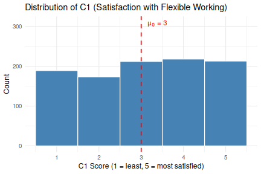
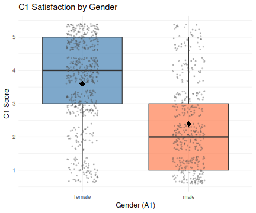
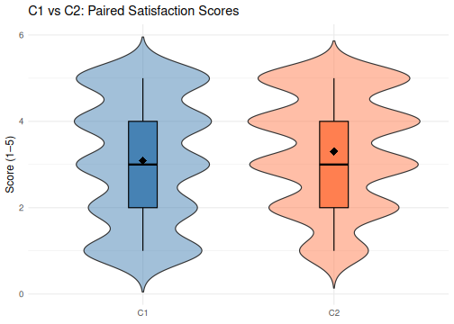

::: objectives
-   Distinguish between one-sample, independent-samples, and paired `t-tests`
-   Run all three `t-test` variants in `R` and interpret their output
-   Check `t-test` assumptions: normality and equal variances
-   Understand when to use a `one-way` vs `two-way ANOVA`
-   Run `one-way ANOVA` and follow up with post-hoc tests
-   Run a `two-way ANOVA` to examine interaction effects
-   Compute and interpret effect sizes: `Cohen's *d*` and η²
-   Report results clearly in a reproducible `R Notebook`
:::

::: questions
-   When should I use a `t-test` vs an `ANOVA`?
-   How do I check whether my data meet the assumptions of these tests?
-   What do I do after a significant `ANOVA` result?
:::

---

## Overview

This workshop covers the two most widely used parametric tests for comparing
**means** of continuous variables:

-   **`T-Tests`** compare the mean of one or two groups to a reference value or to each other.
-   **`ANOVA`** (Analysis of Variance) compares means across **three or more groups** simultaneously.

Both families of tests share a common logic: they ask whether the differences
we observe between group means are larger than we would expect by chance alone.

---

<!--
## Other materials

[See Workshop 6 Slides
here]()

[See Workshop 6 recording here -
1]()
-->


## Dataset overview

This workshop uses a generated (made-up) dataset of **1,005 survey responses**
on flexible working and work-life balance. The cleaned `.rds` file preserves
all factor levels and ordered factors set in the [previous lesson 5. Quantitative Data Analysis in R](https://irim-mongolia.github.io/irim-r-workshops/quantitative_data_analysis.html).

**Survey schema (variables used in this workshop)**

| Section | Variable | Type | Description |
|---------|----------|------|-------------|
| **A (Demographics)** | A1 – Gender | Factor (male, female) | What is your gender? |
| | A2 – Age Group | Ordered Factor (18–34, 35–54, 55+) | What is your age? |
| | A3 – Education | Ordered Factor (primary, secondary, tertiary+) | Highest level of education? |
| | A4 – Income | Ordered Factor (low, middle, high) | Annual income level? |
| | A6 – Area Type | Factor (Rural, Urban) | Urban or rural residence? |
| **C (Satisfaction)** | C1 | Integer (1–5) | Satisfaction with flexible working arrangements |
| | C2 | Integer (1–5) | Extent flex working improves work-life balance |
| | C3 | Integer (1–5) | Employer support for flexible working in practice |
| **D (Commute)** | D1 | Numeric | Commute time to work (minutes) |
| | D2 | Numeric | Commute distance (km) |

---

::: callout
## Likert scale data vs categorical data

In practice, treating 5-point (1-5) Likert items such as variables `C1`, `C2` and `C3` as continuous is extremely common in the analysis or survey data (especially when sample sizes are large), because it unlocks parametric tests like t-tests and ANOVA that are more powerful than their ordinal alternatives.

The key assumption is that the distance between points is meaningful and approximately equal: a 2 is "one unit more" than a 1, a 3 is "one unit more" than a 2, and so on. That equal-interval property allows you to compute a meaningful mean (e.g., "the average satisfaction was 3.09"), standard deviation, and differences between groups.

Categorical variables such as `E1` uses labels: Strongly dissatisfied, Dissatisfied, Neutral, Satisfied, Strongly satisfied. These are ordered; we know Satisfied > Neutral, but there's no defensible claim that the gap between Neutral and Satisfied is the same size as the gap between Dissatisfied and Neutral. 

Because the distances between categories are unknown, you can't take a meaningful mean. Saying "the average satisfaction was 3.2 on the Strongly dissatisfied–Strongly satisfied scale" doesn't make sense the way it does for a numbered scale. So `E1` is classified as an ordered factor and analysed with tests suited to ordinal or categorical data (Chi-square, ordinal regression, etc.).

:::

## Set up

Start by opening your `intro_r` RStudio project and start a new R Notebook
(`File → New File → R Notebook`). Save it as `t_tests_anova.Rmd` in
your `scripts` folder. Ensure your `global environment` is empty! You can also `sweep’`your global environment by clicking the `broom` icon.

When you open a new `R Notebook`, some explanatory text is provided. This can be deleted so you can enter your own text and code.

### Load packages and data

Download packages (if needed) and load libraries. We’ll be using the `rstatix`, `ggpubr`, `effectsize`, and `emmeans` packages for the first time, so they will need to be installed.


``` r
for (pkg in c("tidyverse", "here", "rstatix", "ggpubr", "effectsize", "emmeans")) {
  if (!requireNamespace(pkg, quietly = TRUE)) install.packages(pkg)
}
```

``` output
- Querying repositories for available source packages ... Done!
The following package(s) will be installed:
- abind          [1.4-8]
- car            [3.1-5]
- carData        [3.0-6]
- colorspace     [2.1-2]
- corrplot       [0.95]
- cowplot        [1.2.0]
- Deriv          [4.2.0]
- doBy           [4.7.1]
- forecast       [9.0.2]
- Formula        [1.2-5]
- fracdiff       [1.5-4]
- lme4           [2.0-1]
- lmtest         [0.9-40]
- MatrixModels   [0.5-4]
- microbenchmark [1.5.0]
- minqa          [1.2.8]
- nloptr         [2.2.1]
- numDeriv       [2016.8-1.1]
- pbkrtest       [0.5.5]
- quantreg       [6.1]
- rbibutils      [2.4.1]
- RcppEigen      [0.3.4.0.2]
- Rdpack         [2.6.6]
- reformulas     [0.4.4]
- rstatix        [0.7.3]
- SparseM        [1.84-2]
- timeDate       [4052.112]
- urca           [1.3-4]
- zoo            [1.8-15]
These packages will be installed into "/__w/irim-r-workshops/irim-r-workshops/renv/profiles/lesson-requirements/renv/library/linux-ubuntu-noble/R-4.5/x86_64-pc-linux-gnu".

# Downloading packages -------------------------------------------------------
✔ abind 1.4-8                              [22 kB in 0.4s]
✔ microbenchmark 1.5.0                     [62 kB in 0.41s]
✔ numDeriv 2016.8-1.1                      [76 kB in 0.41s]
✔ reformulas 0.4.4                         [85 kB in 0.41s]
✔ Formula 1.2-5                            [128 kB in 0.41s]
✔ pbkrtest 0.5.5                           [77 kB in 0.42s]
✔ Rdpack 2.6.6                             [379 kB in 0.44s]
✔ forecast 9.0.2                           [591 kB in 0.44s]
✔ rstatix 0.7.3                            [417 kB in 0.45s]
✔ MatrixModels 0.5-4                       [25 kB in 45s]
✔ rbibutils 2.4.1                          [1.2 MB in 0.46s]
✔ cowplot 1.2.0                            [1.6 MB in 0.47s]
✔ minqa 1.2.8                              [55 kB in 65s]
✔ Deriv 4.2.0                              [39 kB in 61s]
✔ RcppEigen 0.3.4.0.2                      [1.8 MB in 0.49s]
✔ corrplot 0.95                            [3.7 MB in 0.5s]
✔ zoo 1.8-15                               [806 kB in 87s]
✔ lme4 2.0-1                               [3.7 MB in 0.51s]
✔ car 3.1-5                                [379 kB in 76s]
✔ lmtest 0.9-40                            [230 kB in 65s]
✔ timeDate 4052.112                        [367 kB in 60s]
✔ fracdiff 1.5-4                           [60 kB in 52s]
✔ nloptr 2.2.1                             [2.3 MB in 0.12s]
✔ colorspace 2.1-2                         [2.1 MB in 0.12s]
✔ carData 3.0-6                            [996 kB in 82s]
✔ quantreg 6.1                             [925 kB in 56s]
✔ urca 1.3-4                               [681 kB in 0.11s]
✔ SparseM 1.84-2                           [553 kB in 0.55s]
✔ doBy 4.7.1                               [4.5 MB in 0.61s]
Successfully downloaded 29 packages in 0.92 seconds.

# Installing packages --------------------------------------------------------
✔ abind 1.4-8                              [built from source in 8.6s]
✔ carData 3.0-6                            [built from source in 10s]
✔ corrplot 0.95                            [built from source in 11s]
✔ Formula 1.2-5                            [built from source in 7.4s]
✔ Deriv 4.2.0                              [built from source in 15s]
✔ fracdiff 1.5-4                           [built from source in 16s]
✔ colorspace 2.1-2                         [built from source in 37s]
✔ microbenchmark 1.5.0                     [built from source in 16s]
✔ MatrixModels 0.5-4                       [built from source in 30s]
✔ numDeriv 2016.8-1.1                      [built from source in 8.2s]
✔ cowplot 1.2.0                            [built from source in 1.1m]
✔ minqa 1.2.8                              [built from source in 45s]
✔ SparseM 1.84-2                           [built from source in 53s]
✔ rbibutils 2.4.1                          [built from source in 1.5m]
✔ nloptr 2.2.1                             [built from source in 2.2m]
✔ urca 1.3-4                               [built from source in 37s]
✔ timeDate 4052.112                        [built from source in 58s]
✔ zoo 1.8-15                               [built from source in 29s]
✔ Rdpack 2.6.6                             [built from source in 20s]
✔ lmtest 0.9-40                            [built from source in 16s]
✔ reformulas 0.4.4                         [built from source in 23s]
✔ RcppEigen 0.3.4.0.2                      [built from source in 3.0m]
✔ quantreg 6.1                             [built from source in 1.2m]
✔ lme4 2.0-1                               [built from source in 1.5m]
✔ forecast 9.0.2                           [built from source in 2.1m]
✔ doBy 4.7.1                               [built from source in 15s]
✔ pbkrtest 0.5.5                           [built from source in 6.9s]
✔ car 3.1-5                                [built from source in 11s]
✔ rstatix 0.7.3                            [built from source in 6.0s]
Successfully installed 29 packages in 390 seconds.
The following package(s) will be installed:
- ggpubr    [0.6.3]
- ggrepel   [0.9.8]
- ggsci     [5.0.0]
- ggsignif  [0.6.4]
- gridExtra [2.3]
- polynom   [1.4-1]
These packages will be installed into "/__w/irim-r-workshops/irim-r-workshops/renv/profiles/lesson-requirements/renv/library/linux-ubuntu-noble/R-4.5/x86_64-pc-linux-gnu".

# Downloading packages -------------------------------------------------------
✔ ggrepel 0.9.8                            [152 kB in 0.39s]
✔ gridExtra 2.3                            [1.1 MB in 0.46s]
✔ polynom 1.4-1                            [335 kB in 0.48s]
✔ ggsignif 0.6.4                           [587 kB in 0.5s]
✔ ggpubr 0.6.3                             [1.7 MB in 0.56s]
✔ ggsci 5.0.0                              [2.2 MB in 0.61s]
Successfully downloaded 6 packages in 0.92 seconds.

# Installing packages --------------------------------------------------------
✔ gridExtra 2.3                            [built from source in 12s]
✔ polynom 1.4-1                            [built from source in 8.6s]
✔ ggsci 5.0.0                              [built from source in 26s]
✔ ggsignif 0.6.4                           [built from source in 37s]
✔ ggrepel 0.9.8                            [built from source in 43s]
✔ ggpubr 0.6.3                             [built from source in 13s]
Successfully installed 6 packages in 57 seconds.
The following package(s) will be installed:
- bayestestR  [0.17.0]
- datawizard  [1.3.1]
- effectsize  [1.0.2]
- insight     [1.5.0]
- parameters  [0.29.0]
- performance [0.16.0]
These packages will be installed into "/__w/irim-r-workshops/irim-r-workshops/renv/profiles/lesson-requirements/renv/library/linux-ubuntu-noble/R-4.5/x86_64-pc-linux-gnu".

# Downloading packages -------------------------------------------------------
✔ datawizard 1.3.1                         [449 kB in 0.31s]
✔ effectsize 1.0.2                         [396 kB in 0.37s]
✔ performance 0.16.0                       [2.2 MB in 0.37s]
✔ bayestestR 0.17.0                        [431 kB in 0.37s]
✔ parameters 0.29.0                        [690 kB in 0.39s]
✔ insight 1.5.0                            [1.1 MB in 0.4s]
Successfully downloaded 6 packages in 0.7 seconds.

# Installing packages --------------------------------------------------------
✔ insight 1.5.0                            [built from source in 17s]
✔ datawizard 1.3.1                         [built from source in 7.1s]
✔ bayestestR 0.17.0                        [built from source in 7.4s]
✔ performance 0.16.0                       [built from source in 21s]
✔ parameters 0.29.0                        [built from source in 26s]
✔ effectsize 1.0.2                         [built from source in 5.2s]
Successfully installed 6 packages in 64 seconds.
The following package(s) will be installed:
- emmeans      [2.0.3]
- estimability [1.5.1]
- mvtnorm      [1.3-7]
These packages will be installed into "/__w/irim-r-workshops/irim-r-workshops/renv/profiles/lesson-requirements/renv/library/linux-ubuntu-noble/R-4.5/x86_64-pc-linux-gnu".

# Downloading packages -------------------------------------------------------
✔ estimability 1.5.1                       [16 kB in 0.4s]
✔ mvtnorm 1.3-7                            [976 kB in 0.5s]
✔ emmeans 2.0.3                            [1.6 MB in 0.52s]
Successfully downloaded 3 packages in 0.78 seconds.

# Installing packages --------------------------------------------------------
✔ estimability 1.5.1                       [built from source in 2.8s]
✔ mvtnorm 1.3-7                            [built from source in 6.9s]
✔ emmeans 2.0.3                            [built from source in 8.6s]
Successfully installed 3 packages in 16 seconds.
```

``` r
library(tidyverse)
library(here)
library(rstatix)    # tidy statistical tests
library(ggpubr)     # publication-ready plots
library(effectsize) # `Cohen's d`, eta-squared
library(emmeans)    # estimated marginal means for `ANOVA`
```

Read in the cleaned survey data that was processed in the [previous workshop](https://irim-mongolia.github.io/irim-r-workshops/quantitative_data_analysis.html).

Download the data first if you need to.


``` r
download.file("https://raw.githubusercontent.com/IRIM-Mongolia/irim-r-workshops/blob/main/episodes/data/cleaned/generated_survey_data_clean.rds", here("generated_survey_data_clean.rds"), mode = "wb")
```


``` r
survey <- readRDS(here("data", "cleaned", "generated_survey_data_clean.rds"))
survey
```

``` output
# A tibble: 1,005 × 28
   A1    A2    A3    A4    A5    A6    B1    B1_1  B1_2  B1_3  B1_4  B1_5  B2   
   <fct> <ord> <ord> <ord> <fct> <fct> <chr> <lgl> <lgl> <lgl> <lgl> <lgl> <chr>
 1 male  18-34 seco… low   regi… Urban <NA>  FALSE FALSE FALSE FALSE FALSE 1 4 7
 2 male  35-54 seco… midd… regi… Rural 2 4 5 FALSE TRUE  FALSE TRUE  TRUE  1 4 6
 3 fema… 35-54 tert… low   regi… Rural 2 3 4 FALSE TRUE  TRUE  TRUE  FALSE 3 6 7
 4 male  18-34 tert… low   regi… Urban 5     FALSE FALSE FALSE FALSE TRUE  3 5 8
 5 male  35-54 seco… high  regi… Rural 5     FALSE FALSE FALSE FALSE TRUE  2 5 6
 6 fema… 18-34 tert… high  regi… Urban 1 3 5 TRUE  FALSE TRUE  FALSE TRUE  3 6  
 7 male  35-54 seco… high  regi… Urban 2 4 5 FALSE TRUE  FALSE TRUE  TRUE  2 6 7
 8 fema… 18-34 tert… midd… regi… Rural 3 4 5 FALSE FALSE TRUE  TRUE  TRUE  6 7 8
 9 male  18-34 tert… low   regi… Urban 2 4   FALSE TRUE  FALSE TRUE  FALSE 2 5 8
10 male  18-34 prim… midd… regi… Urban 5     FALSE FALSE FALSE FALSE TRUE  5 8  
# ℹ 995 more rows
# ℹ 15 more variables: B2_1 <lgl>, B2_2 <lgl>, B2_3 <lgl>, B2_4 <lgl>,
#   B2_5 <lgl>, B2_6 <lgl>, B2_7 <lgl>, B2_8 <lgl>, C1 <dbl>, C2 <dbl>,
#   C3 <dbl>, D1 <dbl>, D2 <dbl>, E1 <ord>, E2 <chr>
```

---

## Choosing the right test

Before running any test, you need to answer three questions:

1. **How many groups am I comparing?**
   - One group vs a fixed value → `one-sample t-test`
   - Two groups → `independent-samples` or `paired t-test`
   - Three or more groups → `ANOVA`

2. **Are the observations paired (matched)?**
   - Paired (same respondent measured twice, or matched pairs) → `paired t-test`
   - Independent (different respondents in each group) → `independent t-test` or `ANOVA`

3. **Are the assumptions met?** (normality, equal variances)
   - If not, consider non-parametric alternatives such as `Wilcoxon` or `Kruskal-Wallis`.

| Research question | Test |
|---|---|
| Is mean satisfaction (C1) different from the scale midpoint of 3? | `One-sample t-test` |
| Do men and women score differently on C1? | `Independent-samples t-test` |
| Does satisfaction (C1) differ from work-life balance improvement (C2) within the same respondent? | `Paired t-test` |
| Does commute time (D1) differ across three age groups? | `One-way ANOVA` |
| Does satisfaction (C1) depend on both gender and income? | `Two-way ANOVA` |

---

## `T-Tests`

### The `one-sample t-test`

The **`one-sample t-test`** tests whether the mean of a single continuous
variable differs significantly from a specified reference value (`mu` or `µ₀`).

**Research question:** Is the mean satisfaction score for flexible working
arrangements (C1) significantly different from the scale midpoint of 3?

The scale midpoint of 3 represents a neutral response ("neither satisfied
nor dissatisfied"). If the mean is significantly above or below 3, it
indicates a consistent directional lean across the sample.

#### Assumptions

- Observations are independent (each row is one respondent). 
- The variable is continuous (interval or ratio scale). 
- The variable is approximately normally distributed *or* the sample is large (n > 30 by the Central Limit Theorem). With n = 1005, this is met. 

#### Exploratory plot

Always visualise your data before running a test to inspect the data.


``` r
survey %>%
  ggplot(aes(x = C1)) +
  geom_histogram(binwidth = 1, fill = "steelblue", colour = "white") +
  geom_vline(xintercept = 3, linetype = "dashed", colour = "red",
             linewidth = 0.8) +
  annotate("text", x = 3.15, y = 310, label = "µ₀ = 3", colour = "red",
           hjust = 0, size = 4) +
  labs(title = "Distribution of C1 (Satisfaction with Flexible Working)",
       x = "C1 Score (1 = least, 5 = most satisfied)",
       y = "Count") +
  theme_minimal(base_size = 12)
```



The distribution looks roughly symmetric around 3, but the mean may differ
slightly. Let us test this formally.

#### Running the `t-test`


``` r
t.test(survey$C1, mu = 3)
```

``` output

	One Sample t-test

data:  survey$C1
t = 2.0835, df = 1004, p-value = 0.03746
alternative hypothesis: true mean is not equal to 3
95 percent confidence interval:
 3.005382 3.179692
sample estimates:
mean of x 
 3.092537 
```

::: callout
## Reading `t-test` output

The output contains:

- **t**: the test statistic. Larger absolute values suggest stronger evidence
  against the null hypothesis H₀.
- **df**: degrees of freedom (n − 1 for a one-sample test).
- **p-value**: the probability of observing a t-statistic this extreme or more
  extreme if H₀ (µ = 3) were true.
- **95% confidence interval**: plausible range for the true population mean.
- **sample estimates**: the observed sample mean.
:::

The result is **t(1004) = 2.08, p = 0.037**. With p < 0.05, we reject the null hypothesis and conclude the mean C1 score is significantly different from 3. The 95%
confidence interval [3.004, 3.175] sits entirely above 3, confirming a small
but statistically reliable positive lean.

#### Effect size: `Cohen's *d*`

`Cohen's *d*` measures how large a difference is in practical terms, not just whether it's statistically significant. It is expressed as the number of standard deviations separating the two group means.

| Cohen's *d* | Interpretation |
|-------------|----------------|
| < 0.2 | Negligible / very small |
| 0.2 | Small |
| 0.5 | Medium |
| 0.8 | Large |


``` r
cohens_d(survey$C1, mu = 3)
```

``` output
Cohen's d |       95% CI
------------------------
0.07      | [0.00, 0.13]

- Deviation from a difference of 3.
```

Cohen's *d* < 0.1 indicates a **very small** effect. Statistical significance
here is partly a consequence of the large sample size, not a practically
important deviation. Always report effect sizes alongside p-values.

An example sentence: 

On average, respondents reported slightly higher than neutral satisfaction with their flexible working arrangements (mean score 3.09 out of 5). This positive lean is statistically reliable and unlikely to be a chance finding (t(1004) = 2.08, p = 0.037). We can be 95% confident the true average across the population falls between 3.00 and 3.18, meaning satisfaction is consistently, if only marginally, above the midpoint.

However, the practical significance of this difference is negligible (`Cohen's *d*` < 0.01), meaning that while the result is statistically detectable, the deviation from neutral is too small to be meaningful in practice.


---

### The `independent-samples t-test`

The **`independent-samples t-test`** (`unpaired t-test`) compares the means of
a continuous variable across **two independent groups**. Let's investigate if there are differences between the satisfaction reported by men and women to the question `C1`.

**Research question:** Do male and female respondents differ in their
satisfaction with flexible working arrangements (C1)?

#### Assumptions

- The two groups are independent (a respondent appears in only one group). 
- The continuous variable is approximately normally distributed within each group, *or* each group has n > 30 (both groups here are large). 
- Equal variances (homoscedasticity): we will check this with `Levene's` test.

#### Check equal variances

`Levene's` test checks whether two or more groups have similar spread (variance) in their data, which is a required assumption for `t-tests` and `ANOVA`. If the test is non-significant (`p > 0.05`), the variances are similar enough to proceed with the standard test. If the test is significant (`p ≤ 0.05`), the groups have unequal spread and you should switch to `Welch's t-test` or `Welch's ANOVA`, which don't require equal variances


``` r
survey %>%
  levene_test(C1 ~ A1)
```

``` output
# A tibble: 1 × 4
    df1   df2 statistic     p
  <int> <int>     <dbl> <dbl>
1     1  1003   0.00147 0.969
```

Levene's test produces `F` and `p` values. If `p > 0.05`, we retain the assumption of
equal variances and use the classic Student's t-test. If `p ≤ 0.05`, variances
are unequal and we use **Welch's t-test** (`var.equal = FALSE`), which does
not assume equal variances. Note, `t.test` in `R` defaults to `Welch's t-test`. We can use the `Student's t-test` by including `var.equal = TRUE` when running the test.

#### Exploratory plot

We'll use a box-plot to plot the distribution of values for males and females.

A boxplot displays the distribution of a continuous variable through five summary statistics. The box spans the interquartile range (IQR) (the middle 50% of the data) with a line inside marking the median. The whiskers extend to the smallest and largest values within 1.5 times the IQR from the box edges, and any points beyond the whiskers are plotted individually as outliers. You can also plot the mean value on the graph as well.


``` r
survey %>%
  ggplot(aes(x = A1, y = C1, fill = A1)) +
  geom_boxplot(alpha = 0.7, outlier.shape = NA) +
  geom_jitter(width = 0.15, size = 0.7, alpha = 0.3, colour = "grey30") +
  stat_summary(fun = mean, geom = "point", shape = 18,
               size = 4, colour = "black") +
  labs(title = "C1 Satisfaction by Gender",
       x = "Gender (A1)", y = "C1 Score") +
  scale_fill_manual(values = c("steelblue", "coral")) +
  theme_minimal(base_size = 12) +
  theme(legend.position = "none")
```



The diamond shows the mean values of the to groups. From the boxplot, a clear difference between the two genders is visible.

#### Running the test


``` r
t.test(C1 ~ A1, data = survey, var.equal = TRUE) # when var.equal = FALSE, Welch's Tt-test is used
```

``` output

	Two Sample t-test

data:  C1 by A1
t = 14.771, df = 1003, p-value < 2.2e-16
alternative hypothesis: true difference in means between group female and group male is not equal to 0
95 percent confidence interval:
 1.045143 1.365382
sample estimates:
mean in group female   mean in group male 
            3.598628             2.393365 
```

#### Summary statistics

We can also produce a table of summary statistics to use in our reporting.

``` r
survey %>%
  group_by(A1) %>%
  summarise(
    n = n(),
    mean = round(mean(C1, na.rm = TRUE), 3),
    sd = round(sd(C1, na.rm = TRUE), 3), # standard deviation
    se = round(sd / sqrt(n), 3) # standard error
  )
```

``` output
# A tibble: 2 × 5
  A1         n  mean    sd    se
  <fct>  <int> <dbl> <dbl> <dbl>
1 female   583  3.60  1.28 0.053
2 male     422  2.39  1.27 0.062
```

The result is **t(836) = −14.77, p < 0.001**. Female respondents score
substantially higher on C1 (mean = 3.60) than male respondents (mean = 2.39).

#### Effect size


``` r
cohens_d(C1 ~ A1, data = survey)
```

``` output
Cohen's d |       95% CI
------------------------
0.94      | [0.81, 1.08]

- Estimated using pooled SD.
```

`Cohen's *d*` = 0.94 is a **large effect**: the gender difference in
satisfaction represents nearly one full standard deviation. This is
substantively meaningful, not just statistically significant.

::: callout
## Reporting checklist for independent t-tests

1. **Research question** and grouping variable
2. **Group means and SDs**
3. **Levene's test result** (and whether Welch or Student was used)
4. **Test statistic and degrees of freedom**: *t*(df) = X.XX
5. **p-value** (exact, or < .001)
6. **95% confidence interval** on the difference
7. **Cohen's *d*** with interpretation

**Example sentence:**
"Female respondents reported significantly higher satisfaction with their flexible
working arrangements (mean = 3.60, sd = 1.28) compared to male respondents
(mean = 2.39, sd = 1.28), a difference of 1.21 points on the 5-point scale. This gap is highly statistically significant (t(836) = −14.77, p < 0.001, 95% CI [−1.37, −1.04]) and represents a large practical effect (`Cohen's d` = 0.94). `Levene's test` confirmed that the two groups had equal variance (p = 0.969), so the `Student's t-test` was used.

:::

---

### The paired t-test

The **paired t-test** (also called the dependent-samples or repeated-measures
t-test) compares means of **two related measurements**: either the same
variable at two time points, or two variables measured on the same participants.

**Research question:** Do respondents score C1 (satisfaction with flexible
working arrangements) differently from C2 (extent flexible working improves
work-life balance)?

Both C1 and C2 are measured on the same 1-to-5 scale by the same respondents.
A paired test correctly accounts for the correlation between these measurements
within each person.

#### Why not an independent t-test?

Using an independent t-test here would ignore that both scores come from the
same person. Pairing removes the between-person variance and gives a more
precise and powerful test of the within-person difference.

#### Assumptions

- Observations are paired: each row contributes one value to both C1 and C2 (the same respondent answered both questions).
- The differences between paired values (C2 − C1) are approximately normally distributed, or the sample is large enough for the Central Limit Theorem to apply (n = 1,005 here). 
- The pairs are independent of each other: one respondent's answers do not influence another's.

#### Exploratory plot

We'll use a violin-plot to plot the distribution of values for responses to C1 and C2. A violin plot is used here because C1 and C2 are discrete 1–5 scale variables, meaning a boxplot alone would be misleading: with only five possible values, the box and whiskers can look identical between two variables even when their distributions are quite different. 

The violin adds the full shape of the distribution, showing where responses cluster (wider = more respondents at that score), so you can immediately see whether responses pile up at the extremes or concentrate around the midpoint. The boxplot is layered on top to retain the familiar median and IQR summary, and the diamond marks the mean, giving you three layers of information in one plot.


``` r
survey %>%
  select(C1, C2) %>%
  pivot_longer(everything(), names_to = "Scale", values_to = "Score") %>%
  ggplot(aes(x = Scale, y = Score, fill = Scale)) +
  geom_violin(alpha = 0.5, trim = FALSE) +
  geom_boxplot(width = 0.15, outlier.shape = NA, colour = "black") +
  stat_summary(fun = mean, geom = "point", shape = 18,
               size = 4, colour = "black") +
  labs(title = "C1 vs C2: Paired Satisfaction Scores",
       x = NULL, y = "Score (1–5)") +
  scale_fill_manual(values = c("steelblue", "coral")) +
  theme_minimal(base_size = 12) +
  theme(legend.position = "none")
```



#### Running the test

Including the argument `paired = TRUE` ensures a `paired t-test` is run.

``` r
t.test(survey$C1, survey$C2, paired = TRUE)
```

``` output

	Paired t-test

data:  survey$C1 and survey$C2
t = -3.8962, df = 1004, p-value = 0.0001042
alternative hypothesis: true mean difference is not equal to 0
95 percent confidence interval:
 -0.3141949 -0.1037155
sample estimates:
mean difference 
     -0.2089552 
```

#### Summary


``` r
survey %>%
  summarise(
    mean_C1 = round(mean(C1, na.rm = TRUE), 3),
    mean_C2 = round(mean(C2, na.rm = TRUE), 3),
    mean_diff = round(mean(C2 - C1, na.rm = TRUE), 3),
    sd_diff = round(sd(C2 - C1, na.rm = TRUE), 3)
  )
```

``` output
# A tibble: 1 × 4
  mean_C1 mean_C2 mean_diff sd_diff
    <dbl>   <dbl>     <dbl>   <dbl>
1    3.09    3.30     0.209     1.7
```

The result is **t(1004) = −3.90, p < 0.001**. Respondents rate C2 (meam = 3.30) significantly higher than C1 (mean = 3.09) on average, with a mean difference of 0.21 points. While statistically significant, this is a small effect.

#### Effect size

For paired data, we'll use the `repeated_measures_d()` function from the `efectsize` package. It offers offers multiple standardisation methods (rm, av, z) that account for the dependency between measurements:

- d (rm) — adjusts for the correlation between the paired scores, which typically produces a slightly larger effect size than standard `Cohen's d` because it accounts for the fact that paired measurements are not independent
- d (av) — uses the average of the two standard deviations rather than the pooled SD, which is more appropriate when the two variables have different spreads
- d (z) — standardises using the population SD, useful when comparing to external benchmarks


``` r
repeated_measures_d(Pair(C1, C2) ~ 1, data = survey, method = "rm")
```

``` output
d (rm) |         95% CI
-----------------------
-0.16  | [-0.23, -0.08]

- Adjusted for small sample bias.
```

The `*d[rm]*` = -0.16 is a very small effect. Statistical significance
here is partly a consequence of the large sample size, not a practically
important deviation.

---

Example sentence:

On average, respondents scored C2 slightly higher than C1 (mean C2 = 3.30 vs mean C1 = 3.09), a mean difference of 0.21 points. This difference is statistically significant (t(1004) = −3.90, p < 0.001, 95% CI [−0.31, −0.10]), indicating that respondents consistently perceive flexible working as improving their work-life balance to a slightly greater degree than they are satisfied with their current arrangements.

However, the practical significance of this difference is small (`d[rm]`= -0.16), and the standard deviation of the within-person differences was wide (sd = 1.70), suggesting considerable variation in how individuals responded across the two questions. While the finding is reliable at the population level, the gap between the two scores is unlikely to be noticeable or meaningful in day-to-day terms.

## One-Way ANOVA

When you want to compare means across **three or more groups**, running
multiple `t-tests` is not appropriate as it inflates the Type I error rate
(false positive rate). A `one-way ANOVA` tests all group differences
simultaneously with a single omnibus `F-test`.

### The `F-statistic`

The `F-statistic` is the ratio of **between-group variance** to
**within-group variance**:

$$F = \frac{\text{Mean Square Between}}{\text{Mean Square Within}}$$

A large F indicates that the group means differ more than expected by
chance. The `F-test` is omnibus; it tells us *that* at least one group
differs, but not *which* groups. Post-hoc tests will answer the question of *which* group differs.

::: callout
## Omnibus tests
An omnibus test is an overall test that asks whether there are any significant differences among a set of groups or variables, without specifying where those differences lie. In the context of `ANOVA`, the `F-test` is omnibus: a significant result tells you that at least one group mean differs from the others, but not which specific pairs are different. 

Think of it as a first screening step: if the omnibus test is non-significant, you stop; if it is significant, you follow up with post-hoc tests (such as `Tukey HSD`) to pinpoint exactly where the differences are.

:::
